本章节主要介绍如何搭建 Kubernetes 的集群环境。

## 环境规划

<div style="border: 1px solid rgba(255, 165, 0,.1);
    padding: 10px;
    border-left: 5px solid rgba(255, 165, 0);
    background: rgba(255, 165, 0,.1);
    border-radius: 0 3px 3px 0;
    color: rgba(255, 165, 0);
    font-family: menlo;
    font-size: 14px;
    margin: 10px 0;
    display: flex;
    align-items: center;
    gap: 8px;">
    <svg viewBox="0 0 24 24" width="16" height="16" fill="none" style="flex-shrink: 0;" xmlns="http://www.w3.org/2000/svg">
    <path d="M12 8.00008V12.0001M12 16.0001H12.01M3 7.94153V16.0586C3 16.4013 3 16.5726 3.05048 16.7254C3.09515 16.8606 3.16816 16.9847 3.26463 17.0893C3.37369 17.2077 3.52345 17.2909 3.82297 17.4573L11.223 21.5684C11.5066 21.726 11.6484 21.8047 11.7985 21.8356C11.9315 21.863 12.0685 21.863 12.2015 21.8356C12.3516 21.8047 12.4934 21.726 12.777 21.5684L20.177 17.4573C20.4766 17.2909 20.6263 17.2077 20.7354 17.0893C20.8318 16.9847 20.9049 16.8606 20.9495 16.7254C21 16.5726 21 16.4013 21 16.0586V7.94153C21 7.59889 21 7.42756 20.9495 7.27477C20.9049 7.13959 20.8318 7.01551 20.7354 6.91082C20.6263 6.79248 20.4766 6.70928 20.177 6.54288L12.777 2.43177C12.4934 2.27421 12.3516 2.19543 12.2015 2.16454C12.0685 2.13721 11.9315 2.13721 11.7985 2.16454C11.6484 2.19543 11.5066 2.27421 11.223 2.43177L3.82297 6.54288C3.52345 6.70928 3.37369 6.79248 3.26463 6.91082C3.16816 7.01551 3.09515 7.13959 3.05048 7.27477C3 7.42756 3 7.59889 3 7.94153Z" fill="none" stroke="currentColor" stroke-width="2" stroke-linecap="round" stroke-linejoin="round">
    </path>
</svg>
    <span style="line-height: 1.6;">说明：为了测试简单，本次搭建的是 <strong>一主两从</strong> 类型的集群。</span>
</div>

### 集群类型

Kubernetes 集群大体上分为两类：**一主多从**  和 **多主多从** 。

- **一主多从：** 一台 Master 节点和多台 Node 节点，搭建简单，但是有单机故障风险，适合用于测试环境。
- **多主多从：** 多台 Master 节点和多台 Node 节点，搭建麻烦，安全性高，适合用于生产环境。

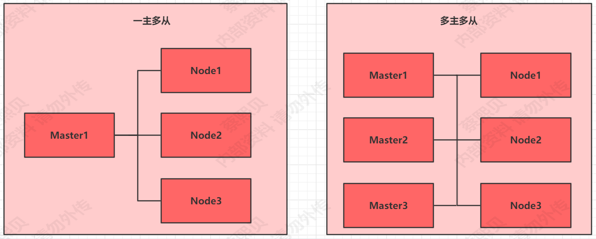

### 安装方式

Kubernetes 有多种部署方式，目前主流的方式有 kubeadm、minikube、二进制包。

-   **minikube：** 一个用于快速搭建单节点 Kubernetes 的工具；

-   **kubeadm：** 一个用于快速搭建 Kubernetes 集群的工具；
-   **二进制包：** 从官网下载每个组件的二进制包，依次去安装，此方式对于理解 Kubernetes 组件更加有效；

### 主机规划

|  作用  |       IP        | 操作系统 |          配置          |
| :----: | :-------------: | :------: | :--------------------: |
| master | 192.168.239.100 |  CentOS  | 双核CPU 2G内存 40G硬盘 |
| node_1 | 192.168.239.101 |  CentOS  | 双核CPU 2G内存 40G硬盘 |
| node_2 | 192.168.239.102 |  CentOS  | 双核CPU 2G内存 40G硬盘 |

## 环境搭建

本次环境搭建需要安装三台 Centos 服务器（一主二从），然后在每台服务器中分别安装 docker（18.06.3）、kubeadm（1.17.4）、kubelet（1.17.4）、kubectl（1.17.4）程序。

### 主机安装

安装虚拟机过程中注意下面选项的设置：

- 操作系统环境：CPU （2核）、内存（2G）、硬盘（20G）
- 语言选择：简体中文
- 软件选择：基础设施服务器
- 分区选择：自动分区
- 网络配置：各虚机按照如下网络信息参考配置

> 网络地址：192.168.239.100（master）、192.168.239.101（node_1）、192.168.239.102（node_2）
>
> 子网掩码：255.255.255.0
>
> 默认网关：192.168.239.2
>
> DNS：223.5.5.5（阿里提供的 DNS 服务器）

网络地址段需要根据自己虚拟机 NAT 模式网卡配置中查看。

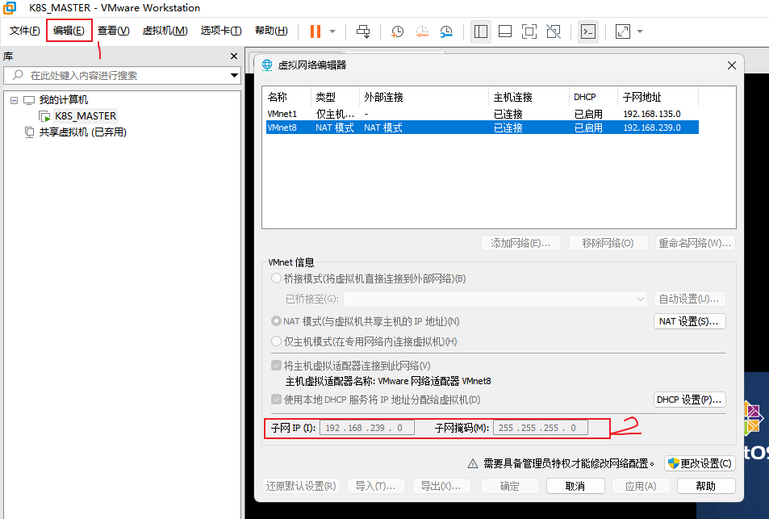

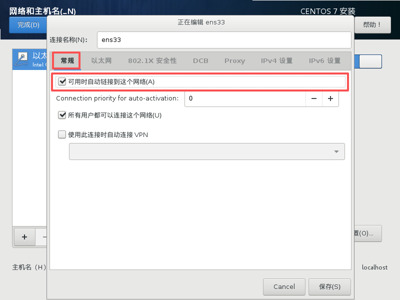

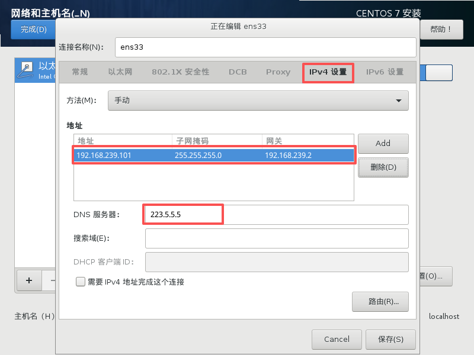

- 主机名设置：按照下面信息参考设置主机名

> master 节点：k8s-master
>
> node 节点：k8s-node-1、k8s-node-2

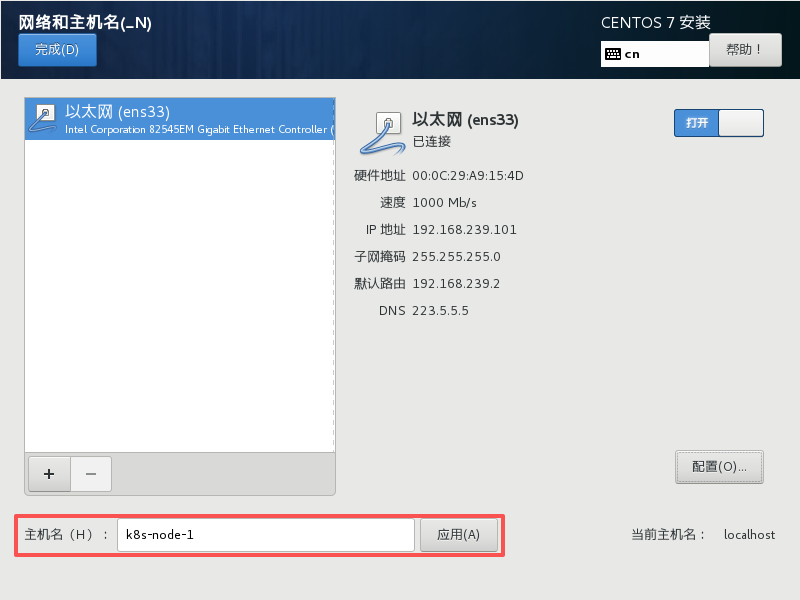

### 环境初始化

#### 检查操作系统版本

<div style="border: 1px solid rgba(254, 40, 87,.1);
    padding: 10px;
    border-left: 5px solid rgba(254, 40, 87);
    background: rgba(254, 40, 87,.1);
    border-radius: 0 3px 3px 0;
    color:rgba(254, 40, 87);
    font-family: menlo;
    font-size: 12px;
    margin: 10px 0;
    display: flex;
    align-items: center;
    gap: 8px;">
    <svg viewBox="0 0 24 24" style="flex-shrink: 0;" width="14px" height="14px" fill="none" xmlns="http://www.w3.org/2000/svg" class="MuiSvgIcon-root MuiSvgIcon-fontSizeSmall css-8l52ux" focusable="false" aria-hidden="true" data-testid="ErrorIcon"><path d="M12 8.00008V12.0001M12 16.0001H12.01M3 7.94153V16.0586C3 16.4013 3 16.5726 3.05048 16.7254C3.09515 16.8606 3.16816 16.9847 3.26463 17.0893C3.37369 17.2077 3.52345 17.2909 3.82297 17.4573L11.223 21.5684C11.5066 21.726 11.6484 21.8047 11.7985 21.8356C11.9315 21.863 12.0685 21.863 12.2015 21.8356C12.3516 21.8047 12.4934 21.726 12.777 21.5684L20.177 17.4573C20.4766 17.2909 20.6263 17.2077 20.7354 17.0893C20.8318 16.9847 20.9049 16.8606 20.9495 16.7254C21 16.5726 21 16.4013 21 16.0586V7.94153C21 7.59889 21 7.42756 20.9495 7.27477C20.9049 7.13959 20.8318 7.01551 20.7354 6.91082C20.6263 6.79248 20.4766 6.70928 20.177 6.54288L12.777 2.43177C12.4934 2.27421 12.3516 2.19543 12.2015 2.16454C12.0685 2.13721 11.9315 2.13721 11.7985 2.16454C11.6484 2.19543 11.5066 2.27421 11.223 2.43177L3.82297 6.54288C3.52345 6.70928 3.37369 6.79248 3.26463 6.91082C3.16816 7.01551 3.09515 7.13959 3.05048 7.27477C3 7.42756 3 7.59889 3 7.94153Z" fill="none" stroke="currentColor" stroke-width="2" stroke-linecap="round" stroke-linejoin="round"></path></svg>
    <span style="line-height: 12px;">此方式下安装 Kubernetes 集群要求 CentOS 版本在 7.5 之上</span>
</div>

```bash
cat /etc/redhat-release
```

输出：

```idl
CentOS Linux release 7.5.1804 (Core) 
```

#### 主机名解析

<div style="border: 1px solid rgba(255, 165, 0,.1);
    padding: 10px;
    border-left: 5px solid rgba(255, 165, 0);
    background: rgba(255, 165, 0,.1);
    border-radius: 0 3px 3px 0;
    color: rgba(255, 165, 0);
    font-family: menlo;
    font-size: 12px;
    margin: 10px 0;
    display: flex;
    align-items: center;
    gap: 8px;">
    <svg viewBox="0 0 24 24" width="14px" height="14px" fill="none" style="flex-shrink: 0;" xmlns="http://www.w3.org/2000/svg">
    <path d="M12 8.00008V12.0001M12 16.0001H12.01M3 7.94153V16.0586C3 16.4013 3 16.5726 3.05048 16.7254C3.09515 16.8606 3.16816 16.9847 3.26463 17.0893C3.37369 17.2077 3.52345 17.2909 3.82297 17.4573L11.223 21.5684C11.5066 21.726 11.6484 21.8047 11.7985 21.8356C11.9315 21.863 12.0685 21.863 12.2015 21.8356C12.3516 21.8047 12.4934 21.726 12.777 21.5684L20.177 17.4573C20.4766 17.2909 20.6263 17.2077 20.7354 17.0893C20.8318 16.9847 20.9049 16.8606 20.9495 16.7254C21 16.5726 21 16.4013 21 16.0586V7.94153C21 7.59889 21 7.42756 20.9495 7.27477C20.9049 7.13959 20.8318 7.01551 20.7354 6.91082C20.6263 6.79248 20.4766 6.70928 20.177 6.54288L12.777 2.43177C12.4934 2.27421 12.3516 2.19543 12.2015 2.16454C12.0685 2.13721 11.9315 2.13721 11.7985 2.16454C11.6484 2.19543 11.5066 2.27421 11.223 2.43177L3.82297 6.54288C3.52345 6.70928 3.37369 6.79248 3.26463 6.91082C3.16816 7.01551 3.09515 7.13959 3.05048 7.27477C3 7.42756 3 7.59889 3 7.94153Z" fill="none" stroke="currentColor" stroke-width="2" stroke-linecap="round" stroke-linejoin="round">
    </path>
</svg>
    <span style="line-height: 16px;">为了方便后面集群节点间的直接调用，我们需要配置下主机名解析，企业中推荐使用内部 DNS 服务器。</span>
</div>

主机名解析，需要编辑三台虚机服务器的 `/etc/hosts` 文件，添加下面内容：

```bash
192.168.239.100 k8s-master
192.168.239.101 k8s-node-1
192.168.239.102 k8s-node-2
```

#### 时间同步

<div style="border: 1px solid rgba(255, 165, 0,.1);
    padding: 10px;
    border-left: 5px solid rgba(255, 165, 0);
    background: rgba(255, 165, 0,.1);
    border-radius: 0 3px 3px 0;
    color: rgba(255, 165, 0);
    font-family: menlo;
    font-size: 12px;
    margin: 10px 0;
    display: flex;
    align-items: center;
    gap: 8px;">
    <svg viewBox="0 0 24 24" width="14px" height="14px" fill="none" style="flex-shrink: 0;" xmlns="http://www.w3.org/2000/svg">
    <path d="M12 8.00008V12.0001M12 16.0001H12.01M3 7.94153V16.0586C3 16.4013 3 16.5726 3.05048 16.7254C3.09515 16.8606 3.16816 16.9847 3.26463 17.0893C3.37369 17.2077 3.52345 17.2909 3.82297 17.4573L11.223 21.5684C11.5066 21.726 11.6484 21.8047 11.7985 21.8356C11.9315 21.863 12.0685 21.863 12.2015 21.8356C12.3516 21.8047 12.4934 21.726 12.777 21.5684L20.177 17.4573C20.4766 17.2909 20.6263 17.2077 20.7354 17.0893C20.8318 16.9847 20.9049 16.8606 20.9495 16.7254C21 16.5726 21 16.4013 21 16.0586V7.94153C21 7.59889 21 7.42756 20.9495 7.27477C20.9049 7.13959 20.8318 7.01551 20.7354 6.91082C20.6263 6.79248 20.4766 6.70928 20.177 6.54288L12.777 2.43177C12.4934 2.27421 12.3516 2.19543 12.2015 2.16454C12.0685 2.13721 11.9315 2.13721 11.7985 2.16454C11.6484 2.19543 11.5066 2.27421 11.223 2.43177L3.82297 6.54288C3.52345 6.70928 3.37369 6.79248 3.26463 6.91082C3.16816 7.01551 3.09515 7.13959 3.05048 7.27477C3 7.42756 3 7.59889 3 7.94153Z" fill="none" stroke="currentColor" stroke-width="2" stroke-linecap="round" stroke-linejoin="round">
    </path>
</svg>
    <span style="line-height: 16px;">kubernetes要求集群中的节点时间必须精确一致，这里直接使用chronyd服务从网络同步时间，企业中建议配置内部的时间同步服务器。</span>
</div>

```bash
# 启动chronyd服务
systemctl start chronyd
# 设置chronyd服务开机自启
systemctl enable chronyd
# chronyd服务启动稍等几秒钟，就可以使用date命令验证时间了
date
```

#### 禁用 iptables 和 firewalld 服务

<div style="border: 1px solid rgba(255, 165, 0,.1);
    padding: 10px;
    border-left: 5px solid rgba(255, 165, 0);
    background: rgba(255, 165, 0,.1);
    border-radius: 0 3px 3px 0;
    color: rgba(255, 165, 0);
    font-family: menlo;
    font-size: 12px;
    margin: 10px 0;
    display: flex;
    align-items: center;
    gap: 8px;">
    <svg viewBox="0 0 24 24" width="14px" height="14px" fill="none" style="flex-shrink: 0;" xmlns="http://www.w3.org/2000/svg">
    <path d="M12 8.00008V12.0001M12 16.0001H12.01M3 7.94153V16.0586C3 16.4013 3 16.5726 3.05048 16.7254C3.09515 16.8606 3.16816 16.9847 3.26463 17.0893C3.37369 17.2077 3.52345 17.2909 3.82297 17.4573L11.223 21.5684C11.5066 21.726 11.6484 21.8047 11.7985 21.8356C11.9315 21.863 12.0685 21.863 12.2015 21.8356C12.3516 21.8047 12.4934 21.726 12.777 21.5684L20.177 17.4573C20.4766 17.2909 20.6263 17.2077 20.7354 17.0893C20.8318 16.9847 20.9049 16.8606 20.9495 16.7254C21 16.5726 21 16.4013 21 16.0586V7.94153C21 7.59889 21 7.42756 20.9495 7.27477C20.9049 7.13959 20.8318 7.01551 20.7354 6.91082C20.6263 6.79248 20.4766 6.70928 20.177 6.54288L12.777 2.43177C12.4934 2.27421 12.3516 2.19543 12.2015 2.16454C12.0685 2.13721 11.9315 2.13721 11.7985 2.16454C11.6484 2.19543 11.5066 2.27421 11.223 2.43177L3.82297 6.54288C3.52345 6.70928 3.37369 6.79248 3.26463 6.91082C3.16816 7.01551 3.09515 7.13959 3.05048 7.27477C3 7.42756 3 7.59889 3 7.94153Z" fill="none" stroke="currentColor" stroke-width="2" stroke-linecap="round" stroke-linejoin="round">
    </path>
</svg>
    <span style="line-height: 16px;">kubernetes 和 docker 在运行中会产生大量的 iptables 规则，为了不让系统规则跟它们混淆，直接关闭系统的规则。</span>
</div>

```bash
# 关闭 firewalld 服务，禁用自启动
systemctl stop firewalld
systemctl disable firewalld

# 关闭 iptables 服务，关闭自启动
systemctl stop iptables
systemctl disable iptables
```

#### 禁用 selinux

<div style="border: 1px solid rgba(255, 165, 0,.1);
    padding: 10px;
    border-left: 5px solid rgba(255, 165, 0);
    background: rgba(255, 165, 0,.1);
    border-radius: 0 3px 3px 0;
    color: rgba(255, 165, 0);
    font-family: menlo;
    font-size: 12px;
    margin: 10px 0;
    display: flex;
    align-items: center;
    gap: 8px;">
    <svg viewBox="0 0 24 24" width="14px" height="14px" fill="none" style="flex-shrink: 0;" xmlns="http://www.w3.org/2000/svg">
    <path d="M12 8.00008V12.0001M12 16.0001H12.01M3 7.94153V16.0586C3 16.4013 3 16.5726 3.05048 16.7254C3.09515 16.8606 3.16816 16.9847 3.26463 17.0893C3.37369 17.2077 3.52345 17.2909 3.82297 17.4573L11.223 21.5684C11.5066 21.726 11.6484 21.8047 11.7985 21.8356C11.9315 21.863 12.0685 21.863 12.2015 21.8356C12.3516 21.8047 12.4934 21.726 12.777 21.5684L20.177 17.4573C20.4766 17.2909 20.6263 17.2077 20.7354 17.0893C20.8318 16.9847 20.9049 16.8606 20.9495 16.7254C21 16.5726 21 16.4013 21 16.0586V7.94153C21 7.59889 21 7.42756 20.9495 7.27477C20.9049 7.13959 20.8318 7.01551 20.7354 6.91082C20.6263 6.79248 20.4766 6.70928 20.177 6.54288L12.777 2.43177C12.4934 2.27421 12.3516 2.19543 12.2015 2.16454C12.0685 2.13721 11.9315 2.13721 11.7985 2.16454C11.6484 2.19543 11.5066 2.27421 11.223 2.43177L3.82297 6.54288C3.52345 6.70928 3.37369 6.79248 3.26463 6.91082C3.16816 7.01551 3.09515 7.13959 3.05048 7.27477C3 7.42756 3 7.59889 3 7.94153Z" fill="none" stroke="currentColor" stroke-width="2" stroke-linecap="round" stroke-linejoin="round">
    </path>
</svg>
    <span style="line-height: 16px;">selinux 是 Linux 系统下的一个安全服务，如果不关闭它，在安装集群中会产生各种各样的奇葩问题。</span>
</div>

编辑 `/etc/selinux/config` 文件，修改 `SELINUX` 的值为 `disabled`，注意修改完毕之后需要重启 `linux` 服务。

```bash
SELINUX=disabled
```

#### 禁用 swap 分区

<div style="border: 1px solid rgba(255, 165, 0,.1);
    padding: 10px;
    border-left: 5px solid rgba(255, 165, 0);
    background: rgba(255, 165, 0,.1);
    border-radius: 0 3px 3px 0;
    color: rgba(255, 165, 0);
    font-family: menlo;
    font-size: 12px;
    margin: 10px 0;
    display: flex;
    align-items: center;
    gap: 8px;">
    <svg viewBox="0 0 24 24" width="14px" height="14px" fill="none" style="flex-shrink: 0;" xmlns="http://www.w3.org/2000/svg">
    <path d="M12 8.00008V12.0001M12 16.0001H12.01M3 7.94153V16.0586C3 16.4013 3 16.5726 3.05048 16.7254C3.09515 16.8606 3.16816 16.9847 3.26463 17.0893C3.37369 17.2077 3.52345 17.2909 3.82297 17.4573L11.223 21.5684C11.5066 21.726 11.6484 21.8047 11.7985 21.8356C11.9315 21.863 12.0685 21.863 12.2015 21.8356C12.3516 21.8047 12.4934 21.726 12.777 21.5684L20.177 17.4573C20.4766 17.2909 20.6263 17.2077 20.7354 17.0893C20.8318 16.9847 20.9049 16.8606 20.9495 16.7254C21 16.5726 21 16.4013 21 16.0586V7.94153C21 7.59889 21 7.42756 20.9495 7.27477C20.9049 7.13959 20.8318 7.01551 20.7354 6.91082C20.6263 6.79248 20.4766 6.70928 20.177 6.54288L12.777 2.43177C12.4934 2.27421 12.3516 2.19543 12.2015 2.16454C12.0685 2.13721 11.9315 2.13721 11.7985 2.16454C11.6484 2.19543 11.5066 2.27421 11.223 2.43177L3.82297 6.54288C3.52345 6.70928 3.37369 6.79248 3.26463 6.91082C3.16816 7.01551 3.09515 7.13959 3.05048 7.27477C3 7.42756 3 7.59889 3 7.94153Z" fill="none" stroke="currentColor" stroke-width="2" stroke-linecap="round" stroke-linejoin="round">
    </path>
</svg>
    <span style="line-height: 16px;">swap 分区指的是虚拟内存分区，它的作用是在物理内存使用完之后，将磁盘空间虚拟成内存来使用。启用 swap 设备会对系统的性能产生非常负面的影响，因此 kubernetes 要求每个节点都要禁用 swap 设备。但是如果因为某些原因确实不能关闭 swap 分区，就需要在集群安装过程中通过明确的参数进行配置说明。</span>
</div>

编辑分区配置文件 `/etc/fstab` ，注释掉 `swap` 分区一行，注意修改完毕之后需要重启 Linux 服务。

```bash
UUID=455cc753-7a60-4c17-a424-7741728c44a1 /boot    xfs     defaults        0 0
/dev/mapper/centos-home /home                      xfs     defaults        0 0
#/dev/mapper/centos-swap swap                      swap    defaults        0 0
```

#### 修改 linux 的内核参数

修改 linux 的内核参数，添加网桥过滤和地址转发功能，编辑 `/etc/sysctl.d/kubernetes.conf` 文件，添加如下配置。

```shell
net.bridge.bridge-nf-call-ip6tables = 1
net.bridge.bridge-nf-call-iptables = 1
net.ipv4.ip_forward = 1
```

重新加载配置，同时加载网桥过滤模块。

```bash
# 重新加载配置
sysctl -p
# 加载网桥过滤模块
modprobe br_netfilter
# 查看网桥过滤模块是否加载成功
lsmod | grep br_netfilter
```

#### 配置 ipvs 功能

在 kubernetes 中 service 有两种代理模型：

- 基于 iptables 
- 基于 ipvs

两者比较的话，ipvs 的性能明显要高一些，但是如果要使用它，需要手动载入 ipvs 模块。

1. 安装 ipset 和 ipvsadmin

```bash
# 如果 yum 源有问题就执行下列命令切换至国内源
wget -O /etc/yum.repos.d/CentOS-Base.repo http://mirrors.aliyun.com/repo/Centos-7.repo

# 安装 ipset 和 ipvsadm 
yum install ipset ipvsadmin -y
```

2. 添加需要加载的模块写入脚本文件

```bash
# 添加需要加载的模块写入脚本文件
cat <<EOF > /etc/sysconfig/modules/ipvs.modules
#!/bin/bash
modprobe -- ip_vs
modprobe -- ip_vs_rr
modprobe -- ip_vs_wrr
modprobe -- ip_vs_sh
modprobe -- nf_conntrack_ipv4
EOF
```

3. 为脚本文件添加执行权限

```bash
chmod +x /etc/sysconfig/modules/ipvs.modules
```

4. 执行脚本文件

```bash
/bin/bash /etc/sysconfig/modules/ipvs.modules
```

5. 查看对应的模块是否加载成功

```bash
lsmod | grep -e ip_vs -e nf_conntrack_ipv4
```

#### 重启服务器

上面步骤完成之后，需要重新启动 Linux 系统。

```bash
reboot
```

### 安装 Docker 服务

1. 切换镜像源

```bash
wget https://mirrors.aliyun.com/docker-ce/linux/centos/docker-ce.repo -O /etc/yum.repos.d/docker-ce.repo
```

2. 查看当前镜像源中支持的 Docker 版本

```bash
yum list docker-ce --showduplicates
```

3. 安装特定版本的 `docker-ce`

```bash
# 必须指定--setopt=obsoletes=0，否则yum会自动安装更高版本
yum install --setopt=obsoletes=0 docker-ce-18.06.3.ce-3.el7 -y
```

4. 添加一个配置文件

Docker 在默认情况下使用的 Cgroup Driver 为 `cgroupfs`，而 kubernetes 推荐使用 `systemd` 来代替 `cgroupfs` 。

```bash
# 创建目录
mkdir /etc/docker

# 写入配置
cat <<EOF > /etc/docker/daemon.json
{
  "exec-opts": ["native.cgroupdriver=systemd"],
  "data-root": "/var/lib/docker",
  "registry-mirrors": [
		"https://docker.1ms.run",
		"https://docker.xuanyuan.me",
		"https://docker.m.daocloud.io",
		"https://dockerproxy.net",
		"https://docker.mirrors.ustc.edu.cn",
		"https://hub-mirror.c.163.com",
		"https://registry.docker-cn.com"
	]
}
EOF
```

5. 重启 Docker 服务，并设置开机自启动

```bash
systemctl restart docker
systemctl enable docker
```

6. 检查 Docker 状态和版本

```bash
docker version
```

### 安装 Kubernetes 组件

由于 Kubernetes 的镜像源在国外，速度比较慢，这里切换成国内的镜像源，编辑 `/etc/yum.repos.d/kubernetes.repo` ，添加下面的配置。

```bash
[kubernetes]
name=Kubernetes
baseurl=http://mirrors.aliyun.com/kubernetes/yum/repos/kubernetes-el7-x86_64
enabled=1
gpgcheck=0
repo_gpgcheck=0
gpgkey=http://mirrors.aliyun.com/kubernetes/yum/doc/yum-key.gpg
       http://mirrors.aliyun.com/kubernetes/yum/doc/rpm-package-key.gpg
```

安装 `kubeadm`、 `kubelet` 和 `kubectl` 。

```bash
yum install --setopt=obsoletes=0 kubeadm-1.17.4-0 kubelet-1.17.4-0 kubectl-1.17.4-0 -y
```

配置 `kubelet` 的 `cgroup` ，编辑 `/etc/sysconfig/kubelet` ，添加下面的配置。

```bash
# 调整 cgroup driver
KUBELET_CGROUP_ARGS="--cgroup-driver=systemd"
# 调整代理模式
KUBE_PROXY_MODE="ipvs"
```

设置 `kubelet` 开机自启。

```bash
systemctl enable kubelet
```

### 准备集群镜像

在安装 Kubernetes 集群之前，必须要提前准备好集群需要的镜像，所需镜像可以通过下面命令查看。

```bash
kubeadm config images list
```

下载镜像，此镜像在 Kubernetes 的仓库中，由于网络原因，无法连接，下面提供了一种替代方案。

```sh
# 复制、粘贴到 Linux 控制台
images=(
    kube-apiserver:v1.17.4
    kube-controller-manager:v1.17.4
    kube-scheduler:v1.17.4
    kube-proxy:v1.17.4
    pause:3.1
    etcd:3.4.3-0
    coredns:1.6.5
)

# 复制、粘贴到 Linux 控制台
for imageName in ${images[@]} ; do
	docker pull registry.cn-hangzhou.aliyuncs.com/google_containers/$imageName
	docker tag registry.cn-hangzhou.aliyuncs.com/google_containers/$imageName 		k8s.gcr.io/$imageName
	docker rmi registry.cn-hangzhou.aliyuncs.com/google_containers/$imageName
done
```

核验镜像是否下载完成。

```bash
docker images 
```

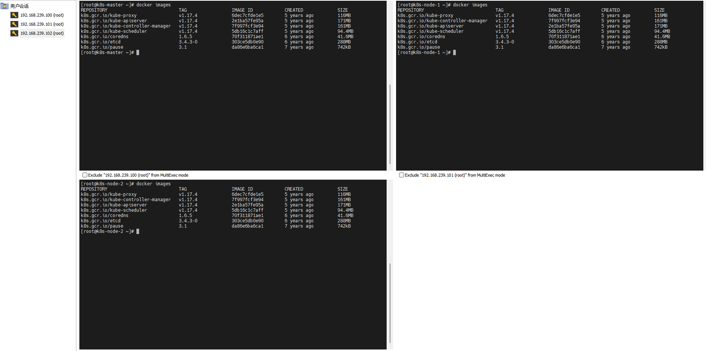

### 集群初始化

下面开始对集群进行初始化，并将 node 节点加入到集群中。

<div style="border: 1px solid rgba(255, 165, 0,.1);
    padding: 10px;
    border-left: 5px solid rgba(255, 165, 0);
    background: rgba(255, 165, 0,.1);
    border-radius: 0 3px 3px 0;
    color: rgba(255, 165, 0);
    font-family: menlo;
    font-size: 12px;
    margin: 10px 0;
    display: flex;
    align-items: center;
    gap: 8px;">
    <svg viewBox="0 0 24 24" width="14px" height="14px" fill="none" style="flex-shrink: 0;" xmlns="http://www.w3.org/2000/svg">
    <path d="M12 8.00008V12.0001M12 16.0001H12.01M3 7.94153V16.0586C3 16.4013 3 16.5726 3.05048 16.7254C3.09515 16.8606 3.16816 16.9847 3.26463 17.0893C3.37369 17.2077 3.52345 17.2909 3.82297 17.4573L11.223 21.5684C11.5066 21.726 11.6484 21.8047 11.7985 21.8356C11.9315 21.863 12.0685 21.863 12.2015 21.8356C12.3516 21.8047 12.4934 21.726 12.777 21.5684L20.177 17.4573C20.4766 17.2909 20.6263 17.2077 20.7354 17.0893C20.8318 16.9847 20.9049 16.8606 20.9495 16.7254C21 16.5726 21 16.4013 21 16.0586V7.94153C21 7.59889 21 7.42756 20.9495 7.27477C20.9049 7.13959 20.8318 7.01551 20.7354 6.91082C20.6263 6.79248 20.4766 6.70928 20.177 6.54288L12.777 2.43177C12.4934 2.27421 12.3516 2.19543 12.2015 2.16454C12.0685 2.13721 11.9315 2.13721 11.7985 2.16454C11.6484 2.19543 11.5066 2.27421 11.223 2.43177L3.82297 6.54288C3.52345 6.70928 3.37369 6.79248 3.26463 6.91082C3.16816 7.01551 3.09515 7.13959 3.05048 7.27477C3 7.42756 3 7.59889 3 7.94153Z" fill="none" stroke="currentColor" stroke-width="2" stroke-linecap="round" stroke-linejoin="round">
    </path>
</svg>
    <span style="line-height: 16px;">下面的操作只需要在 k8s-master 节点上执行即可。</span>
</div>

```bash
kubeadm init \
	--kubernetes-version=v1.17.4 \
    --pod-network-cidr=10.244.0.0/16 \
    --service-cidr=10.96.0.0/12 \
    --apiserver-advertise-address=192.168.239.100
```

创建必要文件，这个命令哪来的呢？如下图所示，注意圈出来的两段命令，后续有用到。

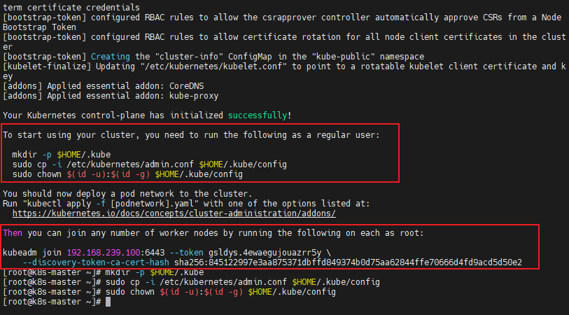

```bash
mkdir -p $HOME/.kube
sudo cp -i /etc/kubernetes/admin.conf $HOME/.kube/config
sudo chown $(id -u):$(id -g) $HOME/.kube/config
```

执行完成之后，我们执行命令看下，当前节点信息。

```bash
kubectl get nodes
```

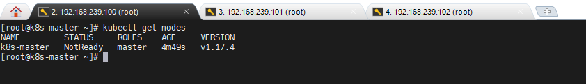

那么 k8s-node-1 节点、和 k8s-node-2 节点如何加入进来呢？

<div style="border: 1px solid rgba(255, 165, 0,.1);
    padding: 10px;
    border-left: 5px solid rgba(255, 165, 0);
    background: rgba(255, 165, 0,.1);
    border-radius: 0 3px 3px 0;
    color: rgba(255, 165, 0);
    font-family: menlo;
    font-size: 12px;
    margin: 10px 0;
    display: flex;
    align-items: center;
    gap: 8px;">
    <svg viewBox="0 0 24 24" width="14px" height="14px" fill="none" style="flex-shrink: 0;" xmlns="http://www.w3.org/2000/svg">
    <path d="M12 8.00008V12.0001M12 16.0001H12.01M3 7.94153V16.0586C3 16.4013 3 16.5726 3.05048 16.7254C3.09515 16.8606 3.16816 16.9847 3.26463 17.0893C3.37369 17.2077 3.52345 17.2909 3.82297 17.4573L11.223 21.5684C11.5066 21.726 11.6484 21.8047 11.7985 21.8356C11.9315 21.863 12.0685 21.863 12.2015 21.8356C12.3516 21.8047 12.4934 21.726 12.777 21.5684L20.177 17.4573C20.4766 17.2909 20.6263 17.2077 20.7354 17.0893C20.8318 16.9847 20.9049 16.8606 20.9495 16.7254C21 16.5726 21 16.4013 21 16.0586V7.94153C21 7.59889 21 7.42756 20.9495 7.27477C20.9049 7.13959 20.8318 7.01551 20.7354 6.91082C20.6263 6.79248 20.4766 6.70928 20.177 6.54288L12.777 2.43177C12.4934 2.27421 12.3516 2.19543 12.2015 2.16454C12.0685 2.13721 11.9315 2.13721 11.7985 2.16454C11.6484 2.19543 11.5066 2.27421 11.223 2.43177L3.82297 6.54288C3.52345 6.70928 3.37369 6.79248 3.26463 6.91082C3.16816 7.01551 3.09515 7.13959 3.05048 7.27477C3 7.42756 3 7.59889 3 7.94153Z" fill="none" stroke="currentColor" stroke-width="2" stroke-linecap="round" stroke-linejoin="round">
    </path>
</svg>
    <span style="line-height: 16px;">下面的操作只需要在 k8s-node-1、k8s-node-2 节点上执行即可。</span>
</div>

```bash
kubeadm join 192.168.239.100:6443 --token 9fx1nm.7dv7fgdb05cb3tyr --discovery-token-ca-cert-hash sha256:845122997e3aa875371dbffd849374b0d75aa62844ffe70666d4fd9acd5d50e2
```

如果这个命令忘记了怎么办呢，通过以下命令找回。

```bash
# 列出所有 token
kubeadm token list
 
 # 使用已有的 token 生成 join 命令（不创建新 token）
kubeadm token create --print-join-command --dry-run

# 使用现有 token 生成 join 命令（会创建新的 token）
kubeadm token create --ttl 0 --print-join-command
```

或者一次性解决：

```bash
# 先删除所有现有 token
kubeadm token list | grep -v "TOKEN" | awk '{print $1}' | xargs -n 1 kubeadm token delete
# 然后创建唯一的新 token
kubeadm token create --ttl 0 --description "Primary join token" --print-join-command
```

两个 node 节点加入后，我们在 k8s-master 节点看一下现在的节点列表，此时的集群状态为 `NotReady`，这是因为还没有配置网络插件。

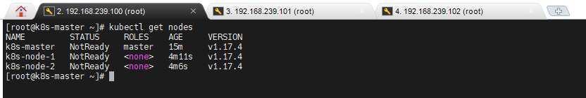

### 安装网络插件

Kubernetes 支持多种网络插件，比如 flannel、calico、canal 等等，任选一种使用即可，本次选择 flannel 。

<div style="border: 1px solid rgba(255, 165, 0,.1);
    padding: 10px;
    border-left: 5px solid rgba(255, 165, 0);
    background: rgba(255, 165, 0,.1);
    border-radius: 0 3px 3px 0;
    color: rgba(255, 165, 0);
    font-family: menlo;
    font-size: 12px;
    margin: 10px 0;
    display: flex;
    align-items: center;
    gap: 8px;">
    <svg viewBox="0 0 24 24" width="14px" height="14px" fill="none" style="flex-shrink: 0;" xmlns="http://www.w3.org/2000/svg">
    <path d="M12 8.00008V12.0001M12 16.0001H12.01M3 7.94153V16.0586C3 16.4013 3 16.5726 3.05048 16.7254C3.09515 16.8606 3.16816 16.9847 3.26463 17.0893C3.37369 17.2077 3.52345 17.2909 3.82297 17.4573L11.223 21.5684C11.5066 21.726 11.6484 21.8047 11.7985 21.8356C11.9315 21.863 12.0685 21.863 12.2015 21.8356C12.3516 21.8047 12.4934 21.726 12.777 21.5684L20.177 17.4573C20.4766 17.2909 20.6263 17.2077 20.7354 17.0893C20.8318 16.9847 20.9049 16.8606 20.9495 16.7254C21 16.5726 21 16.4013 21 16.0586V7.94153C21 7.59889 21 7.42756 20.9495 7.27477C20.9049 7.13959 20.8318 7.01551 20.7354 6.91082C20.6263 6.79248 20.4766 6.70928 20.177 6.54288L12.777 2.43177C12.4934 2.27421 12.3516 2.19543 12.2015 2.16454C12.0685 2.13721 11.9315 2.13721 11.7985 2.16454C11.6484 2.19543 11.5066 2.27421 11.223 2.43177L3.82297 6.54288C3.52345 6.70928 3.37369 6.79248 3.26463 6.91082C3.16816 7.01551 3.09515 7.13959 3.05048 7.27477C3 7.42756 3 7.59889 3 7.94153Z" fill="none" stroke="currentColor" stroke-width="2" stroke-linecap="round" stroke-linejoin="round">
    </path>
</svg>
    <span style="line-height: 16px;">下面操作依旧只在 master 节点执行即可，插件使用的是 DaemonSet 的控制器，它会在每个节点上都运行。</span>
</div>

```bash
# 获取 fannel 的配置文件
wget https://raw.githubusercontent.com/coreos/flannel/master/Documentation/kube-flannel.yml
```

修改文件中 `ghcr.io` 仓库为 `quay-mirror.qiniu.com `，如果你会科学上网，也可以跳过。

```bash
# 查找并显示行号及前后内容
grep -n -A 2 -B 2 "ghcr.io" kube-flannel.yml
# 编辑 yml 文件
vi kube-flannel.yml
```

或者所有的节点配置镜像代理。

```bash
# 配置代理
cat <<EOF > /etc/docker/daemon.json
{
  "exec-opts": ["native.cgroupdriver=systemd"],
  "registry-mirrors": [
	"https://docker.1ms.run",
	"https://docker.xuanyuan.me",
  	"https://docker.m.daocloud.io",
    "https://dockerproxy.net",
    "https://docker.mirrors.ustc.edu.cn",
    "https://hub-mirror.c.163.com",
    "https://registry.docker-cn.com"
  ]
}
EOF

# 重启 Docker
systemctl daemon-reload
systemctl restart docker
```

使用配置文件启动 fannel 。

```bash
kubectl apply -f kube-flannel.yml
```

稍等片刻，再次查看集群节点的状态。

```bash
kubectl get nodes
```

如果发现状态依旧为 `NotReady` ，多半是镜像拉取失败了，具体执行以下命令核验。

```bash
kubectl get pods --all-namespaces
```

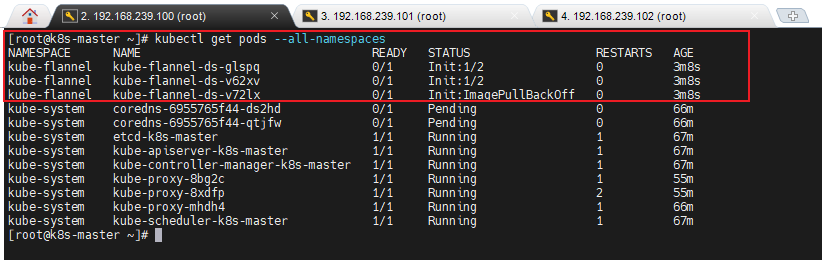

删除所有 Flannel Pod（推荐）

```bash
# 删除所有 Flannel Pod（DaemonSet 会自动重新创建）
kubectl delete pods -n kube-flannel --all
```

或者直接删除命名空间。

```bash
# 删除整个 Flannel 命名空间（会删除所有相关资源）
kubectl delete namespace kube-flannel

# 等待删除完成
kubectl get namespaces

# 检查是否还有残留资源
kubectl get all -n kube-flannel

# 如果有残留，强制删除命名空间
kubectl delete namespace kube-flannel --force --grace-period=0
```

我这里通过科学上网的方式，将 `kube-flannel.yml` 文件中需要的镜像全都拉下来了（三台虚机服务都需要镜像），最后重新执行以下命令。

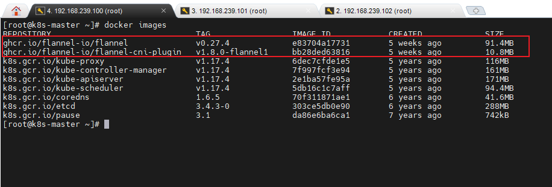

```bash
kubectl apply -f kube-flannel.yml
```

稍等片刻，再次查看集群节点的状态。

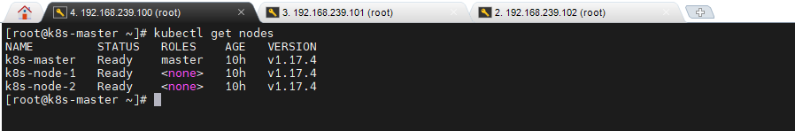

至此，Kubernetes 的集群环境搭建完成。

## 服务部署

接下来在 Kubernetes 集群中部署一个 Nginx 程序，测试下集群是否在正常工作。

<div style="border: 1px solid rgba(255, 165, 0,.1);
    padding: 10px;
    border-left: 5px solid rgba(255, 165, 0);
    background: rgba(255, 165, 0,.1);
    border-radius: 0 3px 3px 0;
    color: rgba(255, 165, 0);
    font-family: menlo;
    font-size: 12px;
    margin: 10px 0;
    display: flex;
    align-items: center;
    gap: 8px;">
    <svg viewBox="0 0 24 24" width="14px" height="14px" fill="none" style="flex-shrink: 0;" xmlns="http://www.w3.org/2000/svg">
    <path d="M12 8.00008V12.0001M12 16.0001H12.01M3 7.94153V16.0586C3 16.4013 3 16.5726 3.05048 16.7254C3.09515 16.8606 3.16816 16.9847 3.26463 17.0893C3.37369 17.2077 3.52345 17.2909 3.82297 17.4573L11.223 21.5684C11.5066 21.726 11.6484 21.8047 11.7985 21.8356C11.9315 21.863 12.0685 21.863 12.2015 21.8356C12.3516 21.8047 12.4934 21.726 12.777 21.5684L20.177 17.4573C20.4766 17.2909 20.6263 17.2077 20.7354 17.0893C20.8318 16.9847 20.9049 16.8606 20.9495 16.7254C21 16.5726 21 16.4013 21 16.0586V7.94153C21 7.59889 21 7.42756 20.9495 7.27477C20.9049 7.13959 20.8318 7.01551 20.7354 6.91082C20.6263 6.79248 20.4766 6.70928 20.177 6.54288L12.777 2.43177C12.4934 2.27421 12.3516 2.19543 12.2015 2.16454C12.0685 2.13721 11.9315 2.13721 11.7985 2.16454C11.6484 2.19543 11.5066 2.27421 11.223 2.43177L3.82297 6.54288C3.52345 6.70928 3.37369 6.79248 3.26463 6.91082C3.16816 7.01551 3.09515 7.13959 3.05048 7.27477C3 7.42756 3 7.59889 3 7.94153Z" fill="none" stroke="currentColor" stroke-width="2" stroke-linecap="round" stroke-linejoin="round">
    </path>
</svg>
    <span style="line-height: 16px;">下面操作依旧只在 master 节点执行即可。</span>
</div>

1. 部署 Nginx

```bash
# 查看 nginx 可用版本
docker search nginx --limit 10
# 创建 Deployment（管理 Pod 的副本） 
kubectl create deployment nginx --image=nginx:alpine
```

2. 暴露端口

```bash
# 显式创建 Service 来暴露 Deployment
kubectl expose deployment nginx --port=80 --type=NodePort
```

3. 查看服务状态

```bash
# 获取 pods 及 service 状态
kubectl get pods,service

# 检查错误原因
kubectl describe pod nginx-5b6fb6dd96-lfpdb

# 如果部署失败，可以删除
kubectl delete deployment nginx
kubectl delete service nginx
```

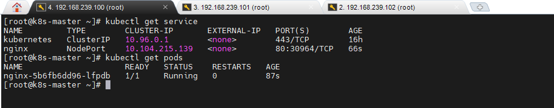

4. 最后访问部署的 Nginx 服务

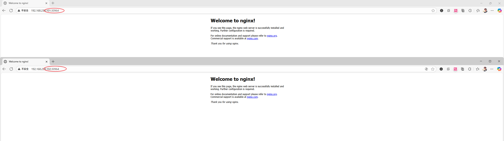
