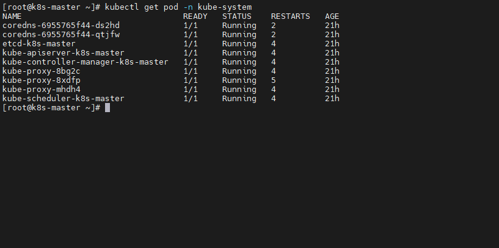
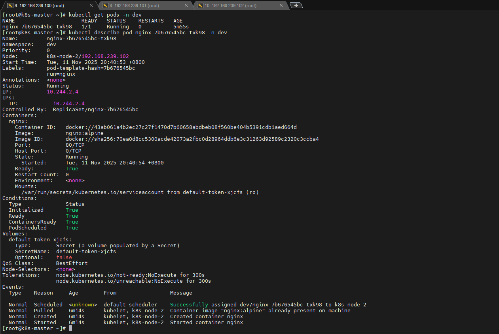
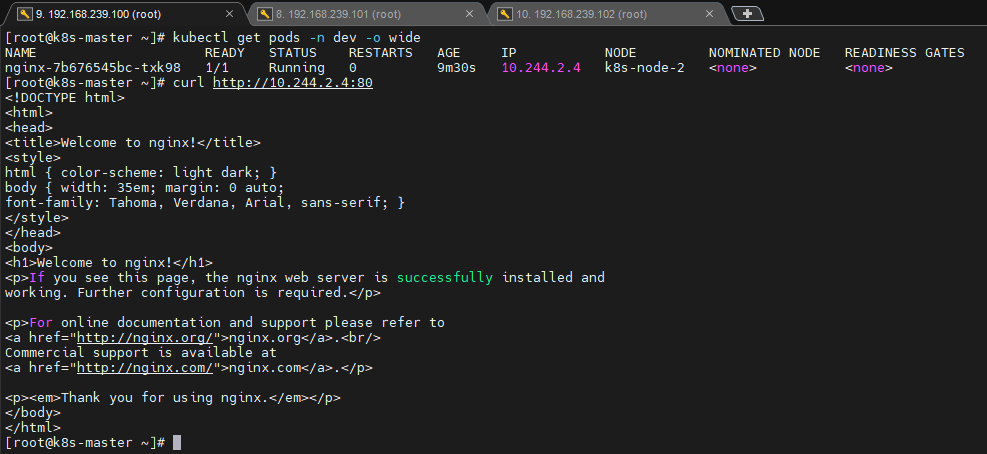
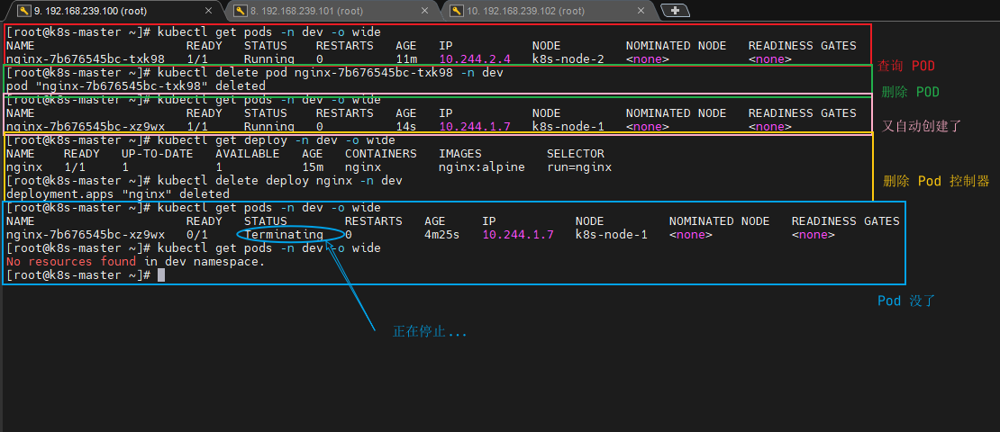

<div style="width:100%;display:flex;"></div>

本章节将介绍如何在 Kubernetes 集群中部署一个 Nginx 服务，并且能够对其进行访问。

## Namespace

Namespace 是 Kubernetes 系统中的一种非常重要资源，它的主要作用是用来实现 **多套环境的资源隔离** 或者 **多租户的资源隔离** 。

默认情况下，Kubernetes 集群中的所有的Pod都是可以相互访问的。但是在实际中，可能不想让两个 Pod 之间进行互相的访问，那此时就可以将两个 Pod 划分到不同的namespace 下。Kubernetes 通过将集群内部的资源分配到不同的 Namespace 中，可以形成逻辑上的 “组”，以方便不同的组的资源进行隔离使用和管理。

可以通过 Kubernetes 的授权机制，将不同的 namespace 交给不同租户进行管理，这样就实现了多租户的资源隔离。此时还能结合 Kubernetes 的资源配额机制，限定不同租户能占用的资源，例如 CPU 使用量、内存使用量等等，来实现租户可用资源的管理。


在集群启动之后，会默认创建几个 namespace 。

```bash
kubectl get namespace
```

输出：

```bash
NAME              STATUS   AGE
default           Active   18h
kube-node-lease   Active   18h
kube-public       Active   18h
kube-system       Active   18h
```

这些命名空间的作用各有不同，承担了不同的职责。

- **default：** 所有未指定 Namespace 的对象都会被分配在 `default` 命名空间

- **kube-node-lease：** 集群节点之间的心跳维护，v1.13 开始引入

- **kube-public：** 此命名空间下的资源可以被所有人访问（包括未认证用户）

- **kube-system：** 所有由 Kubernetes 系统创建的资源都处于这个命名空间

下面来看 namespace 资源的具体操作。

### 查看

#### 查看所有的 ns

```bash
kubectl get ns
```

#### 查看指定的 ns

```bash
kubectl get ns <ns名称>

# 例如：
kubectl get ns dafault
```

#### 指定输出格式

Kubernetes 支持的格式有很多，比较常见的是 wide 、json 、yaml

```bash
kubectl get ns <ns名称>  -o yaml

# 例如：
kubectl get ns default -o yaml
```

#### 查看 ns 详情

```bash
kubectl describe ns <ns名称>

# 例如:
kubectl describe ns default
```

### 创建

```bash
kubectl create ns <ns名称>

# 例如:
kubectl create ns dev
```

### 删除

```bash
kubectl delete ns <ns名称>

# 例如:
kubectl delete ns dev
```

### 通过配置方式操作

首先准备一个 YAML 文件 ns-dev.yaml ，执行以下命令。

```bash
cat <<EOF > ns-dev.yaml
apiVersion: v1
kind: Namespace
metadata:
  name: dev
EOF
```

#### 创建

```bash
kubectl create -f ns-dev.yaml

# 查询，验证是否创建
kubectl get ns
```

#### 删除

```bash
kubectl delete -f ns-dev.yaml

# 查询，验证是否删除
kubectl get ns
```

## Pod

Pod 是 Kubernetes 集群进行管理的最小单元，程序要运行必须部署在容器中，而容器必须存在于 Pod 中。

Pod 可以认为是容器的封装，一个 Pod 中可以存在一个或者多个容器。


Kubernetes 在集群启动之后，集群中的各个组件也都是以 Pod 方式运行的，可以通过下面命令查看。

```bash
kubectl get pod -n kube-system
```



### 创建并运行

Kubernetes 没有提供单独运行 Pod 的命令，都是通过 Pod 控制器来实现的。

命令格式： 

```bash
kubectl run (pod控制器名称) [参数]
```

例：

```bash
# --image  指定Pod的镜像
# --port   指定端口
# --namespace  指定namespace
kubectl run nginx --image=nginx:alpine --port=80 --namespace dev
```

### 查看 Pod 信息

```bash
# 查看 Pod 基本信息
kubectl get pods -n dev

# 查看 Pod 详细信息
kubectl describe pod nginx-7b676545bc-txk98 -n dev
```



### 访问 Pod

```bash
# 获取 POD 的 IP 地址
kubectl get pods -n dev -o wide

# 访问 POD
curl http://10.244.2.4:80
```



### 删除指定 Pod

```bash
# 删除指定 POD
kubectl delete pod nginx-7b676545bc-txk98 -n dev

# 此时，显示删除Pod成功，但是再查询，发现又新产生了一个
kubectl get pods -n dev -o wide

# 这是因为当前Pod是由Pod控制器创建的，控制器会监控 Pod 状况，一旦发现 Pod 死亡，会立即重建
# 此时要想删除 Pod，必须删除 Pod 控制器
# 查询一下当前 namespace 下的 Pod 控制器
kubectl get deploy -n dev -o wide

# 删除此 Pod 控制器
kubectl delete deploy nginx -n dev

# 稍等片刻，再查询 Pod，发现 Pod 被删除了
kubectl get pods -n dev -o wide
```



### 通过配置方式操作

通过执行以下命令，会创建一个 pod-nginx.yaml 文件并写入相关内容。

```bash
cat <<EOF > pod-nginx.yaml
apiVersion: v1
kind: Pod
metadata:
  name: nginx
  namespace: dev
spec:
  containers:
  - image: nginx:alpine
    name: pod
    ports:
    - name: nginx-port
      containerPort: 80
      protocol: TCP
EOF
```

#### 创建

```bash
kubectl create -f pod-nginx.yaml
```

这个时候，Nginx 服务是无法访问的，因为我们并没有创建 service 去暴露 deployment 。


#### 删除

```bash
kubectl delete -f pod-nginx.yaml
```

## Label

Label 是 Kubernetes 系统中的一个重要概念。它的作用就是在资源上添加标识，用来对它们进行区分和选择。

Label 的特点：

- 一个 Label 会以 `key/value` 键值对的形式附加到各种对象上，如 Node 、 Pod 、Service 等；
- 一个资源对象可以定义任意数量的 Label ，同一个 Label 也可以被添加到任意数量的资源对象上去；
- Label 通常在资源对象定义时确定，当然也可以在对象创建后动态添加或者删除；

可以通过 Label 实现资源的多维度分组，以便灵活、方便地进行资源分配、调度、配置、部署等管理工作。

> **🤓 说明：**
>
> 一些常用的 Label 示例如下：
>
> - 版本标签：
>   - "version":"release"
>   - "version":"stable"
>   - ...
> - 环境标签：
>   - "environment":"dev"
>   - "environment":"prod"
>   - "environment":"test"
>   - ...
> - 架构标签：
>   - "tier":"frontend"
>   - "tier":"backend"
>   - ...

标签定义完毕之后，还要考虑到标签的选择，这就要使用到 Label Selector，二者概念区别如下。

- Label 用于给某个资源对象定义标识；
- Label Selector 用于查询和筛选拥有某些标签的资源对象；

当前有两种 Label Selector：

- 基于等式的 Label Selector

> **name=slave：** 选择所有包含 Label 中 `key="name"` 且 `value="slave"` 的对象
>
> **env!=production：** 选择所有包括 Label 中的 `key="env"` 且 `value!="production"` 的对象

- 基于集合的 Label Selector

> **name in (master, slave)：** 选择所有包含 Label 中的 `key="name"` 且 `value="master"` 或 `"slave"` 的对象
>
> **name not in (frontend)：** 选择所有包含 Label 中的 `key="name"` 且 `value` 不等于 `"frontend"` 的对象

标签的选择条件可以使用多个，此时将多个 Label Selector 进行组合，使用逗号 `,` 进行分隔即可。

例如：

```bash
name=slave,env!=production
name not in (frontend),env!=production
```

### 命令方式

```bash
# 为 Pod 资源打标签
kubectl label pod nginx version=1.0 -n dev

# 为 Pod 资源更新标签
kubectl label pod nginx version=2.0 -n dev --overwrite

# 查看 Pod 标签
kubectl get pod nginx -n dev --show-labels

# 通过标签筛选 Pods
kubectl get pod -n dev -l version=2.0  --show-labels
kubectl get pod -n dev -l version!=2.0 --show-labels

# 删除 Pod 资源标签
kubectl label pod nginx-pod version- -n dev
```

### 配置方式

执行下面的命令，新建 YAML 文件并写入内容。

```bash
cat <<EOF > pod-nginx.yaml
apiVersion: v1
kind: Pod
metadata:
  name: nginx
  namespace: dev
  labels:
    version: "3.0" 
    env: "test"
spec:
  containers:
  - image: nginx:alpine
    name: pod
    ports:
    - name: nginx-port
      containerPort: 80
      protocol: TCP
EOF
```

执行以下命令更新标签。

```bash
kubectl apply -f pod-nginx.yaml
```

## Deployment

在 Kubernetes 中，Pod 是最小的控制单元，但是 Kubernetes 很少直接控制 Pod ，一般都是通过 Pod 控制器来完成的。Pod 控制器用于 pod 的管理，确保 pod 资源符合预期的状态，当 pod 的资源出现故障时，会尝试进行重启或重建 pod 。

在 Kubernetes 中 Pod 控制器的种类有很多，本章节只介绍一种：Deployment 。


### 命令方式

```bash
# 命令格式: kubectl run deployment 名称 [参数] 
# --image     指定 pod 的镜像
# --port      指定端口
# --replicas  指定创建 pod 数量
# --namespace 指定 namespace
kubectl run nginx --image=nginx:alpine --port=80 --replicas=3 -n dev

# 查看创建的Pod
kubectl get pods -n dev

# 查看 deployment 的信息
kubectl get deploy -n dev

# UP-TO-DATE：成功升级的副本数量
# AVAILABLE：可用副本的数量
kubectl get deploy -n dev -o wide

# 查看deployment的详细信息
kubectl describe deploy nginx -n dev

# 删除 
kubectl delete deploy nginx -n dev
```

### 配置方式

执行下面的命令，新建 YAML 文件并写入内容。

```bash
cat <<EOF > deploy-nginx.yaml
apiVersion: apps/v1
kind: Deployment
metadata:
  name: nginx
  namespace: dev
spec:
  replicas: 3
  selector:
    matchLabels:
      run: nginx
  template:
    metadata:
      labels:
        run: nginx
    spec:
      containers:
      - image: nginx:alpine
        name: nginx
        ports:
        - containerPort: 80
          protocol: TCP
EOF
```

#### 创建

```bash
kubectl create -f deploy-nginx.yaml
```

#### 删除

```bash
kubectl delete -f deploy-nginx.yaml
```

## Service

经过上面的学习，我们已经能够利用Deployment来创建一组 Pod 来提供具有高可用性的服务。

虽然每个Pod都会分配一个单独的 Pod IP，然而却存在如下两问题：

- Pod IP 会随着 Pod 的重建产生变化
- Pod IP 仅仅是集群内可见的虚拟 IP，外部无法访问

这样对于访问这个服务带来了难度，因此，Kubernetes 设计了 Service 来解决这个问题。

Service 可以看作是一组同类 Pod **对外的访问接口** ，借助 Service，应用可以方便地实现服务发现和负载均衡。


### 命令方式

#### 创建集群内部可访问的 Service

```bash
# 暴露 Service
kubectl expose deploy nginx --name=svc-nginx --type=ClusterIP --port=80 --target-port=80 -n dev

# 查看 service
kubectl get svc svc-nginx -n dev -o wide

# 这里产生了一个 CLUSTER-IP，这就是 service 的 IP，在 Service 的生命周期中，这个地址是不会变动的
# 可以通过这个 IP 访问当前 service 对应的 POD
curl 10.109.179.231:80
```

#### 创建集群外部也可访问的 Service

<div style="border: 1px solid rgba(255, 165, 0,.1);
    padding: 10px;
    border-left: 5px solid rgba(255, 165, 0);
    background: rgba(255, 165, 0,.1);
    border-radius: 0 3px 3px 0;
    color: rgba(255, 165, 0);
    font-family: menlo;
    font-size: 12px;
    margin: 10px 0;
    display: flex;
    align-items: center;
    gap: 8px;">
    <svg viewBox="0 0 24 24" width="14px" height="14px" fill="none" style="flex-shrink: 0;" xmlns="http://www.w3.org/2000/svg">
    <path d="M12 8.00008V12.0001M12 16.0001H12.01M3 7.94153V16.0586C3 16.4013 3 16.5726 3.05048 16.7254C3.09515 16.8606 3.16816 16.9847 3.26463 17.0893C3.37369 17.2077 3.52345 17.2909 3.82297 17.4573L11.223 21.5684C11.5066 21.726 11.6484 21.8047 11.7985 21.8356C11.9315 21.863 12.0685 21.863 12.2015 21.8356C12.3516 21.8047 12.4934 21.726 12.777 21.5684L20.177 17.4573C20.4766 17.2909 20.6263 17.2077 20.7354 17.0893C20.8318 16.9847 20.9049 16.8606 20.9495 16.7254C21 16.5726 21 16.4013 21 16.0586V7.94153C21 7.59889 21 7.42756 20.9495 7.27477C20.9049 7.13959 20.8318 7.01551 20.7354 6.91082C20.6263 6.79248 20.4766 6.70928 20.177 6.54288L12.777 2.43177C12.4934 2.27421 12.3516 2.19543 12.2015 2.16454C12.0685 2.13721 11.9315 2.13721 11.7985 2.16454C11.6484 2.19543 11.5066 2.27421 11.223 2.43177L3.82297 6.54288C3.52345 6.70928 3.37369 6.79248 3.26463 6.91082C3.16816 7.01551 3.09515 7.13959 3.05048 7.27477C3 7.42756 3 7.59889 3 7.94153Z" fill="none" stroke="currentColor" stroke-width="2" stroke-linecap="round" stroke-linejoin="round">
    </path>
</svg>
    <span style="line-height: 16px;">上面创建的 Service 的 type 类型为 ClusterIP，这个 ip 地址只有集群内部可访问，如果需要创建外部也可以访问的 Service，需要修改 type 为 NodePort。</span>
</div>

```bash
# 上面创建的 Service 的 type 类型为 ClusterIP，这个 ip 地址只有集群内部可访问，如果需要创建外部也可以访问的 Service，需要修改 type 为 NodePort。
kubectl expose deploy nginx --name=svc-nginx --type=NodePort --port=80 --target-port=80 -n dev

# 此时查看，会发现出现了 NodePort 类型的Service，而且有一对 Port（80:31928/TC）
kubectl get svc  svc-nginx-1  -n dev -o wide

# 接下来就可以通过集群外的主机访问  节点IP:32525 访问服务了
# 例如在的电脑主机上通过浏览器访问下面的地址
http://192.168.239.100:32525/
```

#### 删除 Service

```bash
kubectl delete svc svc-nginx -n dev
```

### 配置方式

执行下面的命令，新建 YAML 文件并写入内容。

```bash
cat <<EOF > service-nginx.yaml
apiVersion: v1
kind: Service
metadata:
  name: svc-nginx
  namespace: dev
spec:
  clusterIP: 10.109.179.231
  ports:
  - port: 80
    protocol: TCP
    targetPort: 80
    nodePort: 32080
  selector:
    run: nginx
  type: NodePort
EOF
```

#### 创建

```bash
kubectl create -f service-nginx.yaml
```

#### 删除

```bash
kubectl delete -f service-nginx.yaml
```

## 小结

至此，已经掌握了 Namespace 、Pod 、Deployment 、Service 资源的基本操作。有了这些操作，就可以在 Kubernetes 集群中实现一个服务的简单部署和访问了，但是如果想要更好的使用 Kubernetes，就需要深入学习这几种资源的细节和原理。
