## 四种操作 Oracle 数据库的方式

无论是为了以后的就业亦或者是现在的学习，我们都或多或少的了解下常见的操作 Oracle 数据库的方式，简单的列一下（但不限于这些）：

- 通过 SQL 命令行方式，如 Oracle 自带的 SQLPlus 工具；
- 浏览器方式，如基于 Web 的企业管理器 OEM；
- SQL Developer 工具
- PL/SQL Developer 工具
- ...其他工具（如 Navicat、Datagrip 等，此处不作重点介绍）

## SQLPlus 的常用命令

下面简单的罗列一些 sqlplus 工具的常用命令：

- **connect：** 用于切换连接用户，可以简写为  `conn` ；

- **show user：** 显示当前登录的用户；
- **host <dos命令>：** 执行操作系统的命令；
- **spool：** 用于导出记录到文本；
- **clear screen：** 清屏；
- **start xx.sql：** 执行文件系统中的 sql 语句（start 命令等同于  `@` ，即  `@xx.sql` ）；
- **desc <表名>：** 显示表结构；
- **show error：** 显示错误信息；

## 使用系统用户登录 Oracle

### Oracle 中默认的系统用户

<div style="border: 1px solid rgba(254, 40, 87,.1);
    padding: 10px;
    border-left: 5px solid rgba(254, 40, 87);
    background: rgba(254, 40, 87,.1);
    border-radius: 0 3px 3px 0;
    color:rgba(254, 40, 87);
    font-family: menlo;
    font-size: 12px;
    margin: 10px 0;
    display: flex;
    align-items: center;
    gap: 8px;">
    <svg viewBox="0 0 24 24" style="flex-shrink: 0;" width="14px" height="14px" fill="none" xmlns="http://www.w3.org/2000/svg" class="MuiSvgIcon-root MuiSvgIcon-fontSizeSmall css-8l52ux" focusable="false" aria-hidden="true" data-testid="ErrorIcon"><path d="M12 8.00008V12.0001M12 16.0001H12.01M3 7.94153V16.0586C3 16.4013 3 16.5726 3.05048 16.7254C3.09515 16.8606 3.16816 16.9847 3.26463 17.0893C3.37369 17.2077 3.52345 17.2909 3.82297 17.4573L11.223 21.5684C11.5066 21.726 11.6484 21.8047 11.7985 21.8356C11.9315 21.863 12.0685 21.863 12.2015 21.8356C12.3516 21.8047 12.4934 21.726 12.777 21.5684L20.177 17.4573C20.4766 17.2909 20.6263 17.2077 20.7354 17.0893C20.8318 16.9847 20.9049 16.8606 20.9495 16.7254C21 16.5726 21 16.4013 21 16.0586V7.94153C21 7.59889 21 7.42756 20.9495 7.27477C20.9049 7.13959 20.8318 7.01551 20.7354 6.91082C20.6263 6.79248 20.4766 6.70928 20.177 6.54288L12.777 2.43177C12.4934 2.27421 12.3516 2.19543 12.2015 2.16454C12.0685 2.13721 11.9315 2.13721 11.7985 2.16454C11.6484 2.19543 11.5066 2.27421 11.223 2.43177L3.82297 6.54288C3.52345 6.70928 3.37369 6.79248 3.26463 6.91082C3.16816 7.01551 3.09515 7.13959 3.05048 7.27477C3 7.42756 3 7.59889 3 7.94153Z" fill="none" stroke="currentColor" stroke-width="2" stroke-linecap="round" stroke-linejoin="round"></path></svg>
    <span style="line-height: 12px;">sys 和 system 在登录 Oracle 工具的时候，sys 只能通过系统管理员 sysdba 或者 sysoper 的权限而登录，而 system 可以直接登录。</span>
</div>

- **sys：** 相当于 SQL Server 中的  `sa`  账号，是一个超级管理员，拥有最大的权限，可以完成数据库的所有管理任务；
- **system：** 没有 sys 账户的权限大，通常用于创建一些用于查看管理信息的表或者视图，同样也不建议使用 system 架构来创建一些与管理无关的表或者视图；

- **sysman：** 是 Oracle 数据库中用于 EM 管理的用户，如果你不使用该用户，也可以删除；
- **scott：** 是 Oracle 提供的实例用户，里面存在一些供初学者学习操作的表，其默认口令为 `tiger` 。

### Oracle 用户登录的语法格式

<div style="border: 1px solid rgba(255, 165, 0,.1);
    padding: 10px;
    border-left: 5px solid rgba(255, 165, 0);
    background: rgba(255, 165, 0,.1);
    border-radius: 0 3px 3px 0;
    color: rgba(255, 165, 0);
    font-family: menlo;
    font-size: 12px;
    margin: 10px 0;
    display: flex;
    align-items: center;
    gap: 8px;">
    <svg viewBox="0 0 24 24" width="14px" height="14px" fill="none" style="flex-shrink: 0;" xmlns="http://www.w3.org/2000/svg">
    <path d="M12 8.00008V12.0001M12 16.0001H12.01M3 7.94153V16.0586C3 16.4013 3 16.5726 3.05048 16.7254C3.09515 16.8606 3.16816 16.9847 3.26463 17.0893C3.37369 17.2077 3.52345 17.2909 3.82297 17.4573L11.223 21.5684C11.5066 21.726 11.6484 21.8047 11.7985 21.8356C11.9315 21.863 12.0685 21.863 12.2015 21.8356C12.3516 21.8047 12.4934 21.726 12.777 21.5684L20.177 17.4573C20.4766 17.2909 20.6263 17.2077 20.7354 17.0893C20.8318 16.9847 20.9049 16.8606 20.9495 16.7254C21 16.5726 21 16.4013 21 16.0586V7.94153C21 7.59889 21 7.42756 20.9495 7.27477C20.9049 7.13959 20.8318 7.01551 20.7354 6.91082C20.6263 6.79248 20.4766 6.70928 20.177 6.54288L12.777 2.43177C12.4934 2.27421 12.3516 2.19543 12.2015 2.16454C12.0685 2.13721 11.9315 2.13721 11.7985 2.16454C11.6484 2.19543 11.5066 2.27421 11.223 2.43177L3.82297 6.54288C3.52345 6.70928 3.37369 6.79248 3.26463 6.91082C3.16816 7.01551 3.09515 7.13959 3.05048 7.27477C3 7.42756 3 7.59889 3 7.94153Z" fill="none" stroke="currentColor" stroke-width="2" stroke-linecap="round" stroke-linejoin="round">
    </path>
</svg>
    <span style="line-height: 16px;">后续关于 oracle 中对于密码的说法，我们都称呼为 口令。</span>
</div>

1. 登录目标用户

```shell
conn 用户/口令 @实例名 as [sysdba | sysoper]
```

**示例：** 

```sh
# 若未解锁状态下直接连接
SQL> conn scott/scott
ERROR: ORA-28000: the account is locked
# 解锁用户
SQL> alter user scott account unlock;
User altered.
# 连接用户
SQL> conn scott/scott;
Connected.
```

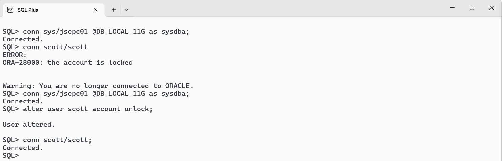

2. 启用 scott 用户

<div style="border: 1px solid rgba(255, 165, 0,.1);
    padding: 10px;
    border-left: 5px solid rgba(255, 165, 0);
    background: rgba(255, 165, 0,.1);
    border-radius: 0 3px 3px 0;
    color: rgba(255, 165, 0);
    font-family: menlo;
    font-size: 12px;
    margin: 10px 0;
    display: flex;
    align-items: center;
    gap: 8px;">
    <svg viewBox="0 0 24 24" width="14px" height="14px" fill="none" style="flex-shrink: 0;" xmlns="http://www.w3.org/2000/svg">
    <path d="M12 8.00008V12.0001M12 16.0001H12.01M3 7.94153V16.0586C3 16.4013 3 16.5726 3.05048 16.7254C3.09515 16.8606 3.16816 16.9847 3.26463 17.0893C3.37369 17.2077 3.52345 17.2909 3.82297 17.4573L11.223 21.5684C11.5066 21.726 11.6484 21.8047 11.7985 21.8356C11.9315 21.863 12.0685 21.863 12.2015 21.8356C12.3516 21.8047 12.4934 21.726 12.777 21.5684L20.177 17.4573C20.4766 17.2909 20.6263 17.2077 20.7354 17.0893C20.8318 16.9847 20.9049 16.8606 20.9495 16.7254C21 16.5726 21 16.4013 21 16.0586V7.94153C21 7.59889 21 7.42756 20.9495 7.27477C20.9049 7.13959 20.8318 7.01551 20.7354 6.91082C20.6263 6.79248 20.4766 6.70928 20.177 6.54288L12.777 2.43177C12.4934 2.27421 12.3516 2.19543 12.2015 2.16454C12.0685 2.13721 11.9315 2.13721 11.7985 2.16454C11.6484 2.19543 11.5066 2.27421 11.223 2.43177L3.82297 6.54288C3.52345 6.70928 3.37369 6.79248 3.26463 6.91082C3.16816 7.01551 3.09515 7.13959 3.05048 7.27477C3 7.42756 3 7.59889 3 7.94153Z" fill="none" stroke="currentColor" stroke-width="2" stroke-linecap="round" stroke-linejoin="round">
    </path>
</svg>
    <span style="line-height: 16px;">Oracle 内置的供初学者使用的实例的相关用户默认都是未解锁状态，无法直接使用。</span>
</div>

```shell
alter user <用户名> account unlock;
```

**示例：** 

```sql
SQL> alter user scott account unlock;
User altered.
```

检查下 `scott` 用户下由 Oracle 提供用于学习的四张表。

```sql
SQL> select table_name from user_tables;
TABLE_NAME
------------------------------
SALGRADE
BONUS
EMP
DEPT
```

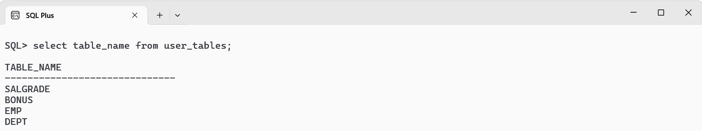

## Oracle 表空间

### 数据库与表空间的关系

表空间实际上是数据库上的逻辑存储结构，可以把表空间理解为在数据库中开辟的一个空间，用于存放我们数据库的对象，一个数据库可以有多个表空间。

### 表空间与数据文件的关系

表空间实际上是由一个或者多个数据库文件构成，数据文件的位置和大小可以由我们自己定义。

### 表空间的分类

Oracle 中，表空间大致有三种类型。

- 永久表空间
- 临时表空间
- UNDO 表空间（也称为：回退表空间）

### 表空间的创建语法

#### 永久表空间

```sql
create tablespace <表空间名称> datafile '<数据文件存放路径>' size 10m;
```

**示例：**

```sql
SQL> create tablespace tbs_temp_001 datafile 'D:\protable\oracle\datafile\tbs_temp_001.dbf' size 10m;
```

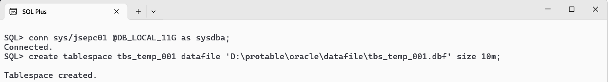

#### 临时表空间

```sql
create temporary tablespace <临时表空间名称> tempfile '<数据文件存放路径>' size 10m;
```

**示例：**

```sql
SQL> create temporary tablespace tbs_temp_002 tempfile 'D:\protable\oracle\tempfile\tbs_temp_002.dbf' size 10m;
Tablespace created.
```

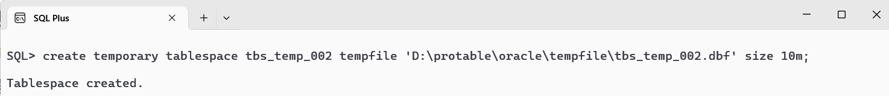

#### 回退表空间

```sql
create undo tablespace <回退表空间名称> datafile '<数据文件存放路径>' size 10m;
```

**示例：**

```sql
SQL> create undo tablespace tbs_temp_003 datafile 'D:\protable\oracle\datafile\tbs_temp_003.dbf' size 10m;
Tablespace created.
```

### 查看表空间

#### 永久表空间

```sql
SELECT file_name, tablespace_name, bytes/1024/1024 as size_mb
FROM dba_data_files 
WHERE tablespace_name LIKE 'TBS%';
```

**示例：**

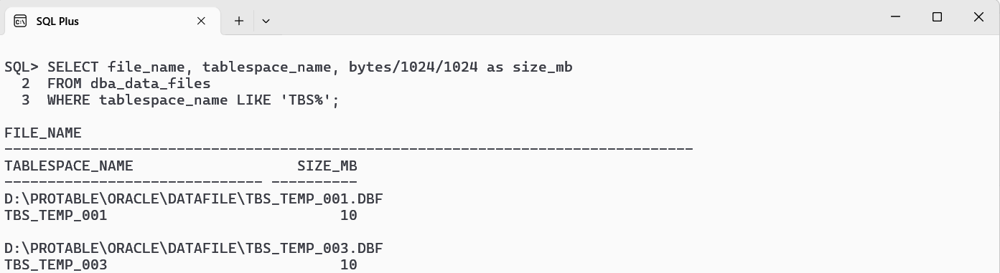

#### 临时表空间

```sql
SELECT file_name, tablespace_name, bytes/1024/1024 as size_mb
FROM dba_temp_files 
WHERE tablespace_name LIKE 'TBS%';
```

**示例：**


#### 回退表空间

- 查询所有回退表空间

```sql
SELECT tablespace_name, status, contents 
FROM dba_tablespaces 
WHERE contents = 'UNDO';
```

**示例：**

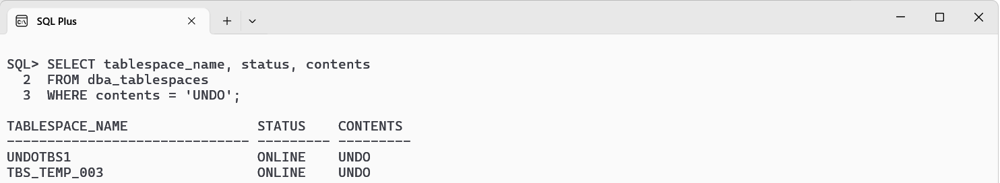

- 查询当前正在使用的回退表空间

```sql
show parameter undo_tablespace;
```

**示例：**

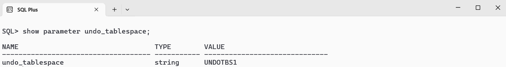

## Oracle 用户管理

### 创建用户

```sql
create user <用户名>
identified by <口令>
default tablespace <表空间名>
temporary tablespace <临时表空间名>;
```

**示例：**

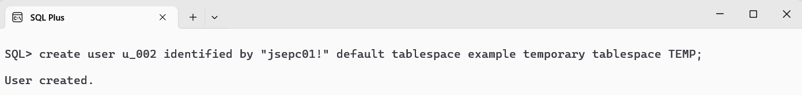

### 连接用户

```sql
conn <用户名>/<口令>
```

**示例：**

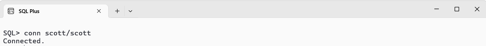

### 用户授权

```sql
grant connect to <用户名>;
```

**示例：**

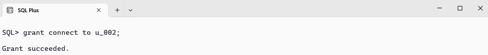

### 删除用户

```sql
drop user <用户名> cascade;
```

**示例：**

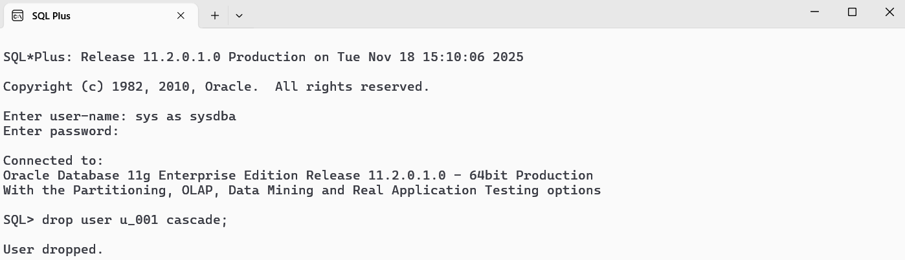

### 修改用户

```sql
alter user <用户名> identified by <口令>;
```

**示例：**

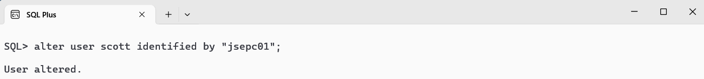

### 锁定用户

```sql
alter user <用户名> account lock;
```

**示例：**

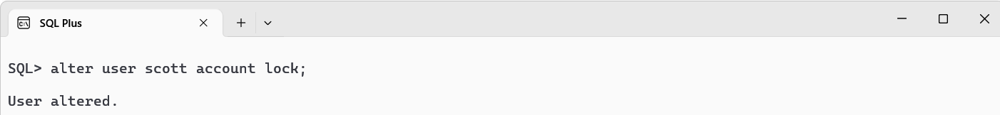

### 解锁用户

```sql
alter user <用户名> account unlock;
```

**示例：**

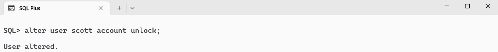

### 查看用户

```sql
select username from dba_users;
```

**示例：**

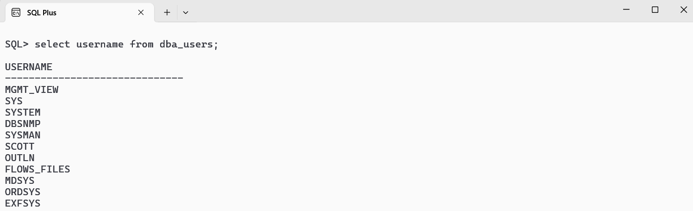
