# Hystrix 服务容错


## 学习目标

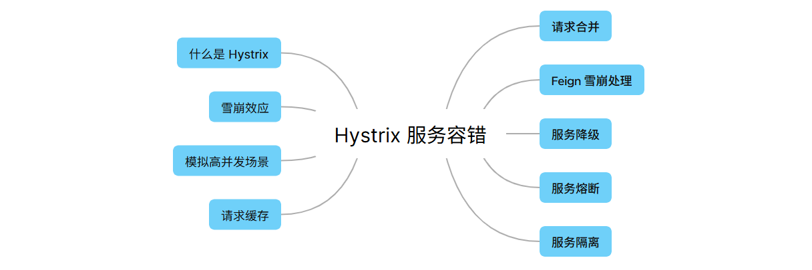

## 什么是 Hystrix

Hystrix 源自 Netflix 团队于 2011 年开始研发，2012 年 Hystrix 不断发展和成熟，Netflix 内部的许多团队都采用了它。如今，每天在 Netflix 上通过 Hystrix 执行数百亿个线程隔离和数千亿个信号隔离的调用，极大的提高了系统的稳定性。

在分布式环境中，不可避免地会有许多服务依赖项中的某些服务失败而导致**雪崩效应**，Hystrix 是一个组件库，可以通过添加等待时间容限和容错逻辑来帮助您控制这些分布式服务之间的访问点，停止服务之间的级联故障并提供后备选项来实现此目的，所有这些都可以提高系统的整体稳定性。

## 雪崩效应

在微服务架构中，一个请求需要调用多个服务是十分常见的。

如客户端访问 A 服务，而 A 服务需要调用 B 服务，B 服务需要调用 C 服务，由于网络波动或服务自身的问题，如果 B 服务或者 C 服务不能及时响应，A 服务将处于请求阻塞状态，直到 B 服务/ C 服务响应。此时如果有大量的请求涌入，容器的线程资源会被消耗完毕，导致服务瘫痪。服务与服务之间的依赖性，故障会传播，造成连锁反应，会对整个微服务系统造成灾难性的严重后果，这就是服务故障的“雪崩”效应。

以下图示完美解释了什么是雪崩效应，当所有服务正常的时候，请求看起来是这样的：


当其中一个服务有延迟时，他可能阻塞整个用户请求：


在高并发的情况下，一个服务的延迟可能导致所有服务器上的所有资源在数秒内饱和。比起服务故障，更糟糕的是这些应用程序还可能导致服务之间的延迟增加，从而备份队列，线程和其他系统资源，进而导致整个系统出现更多的级联故障。


总的来说，造成雪崩的原因可以归结为以下 3 点：

- 服务提供者不可用（硬件故障、程序 BUG、缓存击穿、用户大量请求等）；
- 重试加大流量（用户重试，代码逻辑重试）；
- 服务消费者不可用（同步等待造成的资源耗尽）；

最终的结果就是：一个服务不可用，导致一系列的服务不可用。

## 雪崩效应的解决方案

雪崩是系统中的蝴蝶效应导致，其发生的原因多种多样，从源头我们无法完全杜绝雪崩的发生，但是雪崩的根本原因来源于服务之间的强依赖，所以我们可以提前评估做好服务容错。解决方案大概可以分为以下几种：

- 请求缓存：支持将一个请求与返回结果做缓存处理；
- 请求合并：将相同的请求进行合并然后调用批处理接口；
- 服务隔离：限制调用分布式服务的资源，某一个调用的服务出现问题不会影响其他服务的调用；
- 服务熔断：牺牲局部服务，保全整体系统稳定性的措施；
- 服务降级：服务熔断之后，客户端调用自己本地方法返回缺省值；

## 案例环境准备

我们需要创建一个微服务的聚合项目，并且创建以下几个边缘服务：

- 服务注册中心
- 服务提供者
- 服务消费者

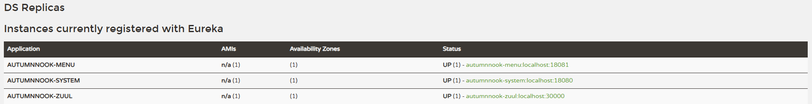

<span style="color:darkred;font-size:11px">注：我们的服务提供者和消费者都没有使用数据源，为了节省时间，返回的都是静态假数据。</span>

## 模拟高并发场景

服务提供者接口添加 `Thread.sleep(2000)` ，模拟服务处理超时。

```java
import com.autumnnook.api.SystemService;
import com.autumnnook.pojo.Menu;
import lombok.RequiredArgsConstructor;
import org.springframework.core.ParameterizedTypeReference;
import org.springframework.http.HttpMethod;
import org.springframework.http.ResponseEntity;
import org.springframework.web.bind.annotation.GetMapping;
import org.springframework.web.bind.annotation.RequestMapping;
import org.springframework.web.bind.annotation.RestController;
import org.springframework.web.client.RestTemplate;
import java.util.Arrays;
import java.util.List;
@RestController
@RequestMapping("/menu")
@RequiredArgsConstructor
public class MenuController {

    private final SystemService systemService;

    private final RestTemplate restTemplate;

    @GetMapping("/list")
    public List<Menu> getMenuList() throws InterruptedException {
        // 🎯 模拟服务处理超时
        Thread.sleep(2000);
        return Arrays.asList(new Menu("1", "Espresso", "3.0"), new Menu("2", "Cappuccino", "4.0"),
            new Menu("3", "Latte", "4.5"));
    }

    @GetMapping("/getMenuById")
    public Menu getMenuById() throws InterruptedException {
        return new Menu("1", "Espresso", "3.0");
    }

    // 🎯Feign 的调用方式，后面会说
    @GetMapping("/systemListFeign")
    public List<?> systemListFeign() {
        return systemService.getSystemList();
    }

    // 🎯这个方法通过 Ribbon 负载均衡调用
    @GetMapping("/systemList")
    public List<?> systemList() {
        String serviceName = "autumnnook-system";
        String url = "http://" + serviceName + "/system/list";
        ResponseEntity<List<?>> response =
            restTemplate.exchange(url, HttpMethod.GET, null, new ParameterizedTypeReference<List<?>>() {
            });
        return response.getBody();
    }

}
```

同时降低 Tomcat 的最大线程数，方便我们后续模拟高并发场景。

```yml
server:
  tomcat:
    max-threads: 10 # 最大线程数，默认 200
```

### JMeter


Apache JMeter 应用程序是开源软件，100% 纯 Java 应用程序而设计的负载均衡测试功能行为和测量性能。它最初是为了测试 Web 应用程序而设计的，但此后已经扩展到其他测试功能。

Apache JMeter 可用于测试静态和动态资源、Web 动态应用程序的性能，它可以用于模拟服务器、服务器组，网络或对象上繁重负载，以测试其强度或分析不同负载类型下的整体性能。

#### 安装

官网 https://jmeter.apache.org/ 下载对应操作系统版本的安装包。

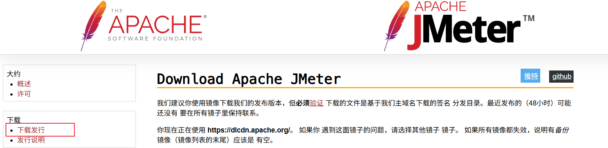


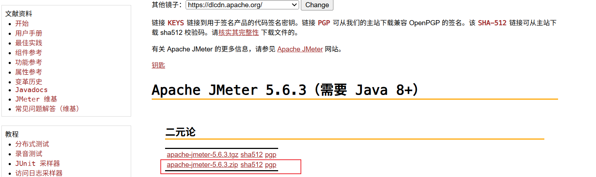

解压 `apache-jmeter-5.6.3.zip`，进入 `bin` 目录运行 `jmeter.bat` 即可，但我们运行之前先修改下配置文件，方便更好的使用。

#### 配置

进入 `bin` 目录编辑 `jmeter.properties` 文件，修改 39 行和 1105 行两处代码（不同的电脑可能行数不一致，不过上下差距不大）。

```properties
# 设置界面显示中文
# language=en
language=zh_CN

# 编码字符集使用 UTF-8,从 5.6.1 开始默认就是 UTF-8
sampleresult.default.encoding=UTF-8
```

#### 运行

运行 `/bin/jmeter.bat` 文件，界面显示如下。

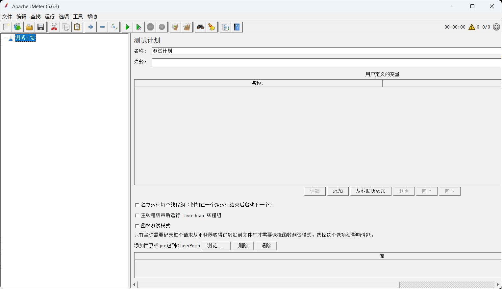

创建 **线程组**，在线程组下创建 **HTTP 请求**，在 HTTP 请求下创建 **查看结果树**，且按照如下配置。

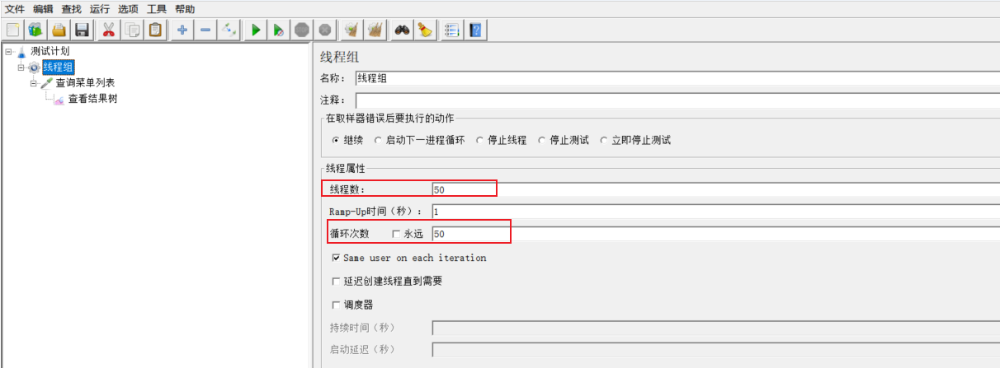

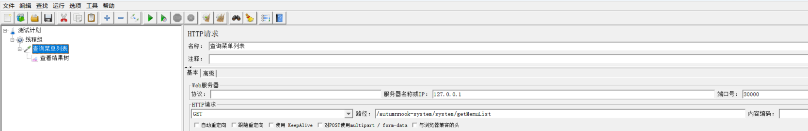

模拟高并发运行，点击查看结果树可以看到大部分请求失败

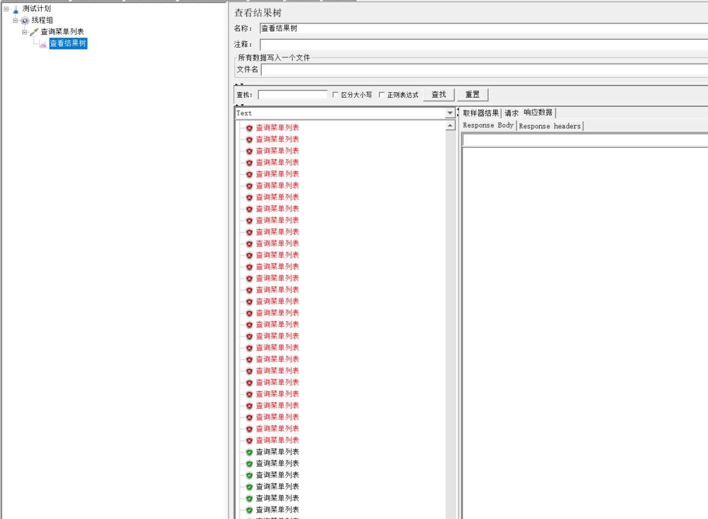

## 请求缓存

Hystrix 为了降低访问服务的频率，支持将一个请求与返回结果做缓存处理。如果再次请求的 URL 没有发生变化，那么 Hystrix 不会请求服务，而是直接从缓存中将结果返回，这样可以大大降低访问服务的压力。

### 安装 Redis

Hystrix 自带缓存有两个缺点：

- 本地缓存，集群环境下缓存无法同步；
- 不支持第三方缓存容器，如：redis、memcache；

本文使用 Spring 的缓存集成方案，NoSQL 使用 Redis 实现，版本是 8.4.0。

### 添加依赖

服务消费者 pom.xml 添加 redis 和 commons-pools 依赖。

```xml
<dependency>
    <groupId>org.springframework.boot</groupId>
    <artifactId>spring-boot-starter-data-redis</artifactId>
</dependency>
<!--
Apache Commons Pool 2
作用：提供对象池实现，用于Redis连接池管理
背景：Spring Boot 2.x 默认使用Lettuce客户端，但Jedis需要此依赖
用途：为Jedis客户端提供连接池支持，提高连接复用和性能
-->
<dependency>
    <groupId>org.apache.commons</groupId>
    <artifactId>commons-pool2</artifactId>
</dependency>
```

### 配置文件

```yml
spring:
  redis:
    timeout: 10000 # 连接超时时间
    host: 117.24.15.104 # redis服务地址
    port: 6379 # redis服务端口
    password: redis_Fct28w # redis密码
    database: 0 # 选择哪一个库，默认0库
    lettuce:
      pool:
        max-active: 1024 # 最大连接数
        max-wait: 10000 #最大连接阻塞等待时间，单位 ms 默认 -1
        max-idle: 200 # 最大空闲连接
        min-idle: 5 # 最小空闲连接
```

### 序列化配置

添加 Redis 配置类重写序列化规则。

```java
import org.springframework.context.annotation.Bean;
import org.springframework.context.annotation.Configuration;
import org.springframework.data.redis.cache.RedisCacheConfiguration;
import org.springframework.data.redis.cache.RedisCacheManager;
import org.springframework.data.redis.cache.RedisCacheWriter;
import org.springframework.data.redis.connection.RedisConnectionFactory;
import org.springframework.data.redis.core.RedisTemplate;
import org.springframework.data.redis.serializer.GenericJackson2JsonRedisSerializer;
import org.springframework.data.redis.serializer.RedisSerializationContext;
import org.springframework.data.redis.serializer.StringRedisSerializer;
import java.time.Duration;
@Configuration
public class RedisConfig {

    @Bean
    public RedisTemplate<String, Object> redisTemplate(RedisConnectionFactory factory) {
        RedisTemplate<String, Object> redisTemplate = new RedisTemplate<>();
        redisTemplate.setConnectionFactory(factory);
        // 为 String 类型 key 设置序列化器
        StringRedisSerializer stringRedisSerializer = new StringRedisSerializer();
        redisTemplate.setKeySerializer(stringRedisSerializer);
        redisTemplate.setHashKeySerializer(stringRedisSerializer);
        // 为 String 类型 value 设置序列化器
        GenericJackson2JsonRedisSerializer genericJackson2JsonRedisSerializer = new GenericJackson2JsonRedisSerializer();
        redisTemplate.setValueSerializer(genericJackson2JsonRedisSerializer);
        // 为 Hash 类型 value 设置序列化器
        redisTemplate.setHashValueSerializer(genericJackson2JsonRedisSerializer);
        redisTemplate.afterPropertiesSet();
        return redisTemplate;
    }

    @Bean
    public RedisCacheManager redisCacheManager(RedisTemplate redisTemplate) {
        RedisCacheWriter redisCacheWriter = RedisCacheWriter.nonLockingRedisCacheWriter(redisTemplate.getConnectionFactory());
        RedisCacheConfiguration redisCacheConfiguration = RedisCacheConfiguration.defaultCacheConfig()
            // 30 min 过期
            .entryTtl(Duration.ofMinutes(30))
            .serializeValuesWith(RedisSerializationContext.SerializationPair.fromSerializer(redisTemplate.getValueSerializer()))
            .serializeKeysWith(RedisSerializationContext.SerializationPair.fromSerializer(redisTemplate.getKeySerializer()));
        return new RedisCacheManager(redisCacheWriter, redisCacheConfiguration);
    }
}
```

### 启动类

启动类上添加 `@EnableCaching` 注解。

```java
import org.slf4j.Logger;
import org.slf4j.LoggerFactory;
import org.springframework.boot.SpringApplication;
import org.springframework.boot.autoconfigure.SpringBootApplication;
import org.springframework.cache.annotation.EnableCaching;
import org.springframework.cloud.openfeign.EnableFeignClients;
import org.springframework.context.ApplicationContext;
import org.springframework.core.env.Environment;
@EnableCaching
@EnableFeignClients
@SpringBootApplication
public class SystemApplication {

    private static final Logger logger = LoggerFactory.getLogger(SystemApplication.class);

    public static void main(String[] args) {
        // 启动 Spring Boot 应用，返回应用上下文
        ApplicationContext context = SpringApplication.run(SystemApplication.class, args);

        // 获取环境配置信息
        Environment environment = context.getEnvironment();

        // 从环境变量中读取关键配置信息
        String port = environment.getProperty("server.port");
        String fetchRegistry = environment.getProperty("eureka.client.fetch-registry");
        String registryWithEureka = environment.getProperty("eureka.client.register-with-eureka");
        String defaultZone = environment.getProperty("eureka.client.service-url.defaultZone");
        String hostname = environment.getProperty("eureka.instance.hostname");
        String preferIpAddress = environment.getProperty("eureka.instance.prefer-ip-address");

        // 输出应用启动成功信息和关键配置
        logger.info("========= AutumnNook System started successfully =========");
        logger.info("🚀 服务端口：{}", port);
        logger.info("🏠 实例地址：{}", hostname);
        logger.info("📥 是否从注册中心拉取服务：{}", fetchRegistry);
        logger.info("📤 是否注册到注册中心：{}", registryWithEureka);
        logger.info("🔗 注册中心集群地址：{}", defaultZone);
        logger.info("🌐 是否优先使用服务器的IP地址：{}", preferIpAddress);
        logger.info("📊 访问地址：http://localhost:{}/", port);
        logger.info("👁️ 监控端点：http://localhost:{}/actuator", port);
        logger.info("========================================================");
    }

    static {
        // 注册 JVM 关闭钩子，确保应用优雅关闭
        Runtime.getRuntime().addShutdownHook(new Thread(() -> {
            logger.info("===================Autumnnook System 正在关闭===================");
            logger.info("正在清理资源...");
            // 这里可以添加具体的资源清理逻辑，如：
            // - 关闭数据库连接池
            // - 释放 Redis 连接
            // - 从注册中心注销服务
            // - 停止后台线程等
            logger.info("资源清理完成，服务已关闭");
        }));
    }
}
```

### 业务层接口

服务消费者业务层接口添加 `@Cacheable` 注解定义存储规则。

```java
@Cacheable(cacheNames = "autumnnookMenu:menu:getMenuListFeign", key = "#id")
@GetMapping("/getSystemById")
public System getSystemById(String id) {
    return new System("AutumnNook System" + id, "1.0.0", "Admin");
}

@Cacheable(cacheNames = "autumnnookMenu:menu:getMenuListFeign")
@GetMapping("/getMenuListFeign")
public List<?> getMenuListFeign() {
    return menuService.getMenuList();
}

@Cacheable(cacheNames = "autumnnookMenu:menu:getMenuList")
@GetMapping("/getMenuList")
public List<?> getMenuList() {
    String serviceName = "autumnnook-menu";
    String url = "http://" + serviceName + "/menu/list";
    ResponseEntity<List<?>> response =
        restTemplate.exchange(url, HttpMethod.GET, null, new ParameterizedTypeReference<List<?>>() {
        });
    return response.getBody();
}
```

### 测试服务

通过 JMeter 工具进行模拟高并发测试，不会出现之前那种请求失败的原因。

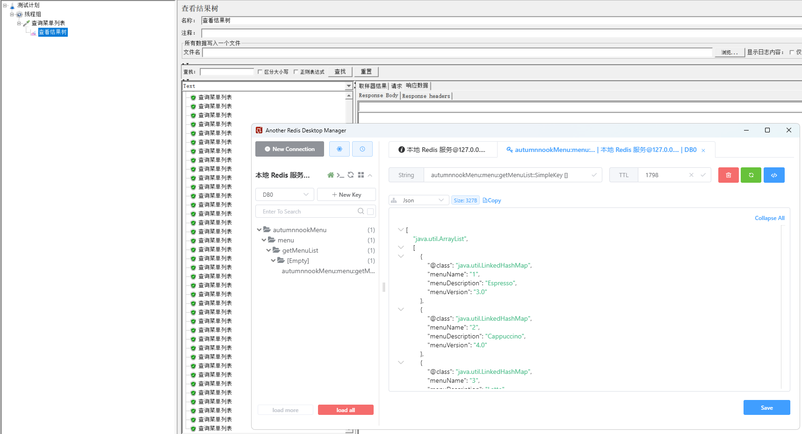

## 请求合并

在微服务架构中，我们将一个项目拆分成很多个独立的模块，这些独立的模块通过远程调用来互相配合工作。但是，在高并发情况下，通信次数的增加会导致总的通信时间增加，同时，**线程池的资源也是有限的**，高并发环境会导致有大量的线程处于等待状态，进而导致响应延迟，为了解决这些问题，我们需要来了解 Hystrix 的请求合并。

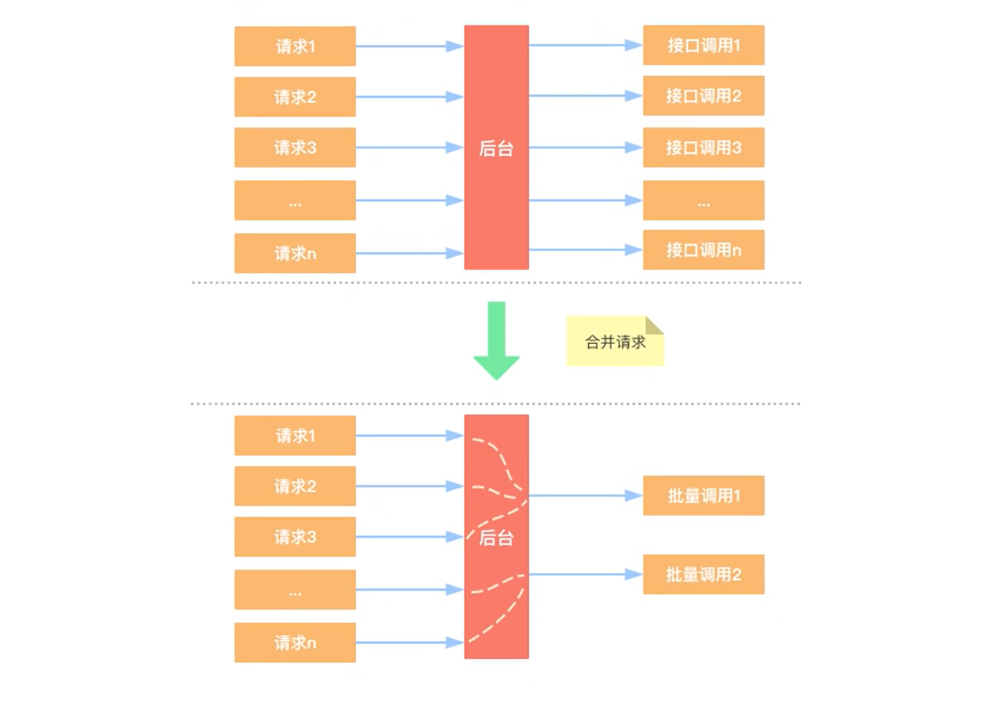

为了区分请求缓存，我们怎么通俗的理解请求合并是什么意思呢？

假设我们现在有 10 个用户都需要调用接口 `getUserById`，从微观角度上看，我们请求合并可以理解为提供一个 `getUserByIds` 接口，批量执行查询，但这样会有一个特别大的弊端，第一个来的请求需要去等待批量请求的执行。就好比你去坐车，每车都需要凑满员才能走，所以最先到的请求需要等待批量执行操作。

### 弊端

设置请求合并之后，本来一个请求可能 5 ms 就搞定了，但是现在必须再等一段时间（假设 10 ms）看看还有没有其他请求一起，这样一个请求耗时就从 5 ms 增加到了 15 ms。

如果我们需要发起的命令本身就是一个高延迟的命令，那么这个时候就可以使用请求合并，因为这个时间消耗就显得无足轻重了，另外高并发也是请求合并的一个非常重要的场景。

### 添加依赖

服务消费者添加 hystrix 依赖。

```xml
<dependency>
    <groupId>org.springframework.cloud</groupId>
    <artifactId>spring-cloud-starter-netflix-hystrix</artifactId>
</dependency>
```

 ### 业务层

服务提供者业务层代码添加请求合并规则接口。

- SystemService

```java
import com.autumnnook.pojo.System;
import java.util.List;
import java.util.concurrent.Future;
public interface SystemService {
    
    Future<System> getSystemById(String id);

    List<System> getSystemList(List<String> ids);

}
```

- SystemServiceImpl

```java
import com.autumnnook.pojo.System;
import com.autumnnook.service.SystemService;
import com.netflix.hystrix.contrib.javanica.annotation.HystrixCollapser;
import com.netflix.hystrix.contrib.javanica.annotation.HystrixCommand;
import com.netflix.hystrix.contrib.javanica.annotation.HystrixProperty;
import org.slf4j.Logger;
import org.slf4j.LoggerFactory;
import org.springframework.stereotype.Service;
import java.util.Arrays;
import java.util.List;
import java.util.concurrent.Future;
@Service
public class SystemServiceImpl implements SystemService {

    private static final Logger logger = LoggerFactory.getLogger(SystemServiceImpl.class);

    @Override
    @HystrixCollapser(
        // 合并请求方法
        batchMethod = "getSystemList",
        // 请求方式
        scope = com.netflix.hystrix.HystrixCollapser.Scope.GLOBAL, collapserProperties = {
        // 间隔多久的请求会进行合并（默认 10 ms）
        @HystrixProperty(name = "timerDelayInMilliseconds", value = "100"),
        // 批处理中，允许的最大请求数
        @HystrixProperty(name = "maxRequestsInBatch", value = "10")})
    public Future<System> getSystemById(String id) {
        logger.info("🎯 ----getSystemById called with id: {}----", id);
        return null;// hystrix 会自动实现该方法
    }

    @Override
    @HystrixCommand
    public List<System> getSystemList(List<String> ids) {
        logger.info("🎯----getSystemList called with ids: {}----", ids);
        return Arrays.asList(new System("AutumnNook System", "1.0.0", "Admin"),
            new System("AutumnNook System", "1.1.0", "Admin"), new System("AutumnNook System", "1.2.0", "Admin"));
    }
}
```

`@HystrixCollapser` 注解各项参数说明如下。

|           参数           |                             作用                             |      默认值       | 备注                                                         |
| :----------------------: | :----------------------------------------------------------: | :---------------: | :----------------------------------------------------------- |
|    @HystrixCollapser     |                                                              |                   | 被 @HystrixCollapser 标注的方法，返回值类型必须是 `Future<?>` ，使用异步方法，否则无法进行请求合并。 |
|       batchMethod        |                        合并请求的方法                        |                   | 方法只能接受一个参数，如果需要传递多个参数，请将其封装为类参数。 |
|          scope           |                           请求方式                           |      REQUEST      | 请求方式：<br />🧇REQUEST：只对一个请求内的多次服务请求进行合并；<br />🧇GLOBAL：多单个应用中的所有线程的请求中的多次服务请求进行合并<br /> |
| timerDelayInMilliseconds | 请求时间间隔（单位：ms），默认 10ms 之内的请求会被合并为一个请求 |        10         | 建议尽量设置的小一点，如果并发量不大的话，其实也没有必要使用请求合并处理。 |
|    maxRequestsInBatch    |      设置触发批处理执行之前，在批处理中允许的最大请求数      | Integer.MAX_VALUE |                                                              |

- SystemController

```java
import com.autumnnook.pojo.System;
import com.autumnnook.service.SystemService;
import lombok.RequiredArgsConstructor;
import org.springframework.web.bind.annotation.GetMapping;
import org.springframework.web.bind.annotation.PathVariable;
import org.springframework.web.bind.annotation.PostMapping;
import org.springframework.web.bind.annotation.RequestBody;
import org.springframework.web.bind.annotation.RequestMapping;
import org.springframework.web.bind.annotation.RestController;
import java.util.List;
import java.util.concurrent.ExecutionException;
@RestController
@RequestMapping("/system")
@RequiredArgsConstructor
public class SystemController {

    private final SystemService systemService;

    @PostMapping("/getSystemByIds")
    public List<?> getSystemByIds(@RequestBody List<String> ids) {
        return systemService.getSystemList(ids);
    }

    @GetMapping("/getSystemById/{id}")
    public System getSystemById(@PathVariable String id) throws ExecutionException, InterruptedException {
        return systemService.getSystemById(id).get();
    }
}
```

### 启动类

启动类需要添加 `@EnableCircuitBreaker` 或者 `@EnableHystrix` 注解。

```java
import org.slf4j.Logger;
import org.slf4j.LoggerFactory;
import org.springframework.boot.SpringApplication;
import org.springframework.boot.autoconfigure.SpringBootApplication;
import org.springframework.cloud.client.circuitbreaker.EnableCircuitBreaker;
import org.springframework.cloud.openfeign.EnableFeignClients;
import org.springframework.context.ApplicationContext;
import org.springframework.core.env.Environment;
@EnableFeignClients
@EnableCircuitBreaker
@SpringBootApplication
public class SystemApplication {

    private static final Logger logger = LoggerFactory.getLogger(SystemApplication.class);

    public static void main(String[] args) {
        // 启动 Spring Boot 应用，返回应用上下文
        ApplicationContext context = SpringApplication.run(SystemApplication.class, args);

        // 获取环境配置信息
        Environment environment = context.getEnvironment();

        // 从环境变量中读取关键配置信息
        String port = environment.getProperty("server.port");
        String fetchRegistry = environment.getProperty("eureka.client.fetch-registry");
        String registryWithEureka = environment.getProperty("eureka.client.register-with-eureka");
        String defaultZone = environment.getProperty("eureka.client.service-url.defaultZone");
        String hostname = environment.getProperty("eureka.instance.hostname");
        String preferIpAddress = environment.getProperty("eureka.instance.prefer-ip-address");

        // 输出应用启动成功信息和关键配置
        logger.info("========= AutumnNook System started successfully =========");
        logger.info("🚀 服务端口：{}", port);
        logger.info("🏠 实例地址：{}", hostname);
        logger.info("📥 是否从注册中心拉取服务：{}", fetchRegistry);
        logger.info("📤 是否注册到注册中心：{}", registryWithEureka);
        logger.info("🔗 注册中心集群地址：{}", defaultZone);
        logger.info("🌐 是否优先使用服务器的IP地址：{}", preferIpAddress);
        logger.info("📊 访问地址：http://localhost:{}/", port);
        logger.info("👁️ 监控端点：http://localhost:{}/actuator", port);
        logger.info("========================================================");
    }

    static {
        // 注册 JVM 关闭钩子，确保应用优雅关闭
        Runtime.getRuntime().addShutdownHook(new Thread(() -> {
            logger.info("===================Autumnnook System 正在关闭===================");
            logger.info("正在清理资源...");
            // 这里可以添加具体的资源清理逻辑，如：
            // - 关闭数据库连接池
            // - 释放 Redis 连接
            // - 从注册中心注销服务
            // - 停止后台线程等
            logger.info("资源清理完成，服务已关闭");
        }));
    }
}
```

### 消费者模拟多次调用

服务消费者我们通过 OpenFeign 去模拟调用服务提供者的请求合并接口。

- SystemService         `api`

```java
@FeignClient(name = "autumnnook-system")
public interface SystemService {
    @ResponseBody
    @GetMapping("/system/getSystemById/{id}")
    Object getSystemById(@PathVariable("id") String id);
}
```

- MenuController

```java
@GetMapping("/getSystemById")
public void getSystemById() throws ExecutionException, InterruptedException {
    // 模拟 5 次调用
    for(int i = 1; i <= 5; i++) {
        Object o = systemService.getSystemById(String.valueOf(i));
        logger.info("👉 ----getSystemById called with id: {}----", i);
    }
}
```

### 测试观察

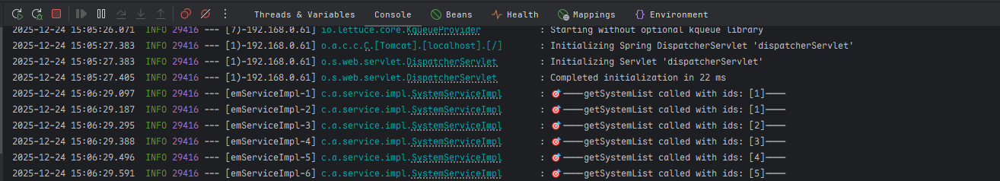

## 服务隔离

### 线程池隔离

没有线程池隔离的项目所有接口都运行在一个 `ThreadPool` 中，当某一个接口压力过大或者出现故障时，会导致资源耗尽从而影响到其他接口的调用而引发服务雪崩效应，我们在模拟高并发场景的时候也演示了该效果。

通过每次都开启一个单独线程运行，他的隔离是通过线程池，即每个隔离粒度都是个线程池，互相不干扰。线程池隔离方式，等于多了一层的保护措施，可以通过 hystrix 直接设置超时，超时后直接返回。

- 隔离前

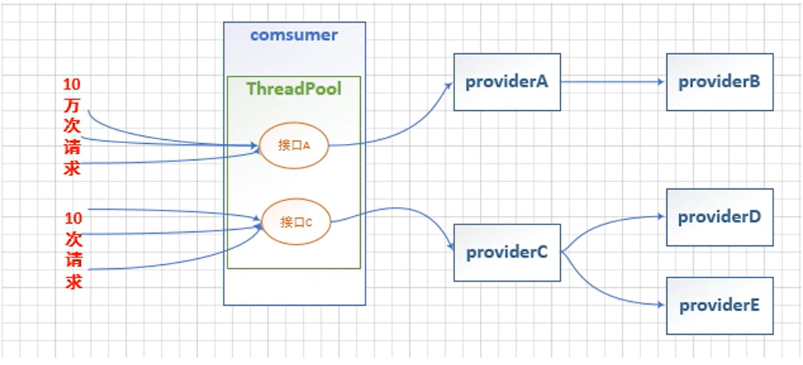


- 隔离后

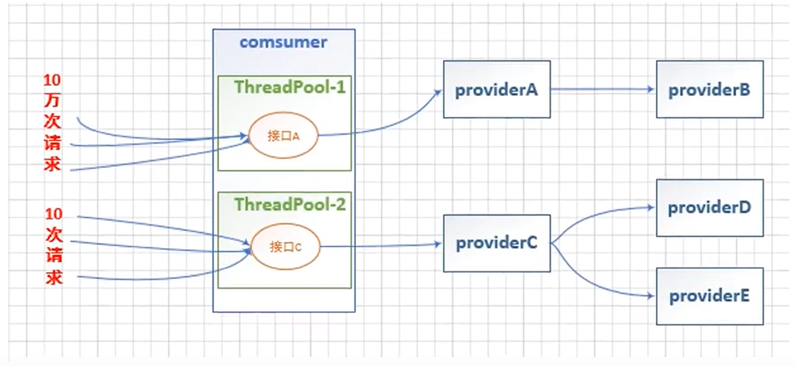

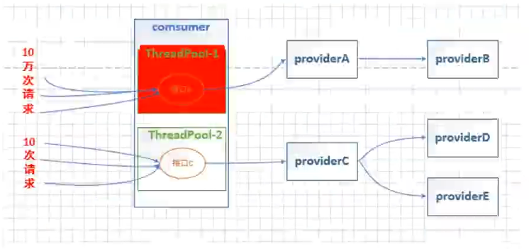


**优点：**

- 使用线程池隔离可以安全隔离依赖的服务（例如图中 A、B、C、D 服务），减少所依赖服务发生故障时的影响面。比如 A 服务发生异常，导致请求大量超时时，对应的线程池被打满，这时并不影响 C、D 服务的调用；
- 当失败的服务变得再次可用时，线程池将清理并立即恢复，而不需要一个长时间的恢复；
- 独立的线程池提高了并发性；

**缺点：**

- 请求在线程池中执行，肯定会带来任务调度、排队和上下文切换带来的 CPU 开销；
- 因为涉及到跨线程，那么就存在 ThreadLocal 数据的传递问题，比如在主线程初始化的 ThreadLocal 变量，在线程池线程中无法获取；

#### 添加依赖

```xml
<dependency>
    <groupId>org.springframework.cloud</groupId>
    <artifactId>spring-cloud-starter-netflix-hystrix</artifactId>
</dependency>
```

#### 业务层

- 不使用线程池隔离的情况

```java
import com.autumnnook.api.SystemService;
import com.autumnnook.pojo.Menu;
import lombok.RequiredArgsConstructor;
import org.slf4j.Logger;
import org.slf4j.LoggerFactory;
import org.springframework.web.bind.annotation.GetMapping;
import org.springframework.web.bind.annotation.RequestMapping;
import org.springframework.web.bind.annotation.RestController;
import org.springframework.web.client.RestTemplate;
import java.util.Arrays;
import java.util.List;
@RestController
@RequestMapping("/menu")
@RequiredArgsConstructor
public class MenuController {

    private final SystemService systemService;

    private final RestTemplate restTemplate;

    private static final Logger logger = LoggerFactory.getLogger(MenuController.class);

    @GetMapping("/list")
    public List<Menu> list() throws InterruptedException {
        Thread.sleep(2000);
        logger.info("[list] 当前线程：{}", Thread.currentThread().getName());
        return Arrays.asList(new Menu("1", "Espresso", "3.0"), new Menu("2", "Cappuccino", "4.0"),
            new Menu("3", "Latte", "4.5"));
    }

    @GetMapping("/getMenuById")
    public Menu getMenuById() {
        logger.info("[getMenuById] 当前线程：{}", Thread.currentThread().getName());
        return new Menu("1", "Espresso", "3.0");
    }

}
```

我们首先看一下，如果我们不使用线程池隔离，然后通过 JMeter 工具模拟高并发场景会得到什么情况。

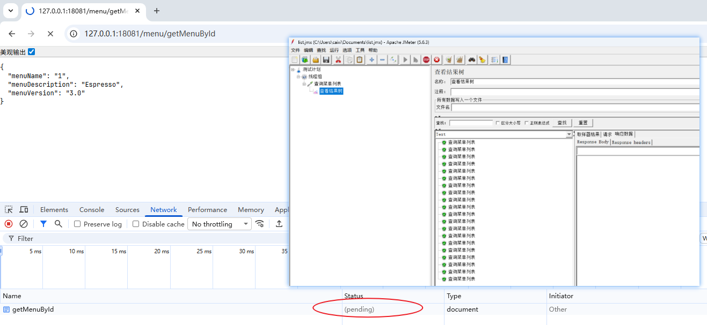

可以清楚的看到，我们在 JMeter 工具中对 `/menu/list` 请求模拟高并发，会影响到 `/menu/getMenuById` 请求的响应。

- 使用线程池隔离

```java
import com.autumnnook.api.SystemService;
import com.autumnnook.pojo.Menu;
import com.netflix.hystrix.contrib.javanica.annotation.HystrixCommand;
import com.netflix.hystrix.contrib.javanica.annotation.HystrixProperty;
import lombok.RequiredArgsConstructor;
import org.slf4j.Logger;
import org.slf4j.LoggerFactory;
import org.springframework.web.bind.annotation.GetMapping;
import org.springframework.web.bind.annotation.RequestMapping;
import org.springframework.web.bind.annotation.RestController;
import org.springframework.web.client.RestTemplate;
import java.util.Arrays;
import java.util.List;
@RestController
@RequestMapping("/menu")
@RequiredArgsConstructor
public class MenuController {

    private final SystemService systemService;

    private final RestTemplate restTemplate;

    private static final Logger logger = LoggerFactory.getLogger(MenuController.class);

    @GetMapping("/list")
    @HystrixCommand(
        // 定义命令的组、命令和线程池名称
        groupKey = "menu-list-group",
        // 每个命令的唯一标识
        commandKey = "list",
        // 线程池名称
        threadPoolKey = "menu-list-thread-pool",
        // 命令属性配置
        commandProperties = {
            // 超时时间，默认 1000 ms
            @HystrixProperty(name = "execution.isolation.thread.timeoutInMilliseconds", value = "3000"),
            // 隔离策略，默认 THREAD
            @HystrixProperty(name = "execution.isolation.strategy", value = "THREAD")},
        // 线程池配置
        threadPoolProperties = {
            // 线程池核心线程数，默认 10
            @HystrixProperty(name = "coreSize", value = "5"),
            // 线程池队列等待阈值，默认 -1，表示不使用队列
            @HystrixProperty(name = "maxQueueSize", value = "10"),
            // 线程池队列拒绝阈值，默认 5
            @HystrixProperty(name = "queueSizeRejectionThreshold", value = "8"),
            // 线程存活时间，默认 60000 ms
            @HystrixProperty(name = "keepAliveTimeMinutes", value = "2")})
    public List<Menu> list() throws InterruptedException {
        Thread.sleep(800);
        logger.info("[list] 当前线程：{}", Thread.currentThread().getName());
        return Arrays.asList(new Menu("1", "Espresso", "3.0"), new Menu("2", "Cappuccino", "4.0"),
            new Menu("3", "Latte", "4.5"));
    }

    @GetMapping("/getMenuById")
    @HystrixCommand(
        // 定义命令的组、命令和线程池名称
        groupKey = "menu-fetch-by-id-group",
        // 每个命令的唯一标识，默认方法名
        commandKey = "getMenuById",
        // 线程池名称
        threadPoolKey = "menu-fetch-by-id-thread-pool",
        // 命令属性配置
        commandProperties = {
            // 超时时间，默认 1000 ms
            @HystrixProperty(name = "execution.isolation.thread.timeoutInMilliseconds", value = "3000"),
            // 隔离策略，默认 THREAD
            @HystrixProperty(name = "execution.isolation.strategy", value = "THREAD")},
        // 线程池配置
        threadPoolProperties = {
            // 线程池核心线程数，默认 10
            @HystrixProperty(name = "coreSize", value = "5"),
            // 线程池队列等待阈值，默认 -1，表示不使用队列
            @HystrixProperty(name = "maxQueueSize", value = "10"),
            // 线程池队列拒绝阈值，默认 5
            @HystrixProperty(name = "queueSizeRejectionThreshold", value = "8"),
            // 线程存活时间，默认 60000 ms
            @HystrixProperty(name = "keepAliveTimeMinutes", value = "2")})
    public Menu getMenuById() {
        logger.info("[getMenuById] 当前线程：{}", Thread.currentThread().getName());
        return new Menu("1", "Espresso", "3.0");
    }
}
```

如果我们开启线程池隔离，同样的通过 JMeter 模拟高并发场景得到的情况如下。

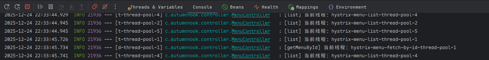

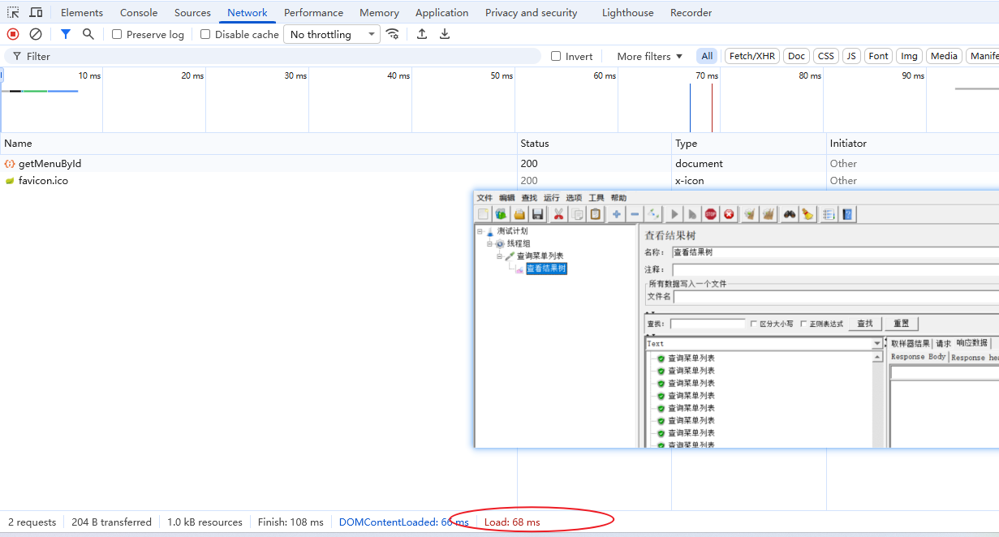

<span style="color:darkred;font-size:12px;">注：如果你在使用 jmeter 模拟高并发测试线程池隔离的时候发现明明已经看到日志中已经使用了不同的线程池，但你压测接口 a 会导致接口 c 响应很慢的时候，请去检查下你在 JMeter 测试的线程数是不是超过你配置的 Tomcat 最大线程数（默认 200 个）。</span>

### 信号量隔离

每次调用线程，当请求通过计数信号量进行限制，当信号量大于了最大请求数 `maxConcurrentRequests` 时，进行限制，调用 `fallback` 接口快速返回。信号量的调用是同步的，也就是说，每次调用都得阻塞调用方的线程，直到结果返回。这样就导致了无法对访问做超时（只能依靠调用协议超时，无法主动释放）。

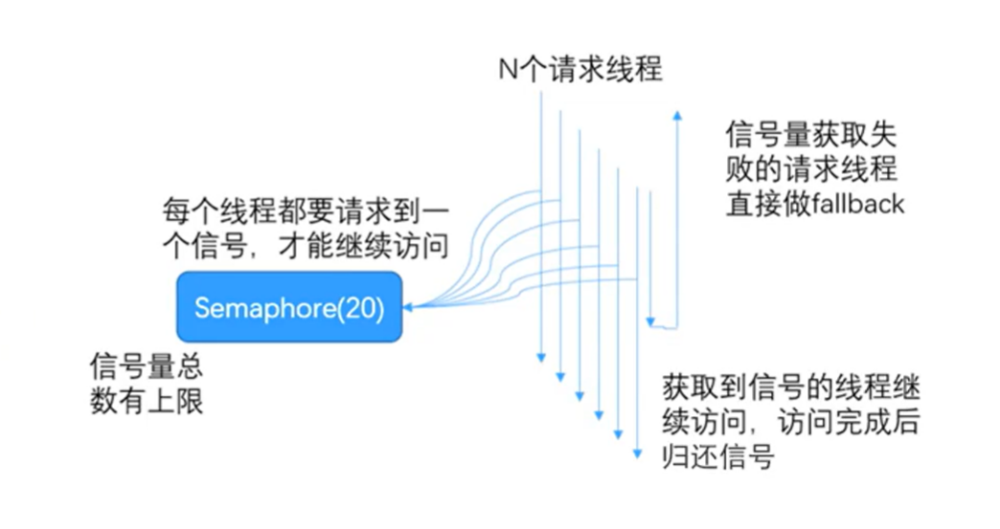

#### 添加依赖

```xml
```


### 线程池隔离 VS 信号量隔离


## 服务熔断


## 服务降级


## Feign 雪崩处理


