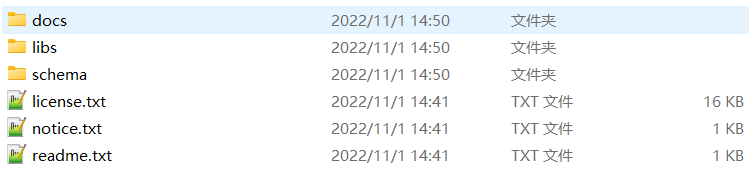
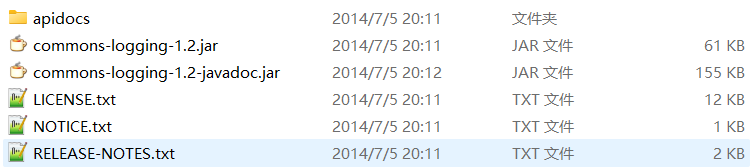
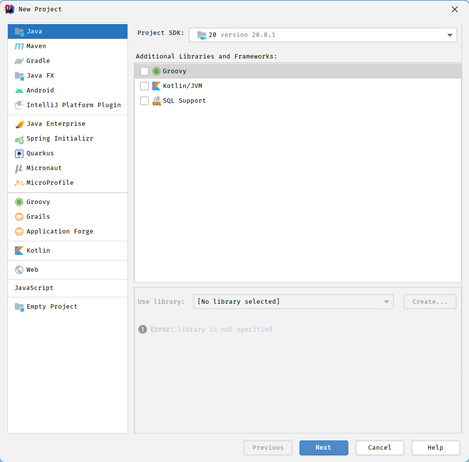
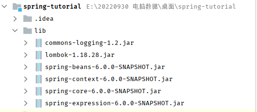
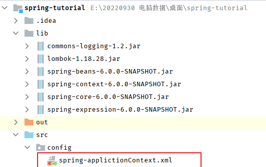

# Spring 基础篇

## 第一章 概述

Spring 是 Java EE 编程领域的一款轻量级的开源框架，由被称为 “ Spring 之父 ” 的 Rod Johnson 于 2002 年提出并创立，它的目标就是要简化 Java 企业级应用程序的开发难度和周期。

Spring 自诞生以来备受青睐，一直被广大开发人员作为 Java 企业级应用程序开发的首选。时至今日，Spring 俨然成为了 Java EE 代名词，成为了构建 Java EE 应用的事实标准。

### Spring 的诞生与发展

早期的 J2EE（Java EE 平台）推崇以 EJB 为核心的开发方式，但这种开发方式在实际的开发过程中存在种种弊端，例如使用复杂、代码臃肿、代码侵入性强、开发周期长、移植难度大等。

Rod Johnson 在其 2004 年编著的畅销书《Expert One-on-One J2EE Development without EJB》中，针对 EJB 各种臃肿的结构进行了逐一的分析和否定，并分别以更加简洁的方式进行了替换。

在这本书中，Rod Johnson 通过一个包含 3 万行代码的附件，展示了如何在不使用 EJB 的情况下构建一个高质量、可扩展的 Java 应用程序。在这个附件中，Rod Johnson 编写了上万行基础结构代码，其中包含了许多可重用的 Java 接口和类，例如 ApplicationContext、BeanFactory 等。这些类的根包被命名为  `com.interface21`  ，含义为：这是提供给 21 世纪的一个参考。

这本书影响甚远，后来 Rod Johnson 将  `com.interface21`  的代码开源，并把这个新框架并命名为 “Spring” ，含义为：Spring 像一缕春风一样，扫平传统 J2EE 的寒冬。

2003 年 2 月，Spring 0.9 版本发布，它采用了 Apache 2.0 开源协议。2004 年 4 月，Spring 1.0 版本正式发布。到目前为止，Spring 已经步入到了第 5 个大版本，也就是我们常说的 Spring 5。

### Spring 的狭义和广义

在不同的语境中，Spring 所代表的含义是不同的。下面我们就分别从 “广义” 和 “狭义” 两个角度，对 Spring 进行介绍。

#### 广义的 Spring: Spring 技术栈

<div style="border: 1px solid #1d63edb5;
	padding: 10px;	
	border-left: 5px solid #1d63edb5;
	background: #bed2fa63;
	border-radius: 0 3px 3px 0;
	color: #1d63ed;
	font-family: menlo;
	font-size: 12px;
	margin: 10px 0;
	display: flex;
	align-items: center;
	gap: 8px;">
	<svg viewBox="0 0 24 24" style="flex-shrink: 0;" width="14px" height="14px" fill="none" xmlns="http://www.w3.org/2000/svg" class="MuiSvgIcon-root MuiSvgIcon-colorInfo MuiSvgIcon-fontSizeSmall css-1bqouqa" focusable="false" aria-hidden="true" data-testid="InfoCircleIcon"><path d="M12 16V12M12 8H12.01M22 12C22 17.5228 17.5228 22 12 22C6.47715 22 2 17.5228 2 12C2 6.47715 6.47715 2 12 2C17.5228 2 22 6.47715 22 12Z" stroke="currentColor" fill="none" stroke-width="2" stroke-linecap="round" stroke-linejoin="round"></path></svg>
	<span style="line-height: 16px;">广义上的 Spring 泛指以 Spring Framework 为核心的 Spring 技术栈。</span>
</div>

经过十多年的发展，Spring 已经不再是一个单纯的应用框架，而是逐渐发展成为一个由多个不同子项目（模块）组成的成熟技术，例如 Spring Framework、Spring MVC、SpringBoot、Spring Cloud、Spring Data、Spring Security 等，其中 Spring Framework 是其他子项目的基础。这些子项目涵盖了从企业级应用开发到云计算等各方面的内容，能够帮助开发人员解决软件发展过程中不断产生的各种实际问题，给开发人员带来了更好的开发体验。

|	项目名称	 | 描述														 |
| :-------------: | :----------------------------------------------------------- |
|   Spring Data   | Spring 提供的数据访问模块，对 JDBC 和 ORM 提供了很好的支持。通过它，开发人员可以使用一种相对统一的方式，来访问位于不同类型数据库中的数据。 |
|  Spring Batch   | 一款专门针对企业级系统中的日常批处理任务的轻量级框架，能够帮助开发人员方便的开发出健壮、高效的批处理应用程序。 |
| Spring Security | 前身为 Acegi，是 Spring 中较成熟的子模块之一。它是一款可以定制化的身份验证和访问控制框架。 |
|  Spring Mobile  | 是对 Spring MVC 的扩展，用来简化移动端 Web 应用的开发。	  |
|   Spring Boot   | 是 Spring 团队提供的全新框架，它为 Spring 以及第三方库一些开箱即用的配置，可以简化 Spring 应用的搭建及开发过程。 |
|  Spring Cloud   | 一款基于 Spring Boot 实现的微服务框架。它并不是某一门技术，而是一系列微服务解决方案或框架的有序集合。它将市面上成熟的、经过验证的微服务框架整合起来，并通过 Spring Boot 的思想进行再封装，屏蔽调其中复杂的配置和实现原理，最终为开发人员提供了一套简单易懂、易部署和易维护的分布式系统开发工具包。 |

#### 狭义的 Spring: Spring 框架

<div style="border: 1px solid #1d63edb5;
	padding: 10px;
	border-left: 5px solid #1d63edb5;
	background: #bed2fa63;
	border-radius: 0 3px 3px 0;
	color: #1d63ed;
	font-family: menlo;
	font-size: 12px;
	margin: 10px 0;
	display: flex;
	align-items: center;
	gap: 8px;">
	<svg viewBox="0 0 24 24" style="flex-shrink: 0;" width="14px" height="14px" fill="none" xmlns="http://www.w3.org/2000/svg" class="MuiSvgIcon-root MuiSvgIcon-colorInfo MuiSvgIcon-fontSizeSmall css-1bqouqa" focusable="false" aria-hidden="true" data-testid="InfoCircleIcon"><path d="M12 16V12M12 8H12.01M22 12C22 17.5228 17.5228 22 12 22C6.47715 22 2 17.5228 2 12C2 6.47715 6.47715 2 12 2C17.5228 2 22 6.47715 22 12Z" stroke="currentColor" fill="none" stroke-width="2" stroke-linecap="round" stroke-linejoin="round"></path></svg>
	<span style="line-height: 16px;">狭义的 Spring 特指 Spring Framework，通常我们将它称为 Spring 框架。Spring 框架是一个分层的、面向切面的 Java 应用程序的一站式轻量级解决方案，它是 Spring 技术栈的核心和基础，是为了解决企业级应用开发的复杂性而创建的。</span>
</div>

Spring 两大核心部分：

- IOC
- AOP

| 核心 | 描述														 |
| ---- | ------------------------------------------------------------ |
| IOC  | Inverse of Control 的简写，译为“控制反转”，指把创建对象过程交给 Spring 进行管理。 |
| AOP  | Aspect Oriented Programming 的简写，译为“面向切面编程”。AOP 用来封装多个类的公共行为，将那些与业务无关，却为业务模块所共同调用的逻辑封装起来，减少系统的重复代码，降低模块间的耦合度。另外，AOP 还解决一些系统层面上的问题，比如日志、事务、权限等。 |

Spring 是一种基于 Bean 的编程技术，它深刻地改变着 Java 开发世界。Spring 使用简单、基本的 Java Bean 来完成以前只有 EJB 才能完成的工作，使得很多复杂的代码变得优雅和简洁，避免了 EJB 臃肿、低效的开发模式，极大的方便项目的后期维护、升级和扩展。在实际开发中，服务器端应用程序通常采用三层体系架构，分别为表现层（web）、业务逻辑层（service）、持久层（dao）。

Spring 致力于 Java EE 应用各层的解决方案，对每一层都提供了技术支持：

1. 在表现层提供了对 Spring MVC、Struts2 等框架的整合；

2. 在业务逻辑层提供了管理事务和记录日志的功能；

3. 在持久层还可以整合 MyBatis、Hibernate 和 JdbcTemplate 等技术，对数据库进行访问。

这充分地体现了 Spring 是一个全面的解决方案，对于那些已经有较好解决方案的领域，Spring 绝不做重复的事情。从设计上看，Spring 框架给予了 Java 程序员更高的自由度，对业界的常见问题也提供了良好的解决方案，因此在开源社区受到了广泛的欢迎，并且被大部分公司作为 Java 项目开发的首选框架。

### Spring 框架的特点

Spring 框架具有以下几个特点：

- **方便解耦，简化开发：** Spring 就是一个大工厂，可以将所有对象的创建和依赖关系的维护交给 Spring 管理。

- **方便集成各种优秀框架：** Spring 不排斥各种优秀的开源框架，其内部提供了对各种优秀框架（如 Struts2、Hibernate、MyBatis 等）的直接支持。

- **降低 Java EE 的使用难度：** Spring 对 Java EE 开发中非常难用的一些 API（JDBC等）都提供了封装，使这些 API 应用的难度大大降低。

- **方便程序的测试：** Spring 支持 JUnit4，可以通过注解方便地测试 Spring 程序。

- **AOP 编程的支持：** Spring 提供面向切面编程，可以方便地实现对程序进行权限拦截和运行监控等功能。

- **声明式事务的支持：** 只需要通过配置就可以完成对事务的管理，而无须手动编程。

## 第二章 体系结构

Spring 框架基本涵盖了企业级应用开发的各个方面，它包含了 20 多个不同的模块，如下所示。

```bash
spring-aop	  					  spring-context-indexer			   spring-instrument				spring-orm				   spring-web
spring-aspects  					  spring-context-support			   spring-jcl					   spring-oxm				   spring-webflux
spring-beans						  spring-core						  spring-jdbc					  spring-r2dbc				 spring-webmvc
spring-context  					  spring-expression					spring-jms					   spring-test				  spring-websocket
spring-messaging   					  spring-tx											
```


上图中包含了 Spring 框架的所有模块，这些模块可以满足一切企业级应用开发的需求，在开发过程中可以根据需求有选择性地使用所需要的模块。下面分别对这些模块的作用进行简单介绍。

### 数据访问与集成 (Data Access / Integration）

数据访问／集成层包括 JDBC、ORM、OXM、JMS 和 Transactions 模块，具体介绍如下。

- JDBC 模块：提供了一个 JBDC 的样例模板，使用这些模板能消除传统冗长的 JDBC 编码还有必须的事务控制，而且能享受到 Spring 管理事务的好处；

- ORM 模块：提供与流行的“对象-关系”映射框架无缝集成的 API，包括 JPA、JDO、Hibernate 和 MyBatis 等。而且还可以使用 Spring 事务管理，无需额外控制事务；

- OXM 模块：提供了一个支持 Object /XML 映射的抽象层实现，如 JAXB、Castor、XMLBeans、JiBX 和 XStream。将 Java 对象映射成 XML 数据，或者将XML 数据映射成 Java 对象；

- JMS 模块：指 Java 消息服务，提供一套 “消息生产者、消息消费者”模板用于更加简单的使用 JMS，JMS 用于用于在两个应用程序之间，或分布式系统中发送消息，进行异步通信；

- Transactions 事务模块：支持编程和声明式事务管理；

### Web层（Web）

Spring 的 Web 层包括 Web、Servlet、WebSocket 和 Portlet 组件，具体介绍如下。

- Web 模块：提供了基本的 Web 开发集成特性，例如多文件上传功能、使用的 Servlet 监听器的 IOC 容器初始化以及 Web 应用上下文。

- Servlet 模块：提供了一个 Spring MVC Web 框架实现。Spring MVC 框架提供了基于注解的请求资源注入、更简单的数据绑定、数据验证等及一套非常易用的 JSP 标签，完全无缝与 Spring 其他技术协作。

- WebSocket 模块：提供了简单的接口，用户只要实现响应的接口就可以快速的搭建 WebSocket Server，从而实现双向通讯。

- Portlet 模块：提供了在 Portlet 环境中使用 MVC 实现，类似 Web-Servlet 模块的功能。

### 核心容器 （Core Container）

Spring 的核心容器是其他模块建立的基础，由 Beans 模块、Core 核心模块、Context 上下文模块和 SpEL 表达式语言模块组成，没有这些核心容器，也不可能有 AOP、Web 等上层的功能。具体介绍如下。

- Beans 模块：提供了框架的基础部分，包括控制反转和依赖注入；

- Core 核心模块：封装了 Spring 框架的底层部分，包括资源访问、类型转换及一些常用工具类；

- Context 上下文模块：建立在 Core 和 Beans 模块的基础之上，集成 Beans 模块功能并添加资源绑定、数据验证、国际化、Java EE 支持、容器生命周期、事件传播等。ApplicationContext 接口是上下文模块的焦点；

- SpEL 模块：提供了强大的表达式语言支持，支持访问和修改属性值，方法调用，支持访问及修改数组、容器和索引器，命名变量，支持算数和逻辑运算，支持从 Spring 容器获取 Bean，它也支持列表投影、选择和一般的列表聚合等。

### AOP、Aspects、Instrumentation 和 Messaging

在 Core Container 之上是 AOP、Aspects 等模块，具体介绍如下：

- **AOP 模块：** 提供了面向切面编程实现，提供比如日志记录、权限控制、性能统计等通用功能和业务逻辑分离的技术，并且能动态的把这些功能添加到需要的代码中，这样各司其职，降低业务逻辑和通用功能的耦合；

- **Aspects 模块：** 提供与 AspectJ 的集成，是一个功能强大且成熟的面向切面编程（AOP）框架。

- **Instrumentation 模块：** 提供了类工具的支持和类加载器的实现，可以在特定的应用服务器中使用。

- **Messaging 模块：** Spring 4.0 以后新增了消息（Spring-messaging）模块，该模块提供了对消息传递体系结构和协议的支持。

### Test

- **Test 模块：** Spring 支持 Junit 和 TestNG 测试框架，而且还额外提供了一些基于 Spring 的测试功能，比如在测试 Web 框架时，模拟 Http 请求的功能。

## 第三章 开发环境搭建

<div style="border: 1px solid #1d63edb5;
	padding: 10px;
	border-left: 5px solid #1d63edb5;
	background: #bed2fa63;
	border-radius: 0 3px 3px 0;
	color: #1d63ed;
	font-family: menlo;
	font-size: 12px;
	margin: 10px 0;
	display: flex;
	align-items: center;
	gap: 8px;">
	<svg viewBox="0 0 24 24" style="flex-shrink: 0;" width="14px" height="14px" fill="none" xmlns="http://www.w3.org/2000/svg" class="MuiSvgIcon-root MuiSvgIcon-colorInfo MuiSvgIcon-fontSizeSmall css-1bqouqa" focusable="false" aria-hidden="true" data-testid="InfoCircleIcon"><path d="M12 16V12M12 8H12.01M22 12C22 17.5228 17.5228 22 12 22C6.47715 22 2 17.5228 2 12C2 6.47715 6.47715 2 12 2C17.5228 2 22 6.47715 22 12Z" stroke="currentColor" fill="none" stroke-width="2" stroke-linecap="round" stroke-linejoin="round"></path></svg>
	<span style="line-height: 16px;">本节主要介绍如何搭建 Spring 开发环境。</span>
</div>

首先，需要确认 JDK 版本的信息，顺带检查环境变量是否配置正确：

```shell
$java --version
java 20.0.1 2023-04-18
Java(TM) SE Runtime Environment (build 20.0.1+9-29)
Java HotSpot(TM) 64-Bit Server VM (build 20.0.1+9-29, mixed mode, sharing)
```

然后需要导入 Spring 相关依赖包，下载地址：https://repo.spring.io/ui/repos/tree/General/libs-snapshot-local/org/springframework/spring ，解压缩后内容如下：



简单的对文件内容介绍下：

|  名称  |							 作用							 |
| :----: | :----------------------------------------------------------: |
|  docs  |			  包含 Spring 的 API 文档和开发规范			   |
|  libs  |				包含开发需要的 jar 包和源码包				 |
| schema | 包含开发所需要的 schema 文件，在这些文件中定义了 Spring 相关配置文件的约束 |

并且在 libs 目录中，涵盖了开发所需要的所有依赖包：

|		  名称		   |							 作用							 |
| :---------------------: | :----------------------------------------------------------: |
|	spring-core-*.jar	| 包含 Spring 框架基本的核心工具类，Spring 其他组件都要用到这个包中的类，是其他组件的基本核心。 |
|   spring-beans-*.jar	| 所有应用都要用到的，它包含访问配置文件、创建和管理 Bean 以及进行 Inversion of Control（IoC）或者 Dependency Injection（DI）操作相关的所有类。 |
|  spring-context-*.jar   | Spring 提供在基础 IoC 功能上的扩展服务，此外还提供许多企业级服务的支持，如邮件服务、任务调度、JNDI 定位、EJB 集成、远程访问、缓存以及各种视图层框架的封装等。 |
| spring-expression-*.jar | 定义了 Spring 的表达式语言。  需要注意的是，在使用 Spring 开发时，除了 Spring 自带的 JAR 包以外，还需要一个第三方 JAR 包 commons.logging 处理日志信息。 |

Common Logging 日志组件是使用 Spring 的必要组件，所以我们还需要导入相应依赖包，下载地址：https://commons.apache.org/proper/commons-logging/download_logging.cgi ，解压后内容如下：




使用 Spring 框架时，只需将 Spring 的 4 个基础包以及 commons-logging-1.2.jar 包复制到项目的 lib 目录，并发布到类路径中即可。

## 第四章 第一个Spring程序

打开IDEA，创建一个最简单的 Java 项目：



加入依赖：



创建  `Spring`  的配置文件：



```xml
<?xml version="1.0" encoding="UTF-8"?>
<beans xmlns="http://www.springframework.org/schema/beans"
	   xmlns:xsi="http://www.w3.org/2001/XMLSchema-instance"
	   xsi:schemaLocation="http://www.springframework.org/schema/beans
			http://www.springframework.org/schema/beans/spring-beans-3.0.xsd">

	<!--无参构造注入-->
	<bean name="user_01" class="ioc.User"></bean>
</beans>
```

编写测试程序以及实体类

```java
import lombok.*;
import java.io.Serializable;
import java.util.Date;
@AllArgsConstructor
@NoArgsConstructor
@Getter
@Setter
@ToString
@EqualsAndHashCode
public class User implements Serializable {
	private static final long seriaVersionUID = 1723L;
	/**
	 * 主键
	 */
	private Integer id;
	/**
	 * 姓名
	 */
	private String name;
	/**
	 * 年龄
	 */
	private Integer age;
	/**
	 * 性别
	 */
	private String gender;
	/**
	 * 出生日期
	 */
	private Date birthday;
}
```

```java
import org.springframework.context.support.ClassPathXmlApplicationContext;
public class TestApplication {
	public static void main(String[] args) {
		ClassPathXmlApplicationContext context = new ClassPathXmlApplicationContext("config/spring-applictionContext.xml");
		User user_01 = context.getBean("user_01",User.class);
		System.out.println(user_01.toString());
	}
}
```

控制台打印结果如下：

```powershell
User(id=null, name=null, age=null, gender=null, birthday=null)
```

实体类上的注解   `@Data`   是 Lombok 插件，到这里，我们的第一个 Spring 程序就完成了。

## 第五章 Spring IoC

IoC 是  `Inversion of Control`  的简写，译为“控制反转”，它不是一门技术，而是一种设计思想，是一个重要的面向对象编程法则，能够指导我们如何设计出松耦合、更优良的程序。Spring 通过 IoC 容器来管理所有 Java 对象的实例化和初始化，控制对象与对象之间的依赖关系。我们将由 IoC 容器管理的 Java 对象称为 Spring Bean，它与使用关键字 new 创建的 Java 对象没有任何区别。IoC 容器是 Spring 框架中最重要的核心组件之一，它贯穿了 Spring 从诞生到成长的整个过程。

### 控制反转（IoC）

在传统的 Java 应用中，一个类想要调用另一个类中的属性或方法，通常会先在其代码中通过 new Object() 的方式将后者的对象创建出来，然后才能实现属性或方法的调用。为了方便理解和描述，我们可以将前者称为“调用者”，将后者称为“被调用者”。也就是说，调用者掌握着被调用者对象创建的控制权。

但在 Spring 应用中，Java 对象创建的控制权是掌握在 IoC 容器手里的，其大致步骤如下。

1. 开发人员通过 XML 配置文件、注解、Java 配置类等方式，对 Java 对象进行定义，例如在 XML 配置文件中使用 <bean> 标签、在 Java 类上使用 @Component 注解等。
2. Spring 启动时，IoC 容器会自动根据对象定义，将这些对象创建并管理起来。这些被 IoC 容器创建并管理的对象被称为 Spring Bean。
3. 当我们想要使用某个 Bean 时，可以直接从 IoC 容器中获取（例如通过 ApplicationContext 的 getBean() 方法），而不需要手动通过代码（例如 new Obejct() 的方式）创建。

IoC 带来的最大改变不是代码层面的，而是从思想层面上发生了“主从换位”的改变。原本调用者是主动的一方，它想要使用什么资源就会主动出击，自己创建；但在 Spring 应用中，IoC 容器掌握着主动权，调用者则变成了被动的一方，被动的等待 IoC 容器创建它所需要的对象（Bean）。

这个过程在职责层面发生了控制权的反转，把原本调用者通过代码实现的对象的创建，反转给 IoC 容器来帮忙实现，因此我们将这个过程称为 Spring 的“控制反转”。

### 依赖注入（DI）

<div style="border: 1px solid rgba(255, 165, 0,.1);
	padding: 10px;
	border-left: 5px solid rgba(255, 165, 0);
	background: rgba(255, 165, 0,.1);
	border-radius: 0 3px 3px 0;
	color: rgba(255, 165, 0);
	font-family: menlo;
	font-size: 12px;
	margin: 10px 0;
	display: flex;
	align-items: center;
	gap: 8px;">
	<svg viewBox="0 0 24 24" width="14px" height="14px" fill="none" style="flex-shrink: 0;" xmlns="http://www.w3.org/2000/svg">
	<path d="M12 8.00008V12.0001M12 16.0001H12.01M3 7.94153V16.0586C3 16.4013 3 16.5726 3.05048 16.7254C3.09515 16.8606 3.16816 16.9847 3.26463 17.0893C3.37369 17.2077 3.52345 17.2909 3.82297 17.4573L11.223 21.5684C11.5066 21.726 11.6484 21.8047 11.7985 21.8356C11.9315 21.863 12.0685 21.863 12.2015 21.8356C12.3516 21.8047 12.4934 21.726 12.777 21.5684L20.177 17.4573C20.4766 17.2909 20.6263 17.2077 20.7354 17.0893C20.8318 16.9847 20.9049 16.8606 20.9495 16.7254C21 16.5726 21 16.4013 21 16.0586V7.94153C21 7.59889 21 7.42756 20.9495 7.27477C20.9049 7.13959 20.8318 7.01551 20.7354 6.91082C20.6263 6.79248 20.4766 6.70928 20.177 6.54288L12.777 2.43177C12.4934 2.27421 12.3516 2.19543 12.2015 2.16454C12.0685 2.13721 11.9315 2.13721 11.7985 2.16454C11.6484 2.19543 11.5066 2.27421 11.223 2.43177L3.82297 6.54288C3.52345 6.70928 3.37369 6.79248 3.26463 6.91082C3.16816 7.01551 3.09515 7.13959 3.05048 7.27477C3 7.42756 3 7.59889 3 7.94153Z" fill="none" stroke="currentColor" stroke-width="2" stroke-linecap="round" stroke-linejoin="round">
	</path>
</svg>
	<span style="line-height: 12px;">在了解了 IoC 之后，我们还需要了解另外一个非常重要的概念：依赖注入</span>
</div>

依赖注入（Denpendency Injection，简写为 DI）是 Martin Fowler 在 2004 年在对“控制反转”进行解释时提出的。Martin Fowler 认为“控制反转”一词很晦涩，无法让人很直接的理解“到底是哪里反转了”，因此他建议使用 “ 依赖注入” 来代替 “ 控制反转 ”。

在面向对象中，对象和对象之间是存在一种叫做“依赖”的关系。简单来说，依赖关系就是在一个对象中需要用到另外一个对象，即对象中存在一个属性，该属性是另外一个类的对象。

例如，有一个名为 B 的 Java 类，它的代码如下:

```java
public class B {
	String bid;
	A a;
}
```

从代码可以看出，B 中存在一个 A 类型的对象属性 a，此时我们就可以说 B 的对象依赖于对象 a，而依赖注入就是就是基于这种“依赖关系”而产生的。

控制反转核心思想就是由 Spring 负责对象的创建，在对象创建过程中，Spring 会自动根据依赖关系，将它依赖的对象注入到当前对象中，这就是所谓的“依赖注入”，依赖注入本质上是 Spring Bean 属性注入的一种，只不过这个属性是一个对象属性而已。

### IoC 的工作原理

在 Java 软件开发过程中，系统中的各个对象之间、各个模块之间、软件系统和硬件系统之间，或多或少都存在一定的耦合关系。

若一个系统的耦合度过高，那么就会造成难以维护的问题，但完全没有耦合的代码几乎无法完成任何工作，这是由于几乎所有的功能都需要代码之间相互协作、相互依赖才能完成。因此我们在程序设计时，所秉承的思想一般都是在不影响系统功能的前提下，最大限度的降低耦合度。

IoC 底层通过工厂模式、Java 的反射机制、XML 解析等技术，将代码的耦合度降低到最低限度，其主要步骤如下。

1. 在配置文件（例如 Bean.xml）中，对各个对象以及它们之间的依赖关系进行配置；
2. 我们可以把 IoC 容器当做一个工厂，这个工厂的产品就是 Spring Bean；
3. 容器启动时会加载并解析这些配置文件，得到对象的基本信息以及它们之间的依赖关系；
4. IoC 利用 Java 的反射机制，根据类名生成相应的对象（即 Spring Bean），并根据依赖关系将这个对象注入到依赖它的对象中。


由于对象的基本信息、对象之间的依赖关系都是在配置文件中定义的，并没有在代码中紧密耦合，因此即使对象发生改变，我们也只需要在配置文件中进行修改即可，而无须对 Java 代码进行修改，这就是 Spring IoC 实现解耦的原理。

### IoC 容器的两种实现

IoC 思想基于 IoC 容器实现的，IoC 容器底层其实就是一个 Bean 工厂。Spring 框架为我们提供了两种不同类型 IoC 容器，它们分别是  `BeanFactory`  和  `ApplicationContext` 。

#### BeanFactory工厂类

BeanFactory 是 IoC 容器的基本实现，也是 Spring 提供的最简单的 IoC 容器，它提供了 IoC 容器最基本的功能，由 org.springframework.beans.factory.BeanFactory 接口定义。BeanFactory 采用懒加载（lazy-load）机制，容器在加载配置文件时并不会立刻创建 Java 对象，只有程序中获取（使用）这个对对象时才会创建。

```java
BeanFactory context = new ClassPathXmlApplicationContext("spring-context.xml");
```

需要注意的是， `BeanFactory`  是 Spring 的内部接口，并不推荐使用。

#### ApplicationContext上下文

ApplicationContext 是 BeanFactory 接口的子接口，是对 BeanFactory 的扩展。ApplicationContext 在 BeanFactory 的基础上增加了许多企业级的功能，例如 AOP（面向切面编程）、国际化、事务支持等。ApplicationContext 接口有两个常用的实现类，具体如下表：

| 实现类						  | 描述														 | 示例代码													 |
| ------------------------------- | ------------------------------------------------------------ | ------------------------------------------------------------ |
| ClassPathXmlApplicationContext  | 加载类路径 ClassPath 下指定的 XML 配置文件，并完成 ApplicationContext 的实例化工作 | ApplicationContext applicationContext = new ClassPathXmlApplicationContext(String configLocation); |
| FileSystemXmlApplicationContext | 加载指定的文件系统路径中指定的 XML 配置文件，并完成 ApplicationContext 的实例化工作 | ApplicationContext applicationContext = new FileSystemXmlApplicationContext(String configLocation); |

在上表的示例代码中，参数  `configLocation`  用于指定 Spring 配置文件的名称和位置，如  spring-context.xml。

## 第六章 Bean的属性注入

### 构造注入

编写实体类

```java
import lombok.*;
import java.io.Serializable;
import java.util.Date;
@AllArgsConstructor
@NoArgsConstructor
@Getter
@Setter
@ToString
@EqualsAndHashCode
public class User implements Serializable {
	private static final long seriaVersionUID = 1723L;
	/**
	 * 主键
	 */
	private Integer id;
	/**
	 * 姓名
	 */
	private String name;
	/**
	 * 年龄
	 */
	private Integer age;
	/**
	 * 性别
	 */
	private String gender;
	/**
	 * 出生日期
	 */
	private Date birthday;
}
```

配置文件

```xml
<?xml version="1.0" encoding="UTF-8"?>
<beans xmlns="http://www.springframework.org/schema/beans"
	   xmlns:xsi="http://www.w3.org/2001/XMLSchema-instance" xmlns:p="http://www.springframework.org/schema/p"
	   xmlns:c="http://www.springframework.org/schema/c"
	   xsi:schemaLocation="http://www.springframework.org/schema/beans
			http://www.springframework.org/schema/beans/spring-beans-3.0.xsd">

	<!--无参构造注入-->
	<bean name="user_01" class="ioc.User"></bean>

	<!--带参构造注入-->
	<bean name="date" class="java.util.Date"></bean>
	<bean name="user_02" class="ioc.User">
		<constructor-arg value="9527" index="0"></constructor-arg>
		<constructor-arg value="Pitter" index="1"></constructor-arg>
		<constructor-arg value="12" index="2"></constructor-arg>
		<constructor-arg value="f" index="3"></constructor-arg>
		<constructor-arg ref="date" index="4"></constructor-arg>
	</bean>

</beans>
```

测试类

```java
import org.springframework.context.support.ClassPathXmlApplicationContext;
public class TestApplication {
	public static void main(String[] args) {
		ClassPathXmlApplicationContext context = new ClassPathXmlApplicationContext("config/spring-applictionContext.xml");
		User user_01 = context.getBean("user_01",User.class);
		User user_02 = context.getBean("user_02",User.class);
		System.out.println(user_01.toString());//User(id=null, name=null, age=null, gender=null, birthday=null)
		System.out.println(user_02.toString());//User(id=9527, name=Pitter, age=12, gender=f, birthday=Fri Jun 02 16:30:36)
	}
}
```

### Setter注入

修改配置文件

```xml
<?xml version="1.0" encoding="UTF-8"?>
<beans xmlns="http://www.springframework.org/schema/beans"
	   xmlns:xsi="http://www.w3.org/2001/XMLSchema-instance" xmlns:p="http://www.springframework.org/schema/p"
	   xmlns:c="http://www.springframework.org/schema/c"
	   xsi:schemaLocation="http://www.springframework.org/schema/beans
			http://www.springframework.org/schema/beans/spring-beans-3.0.xsd">

	<!--setter、getter注入-->
	<bean name="user_03" class="ioc.User">
		<property name="id" value="9527"></property>
		<property name="name" value="Tom"></property>
		<property name="age" value="23"></property>
		<property name="gender" value="f"></property>
		<property name="birthday" ref="date"></property>
	</bean>

</beans>
```

测试类

```java
public class TestApplication {
	public static void main(String[] args) {
		ClassPathXmlApplicationContext context = new ClassPathXmlApplicationContext("config/spring-applictionContext.xml");
		User user_03 = context.getBean("user_03",User.class);
		System.out.println(user_03.toString());//User(id=9527, name=Tom, age=23, gender=f, birthday=Fri Jun 02 16:30:36)
	}
}
```

### 静态工厂注入

实体类

```java
import lombok.*;
import java.io.Serializable;
@AllArgsConstructor
@NoArgsConstructor
@Getter
@Setter
@ToString
@EqualsAndHashCode
public class Student extends User implements Serializable {
	private static final long seriaVersionUID = 1723L;
	/**学号*/
	private String studentdNumber;
	/**
	 * 年级
	 */
	private String gradeLevel;
	/**
	 * 班级
	 */
	private String className;
}
```

```java
import lombok.*;
import java.io.Serializable;
import java.math.BigDecimal;
@AllArgsConstructor
@NoArgsConstructor
@Getter
@Setter
@ToString
@EqualsAndHashCode
public class Teacher extends User implements Serializable {
	private static final long seriaVersionUID = 1723L;
	/**
	 * 薪水
	 */
	private BigDecimal salary;
	/**
	 * 授课科目
	 */
	private String subjectName;
}
```

```java
import lombok.*;
import java.io.Serializable;
import java.util.Date;
@AllArgsConstructor
@NoArgsConstructor
@Getter
@Setter
@ToString
@EqualsAndHashCode
public class User implements Serializable {
	private static final long seriaVersionUID = 1723L;
	/**
	 * 主键
	 */
	private Integer id;
	/**
	 * 姓名
	 */
	private String name;
	/**
	 * 年龄
	 */
	private Integer age;
	/**
	 * 性别
	 */
	private String gender;
	/**
	 * 出生日期
	 */
	private Date birthday;
}
```

静态工厂类

```java
public class UserStaticFactory {
	private static User user = null;
	/**
	 * 创建用户
	 * @param type
	 * @return
	 */
	public static User createStaticUser(String type){
		if(usernull){
			switch (type){
				case "student":
					return new Student();
				case "teacher":
					return new Teacher();
				default:
					return new User();
			}
		}
		return user;
	}
}
```

修改配置文件

```xml
<?xml version="1.0" encoding="UTF-8"?>
<beans xmlns="http://www.springframework.org/schema/beans"
	   xmlns:xsi="http://www.w3.org/2001/XMLSchema-instance" xmlns:p="http://www.springframework.org/schema/p"
	   xmlns:c="http://www.springframework.org/schema/c"
	   xsi:schemaLocation="http://www.springframework.org/schema/beans
			http://www.springframework.org/schema/beans/spring-beans-3.0.xsd">
	<!--静态工厂注入-->
	<bean name="user_04" class="ioc.UserStaticFactory" factory-method="createStaticUser">
		<constructor-arg value="teacher"></constructor-arg>
	</bean>
</beans>
```

测试类

```java
public class TestApplication {
	public static void main(String[] args) {
		ClassPathXmlApplicationContext context = new ClassPathXmlApplicationContext("config/spring-applictionContext.xml");
		User user_04 = context.getBean("user_04",User.class);
		System.out.println(user_04.toString());//Teacher(salary=null, subjectName=null)
	}
}
```

<div style="border: 1px solid rgba(255, 165, 0,.1);
	padding: 10px;
	border-left: 5px solid rgba(255, 165, 0);
	background: rgba(255, 165, 0,.1);
	border-radius: 0 3px 3px 0;
	color: rgba(255, 165, 0);
	font-family: menlo;
	font-size: 12px;
	margin: 10px 0;
	display: flex;
	align-items: center;
	gap: 8px;">
	<svg viewBox="0 0 24 24" width="14px" height="14px" fill="none" style="flex-shrink: 0;" xmlns="http://www.w3.org/2000/svg">
	<path d="M12 8.00008V12.0001M12 16.0001H12.01M3 7.94153V16.0586C3 16.4013 3 16.5726 3.05048 16.7254C3.09515 16.8606 3.16816 16.9847 3.26463 17.0893C3.37369 17.2077 3.52345 17.2909 3.82297 17.4573L11.223 21.5684C11.5066 21.726 11.6484 21.8047 11.7985 21.8356C11.9315 21.863 12.0685 21.863 12.2015 21.8356C12.3516 21.8047 12.4934 21.726 12.777 21.5684L20.177 17.4573C20.4766 17.2909 20.6263 17.2077 20.7354 17.0893C20.8318 16.9847 20.9049 16.8606 20.9495 16.7254C21 16.5726 21 16.4013 21 16.0586V7.94153C21 7.59889 21 7.42756 20.9495 7.27477C20.9049 7.13959 20.8318 7.01551 20.7354 6.91082C20.6263 6.79248 20.4766 6.70928 20.177 6.54288L12.777 2.43177C12.4934 2.27421 12.3516 2.19543 12.2015 2.16454C12.0685 2.13721 11.9315 2.13721 11.7985 2.16454C11.6484 2.19543 11.5066 2.27421 11.223 2.43177L3.82297 6.54288C3.52345 6.70928 3.37369 6.79248 3.26463 6.91082C3.16816 7.01551 3.09515 7.13959 3.05048 7.27477C3 7.42756 3 7.59889 3 7.94153Z" fill="none" stroke="currentColor" stroke-width="2" stroke-linecap="round" stroke-linejoin="round">
	</path>
</svg>
	<span style="line-height: 12px;">静态工厂注入要求静态工厂方法 createStaticUser 必须被 static 关键字所修饰！</span>
</div>


### 实例工厂注入

实体类

```java
import lombok.*;
import java.io.Serializable;
@AllArgsConstructor
@NoArgsConstructor
@Getter
@Setter
@ToString
@EqualsAndHashCode
public class Student extends User implements Serializable {
	private static final long seriaVersionUID = 1723L;
	/**学号*/
	private String studentdNumber;
	/**
	 * 年级
	 */
	private String gradeLevel;
	/**
	 * 班级
	 */
	private String className;
}
```

```java
import lombok.*;
import java.io.Serializable;
import java.math.BigDecimal;
@AllArgsConstructor
@NoArgsConstructor
@Getter
@Setter
@ToString
@EqualsAndHashCode
public class Teacher extends User implements Serializable {
	private static final long seriaVersionUID = 1723L;
	/**
	 * 薪水
	 */
	private BigDecimal salary;
	/**
	 * 授课科目
	 */
	private String subjectName;
}
```

```java
import lombok.*;
import java.io.Serializable;
import java.util.Date;
@AllArgsConstructor
@NoArgsConstructor
@Getter
@Setter
@ToString
@EqualsAndHashCode
public class User implements Serializable {
	private static final long seriaVersionUID = 1723L;
	/**
	 * 主键
	 */
	private Integer id;
	/**
	 * 姓名
	 */
	private String name;
	/**
	 * 年龄
	 */
	private Integer age;
	/**
	 * 性别
	 */
	private String gender;
	/**
	 * 出生日期
	 */
	private Date birthday;
}
```

实例工厂类

```java
public class UserInstanceFactory {
	private static User user = null;
	/**
	 * 创建用户
	 * @param type
	 * @return
	 */
	public User createInstanceUser(String type){
		if(usernull){
			synchronized (User.class){
				switch (type){
					case "student":
						return new Student();
					case "teacher":
						return new Teacher();
					default:
						return new User();
				}
			}
		}
		return user;
	}
}
```

修改配置文件

```xml
<?xml version="1.0" encoding="UTF-8"?>
<beans xmlns="http://www.springframework.org/schema/beans"
	   xmlns:xsi="http://www.w3.org/2001/XMLSchema-instance" xmlns:p="http://www.springframework.org/schema/p"
	   xmlns:c="http://www.springframework.org/schema/c"
	   xsi:schemaLocation="http://www.springframework.org/schema/beans
			http://www.springframework.org/schema/beans/spring-beans-3.0.xsd">
	<!--实例工厂注入-->
	<bean name="instanceFactory" class="ioc.UserInstanceFactory"></bean>
	<bean name="user_05" factory-bean="instanceFactory" factory-method="createInstanceUser">
		<constructor-arg value="student"></constructor-arg>
	</bean>
</beans>
```

测试类

```java
public class TestApplication {
	public static void main(String[] args) {
		ClassPathXmlApplicationContext context = new ClassPathXmlApplicationContext("config/spring-applictionContext.xml");
		User user_05 = context.getBean("user_05",User.class);
		System.out.println(user_05.toString());//Student(studentdNumber=null, gradeLevel=null, className=null)
	}
}
```

### P 命名空间注入

p 命名空间是 setter 方式属性注入的一种快捷实现方式。通过它，我们能够以 bean 属性的形式实现 setter 方式的属性注入，而不再使用嵌套的 <property> 元素，以实现简化 Spring 的 XML 配置的目的。

修改配置文件

```xml
<?xml version="1.0" encoding="UTF-8"?>
<beans xmlns="http://www.springframework.org/schema/beans"
	   xmlns:xsi="http://www.w3.org/2001/XMLSchema-instance" xmlns:p="http://www.springframework.org/schema/p"
	   xmlns:c="http://www.springframework.org/schema/c"
	   xsi:schemaLocation="http://www.springframework.org/schema/beans
			http://www.springframework.org/schema/beans/spring-beans-3.0.xsd">
	<!--p命名空间注入-->
	<bean name="user_06" class="ioc.User"
		  p:id="9527"
		  p:age="24"
		  p:gender="f"
		  p:name="lucy"
		  p:birthday-ref="date">
	</bean>
</beans>
```

测试类

```java
public class TestApplication {
	public static void main(String[] args) {
		ClassPathXmlApplicationContext context = new ClassPathXmlApplicationContext("config/spring-applictionContext.xml");
		User user_06 = context.getBean("user_06",User.class);
		System.out.println(user_06.toString());//User(id=9527, name=lucy, age=24, gender=f, birthday=Fri Jun 02 16:30:36)
	}
}
```

使用 p 命名空间注入依赖时，必须注意以下 3 点：

- Java 类中必须有 setter 方法；
- Java 类中必须有无参构造器（类中不包含任何带参构造函数的情况，无参构造函数默认存在）；
- 在使用 p 命名空间实现属性注入前，XML 配置的  `<beans> ` 元素内必须先导入 p 命名空间的 XML 约束。

### C 命名空间注入

c 命名空间是构造函数注入的一种快捷实现方式。通过它，我们能够以  `<bean> ` 属性的形式实现构造函数方式的属性注入，而不再使用嵌套的  `<constructor-arg> ` 元素，以实现简化 Spring 的 XML 配置的目的。

修改配置文件

```xml
<?xml version="1.0" encoding="UTF-8"?>
<beans xmlns="http://www.springframework.org/schema/beans"
	   xmlns:xsi="http://www.w3.org/2001/XMLSchema-instance" xmlns:p="http://www.springframework.org/schema/p"
	   xmlns:c="http://www.springframework.org/schema/c"
	   xsi:schemaLocation="http://www.springframework.org/schema/beans
			http://www.springframework.org/schema/beans/spring-beans-3.0.xsd">

	<!--c命名空间注入-->
	<bean name="user_07" class="ioc.User"
		  c:id="9528"
		  c:age="27"
		  c:gender="m"
		  c:name="tom"
		  c:birthday-ref="date">
	</bean>
</beans>
```

测试类

```java
public class TestApplication {
	public static void main(String[] args) {
		ClassPathXmlApplicationContext context = new ClassPathXmlApplicationContext("config/spring-applictionContext.xml");
		User user_07 = context.getBean("user_07",User.class);
		System.out.println(user_07.toString());//User(id=9528, name=tom, age=27, gender=m, birthday=Fri Jun 02 16:30:36)
	}
}
```

使用 c 命名空间注入依赖时，必须注意以下 2 点：

- Java 类中必须包含对应的带参构造器；
- 在使用 c 命名空间实现属性注入前，XML 配置的 ` <beans>`  元素内必须先导入 c 命名空间的 XML 约束。

## 第七章 Bean的作用域

默认情况下，所有的 Spring Bean 都是单例的，也就是说在整个 Spring 应用中， Bean 的实例只有一个。

我们可以在  `<bean> ` 元素中添加 scope 属性来配置 Spring Bean 的作用范围。例如，如果每次获取 Bean 时，都需要一个新的 Bean 实例，那么应该将 Bean 的 scope 属性定义为 prototype，如果 Spring 需要每次都返回一个相同的 Bean 实例，则应将 Bean 的 scope 属性定义为 singleton。

Spring 5 共提供了 6 种 scope 作用域，如下表：

| 作用范围	| 描述														 |
| ----------- | ------------------------------------------------------------ |
| singleton   | 默认值，单例模式，表示在 Spring 容器中只有一个 Bean 实例	 |
| prototype   | 原型模式，表示每次通过 Spring 容器获取 Bean 时，容器都会创建一个新的 Bean 实例。 |
| request	 | 每次 HTTP 请求，容器都会创建一个 Bean 实例。该作用域只在当前 HTTP Request 内有效。 |
| session	 | 同一个 HTTP Session 共享一个 Bean 实例，不同的 Session 使用不同的 Bean 实例。该作用域仅在当前 HTTP Session 内有效。 |
| application | 同一个 Web 应用共享一个 Bean 实例，该作用域在当前 ServletContext 内有效。  与 singleton 类似，但 singleton 表示每个 IoC 容器中仅有一个 Bean 实例，而一个 Web 应用中可能会存在多个 IoC 容器，但一个 Web 应用只会有一个 ServletContext，也可以说 application 才是 Web 应用中货真价实的单例模式。 |
| websocket   | websocket 的作用域是 WebSocket ，即在整个 WebSocket 中有效。 |

<div style="border: 1px solid rgba(255, 165, 0,.1);
	padding: 10px;
	border-left: 5px solid rgba(255, 165, 0);
	background: rgba(255, 165, 0,.1);
	border-radius: 0 3px 3px 0;
	color: rgba(255, 165, 0);
	font-family: menlo;
	font-size: 14px;
	margin: 10px 0;
	display: flex;
	align-items: center;
	gap: 8px;">
	<svg viewBox="0 0 24 24" width="14px" height="14px" fill="none" style="flex-shrink: 0;" xmlns="http://www.w3.org/2000/svg">
	<path d="M12 8.00008V12.0001M12 16.0001H12.01M3 7.94153V16.0586C3 16.4013 3 16.5726 3.05048 16.7254C3.09515 16.8606 3.16816 16.9847 3.26463 17.0893C3.37369 17.2077 3.52345 17.2909 3.82297 17.4573L11.223 21.5684C11.5066 21.726 11.6484 21.8047 11.7985 21.8356C11.9315 21.863 12.0685 21.863 12.2015 21.8356C12.3516 21.8047 12.4934 21.726 12.777 21.5684L20.177 17.4573C20.4766 17.2909 20.6263 17.2077 20.7354 17.0893C20.8318 16.9847 20.9049 16.8606 20.9495 16.7254C21 16.5726 21 16.4013 21 16.0586V7.94153C21 7.59889 21 7.42756 20.9495 7.27477C20.9049 7.13959 20.8318 7.01551 20.7354 6.91082C20.6263 6.79248 20.4766 6.70928 20.177 6.54288L12.777 2.43177C12.4934 2.27421 12.3516 2.19543 12.2015 2.16454C12.0685 2.13721 11.9315 2.13721 11.7985 2.16454C11.6484 2.19543 11.5066 2.27421 11.223 2.43177L3.82297 6.54288C3.52345 6.70928 3.37369 6.79248 3.26463 6.91082C3.16816 7.01551 3.09515 7.13959 3.05048 7.27477C3 7.42756 3 7.59889 3 7.94153Z" fill="none" stroke="currentColor" stroke-width="2" stroke-linecap="round" stroke-linejoin="round">
	</path>
</svg>
	<span style="line-height: 20px;">注意：在以上 6 种 Bean 作用域中，除了 singleton 和 prototype 可以直接在常规的 Spring IoC 容器（例如 ClassPathXmlApplicationContext）中使用外，剩下的都只能在基于 Web 的 ApplicationContext 实现（例如 XmlWebApplicationContext）中才能使用，否则就会抛出一个 IllegalStateException 的异常。</span>
</div>

现在我们就以  `singleton`  和  `prototype`  两种作用域范围：

#### singleton作用域

默认值，单例模式，表示在 Spring 容器中只有一个 Bean 实例。

我们修改一下 `xml` 的内容，加上 `scope="singleton"` 进行声明作用域

```xml
<?xml version="1.0" encoding="UTF-8"?>
<beans xmlns="http://www.springframework.org/schema/beans"
	   xmlns:xsi="http://www.w3.org/2001/XMLSchema-instance" xmlns:p="http://www.springframework.org/schema/p"
	   xmlns:c="http://www.springframework.org/schema/c"
	   xsi:schemaLocation="http://www.springframework.org/schema/beans
			http://www.springframework.org/schema/beans/spring-beans-3.0.xsd">
	<bean name="date" class="java.util.Date"></bean>
	<bean name="user_01" class="ioc.User" scope="singleton">
		<property name="id" value="9527"></property>
		<property name="name" value="Tom"></property>
		<property name="age" value="23"></property>
		<property name="gender" value="f"></property>
		<property name="birthday" ref="date"></property>
	</bean>
</beans>
```

然后我们看看获取bean的时候，得到的是什么

```java
public class TestApplication {
	public static void main(String[] args) {
		ClassPathXmlApplicationContext context = new ClassPathXmlApplicationContext("config/spring-applictionContext.xml");
		User user_01 = context.getBean("user_01",User.class);
		User user_02 = context.getBean("user_01",User.class);
		System.out.println(user_01);//ioc.User@4e096385
		System.out.println(user_02);//ioc.User@4e096385
	}
}
```

得到的内存地址都是： `ioc.User@4e096385` 说明之创建了一个Bean实例。

#### prototype作用域

原型模式，表示每次通过 Spring 容器获取 Bean 时，容器都会创建一个新的 Bean 实例。

我们修改一下 `xml` 的内容，加上 `scope="prototype"` 进行声明作用域

```xml
<?xml version="1.0" encoding="UTF-8"?>
<beans xmlns="http://www.springframework.org/schema/beans"
	   xmlns:xsi="http://www.w3.org/2001/XMLSchema-instance" xmlns:p="http://www.springframework.org/schema/p"
	   xmlns:c="http://www.springframework.org/schema/c"
	   xsi:schemaLocation="http://www.springframework.org/schema/beans
			http://www.springframework.org/schema/beans/spring-beans-3.0.xsd">
	<bean name="date" class="java.util.Date"></bean>
	<bean name="user_01" class="ioc.User" scope="prototype">
		<property name="id" value="9527"></property>
		<property name="name" value="Tom"></property>
		<property name="age" value="23"></property>
		<property name="gender" value="f"></property>
		<property name="birthday" ref="date"></property>
	</bean>
</beans>
```

然后我们看看获取bean的时候，得到的是什么

```java
public class TestApplication {
	public static void main(String[] args) {
		ClassPathXmlApplicationContext context = new ClassPathXmlApplicationContext("config/spring-applictionContext.xml");
		User user_01 = context.getBean("user_01",User.class);
		User user_02 = context.getBean("user_01",User.class);
		System.out.println(user_01);//ioc.User@27ff5d15
		System.out.println(user_02);//ioc.User@4e096385
	}
}
```

可见两个Bean实例的内存不一样，也就意味着创建了两个Bean的实例。

## 第八章 Bean的继承

在 Spring 中，Bean 和 Bean 之间也存在继承关系。我们将被继承的 Bean 称为父 Bean，将继承父 Bean 配置信息的 Bean 称为子 Bean。

Spring Bean 的定义中可以包含很多配置信息，例如构造方法参数、属性值。子 Bean 既可以继承父 Bean 的配置数据，也可以根据需要重写或添加属于自己的配置信息。

在 Spring XML 配置中，我们通过子 Bean 的 parent 属性来指定需要继承的父 Bean，配置格式如下。

```xml
<!--父-->
<bean name="date" class="java.util.Date"></bean>
<bean name="user_01" class="ioc.User" scope="prototype">
	<property name="id" value="9527"></property>
	<property name="name" value="Tom"></property>
	<property name="age" value="23"></property>
	<property name="gender" value="f"></property>
	<property name="birthday" ref="date"></property>
</bean>

<!--子-->
<bean name="student_01" class="ioc.Student" parent="user_01"></bean>
```

接下来，我们通过一个案例具体看下：

```xml
<?xml version="1.0" encoding="UTF-8"?>
<beans xmlns="http://www.springframework.org/schema/beans"
	   xmlns:xsi="http://www.w3.org/2001/XMLSchema-instance" xmlns:p="http://www.springframework.org/schema/p"
	   xmlns:c="http://www.springframework.org/schema/c"
	   xsi:schemaLocation="http://www.springframework.org/schema/beans
			http://www.springframework.org/schema/beans/spring-beans-3.0.xsd">

	<!--父-->
	<bean name="date" class="java.util.Date"></bean>
	<bean name="user_01" class="ioc.User" scope="prototype">
		<property name="id" value="9527"></property>
		<property name="name" value="Tom"></property>
		<property name="age" value="23"></property>
		<property name="gender" value="f"></property>
		<property name="birthday" ref="date"></property>
	</bean>

	<!--子-->
	<bean name="student_01" class="ioc.Student" parent="user_01"></bean>
</beans>
```

```java
import org.springframework.context.support.ClassPathXmlApplicationContext;
public class TestApplication {
	public static void main(String[] args) {
		ClassPathXmlApplicationContext context = new ClassPathXmlApplicationContext("config/spring-applictionContext.xml");
		User user_01 = context.getBean("user_01",User.class);
		User student_01 = context.getBean("student_01",User.class);
		System.out.println(user_01.toString());
		System.out.println(student_01.toString());
	}
}
```

打印输出：（可以注意到， `student` 继承了 `user` 声明的属性值）

```powershell
User(id=9527, name=Tom, age=23, gender=f, birthday=Mon Jun 05 10:51:52 CST 2023)
Student(id=9527, name=Tom, age=23, gender=f, birthday=Mon Jun 05 10:51:52 CST 2023, studentdNumber=null, gradeLevel=null, className=null)
```

## 第九章 Bean定义模板

在父 Bean 的定义中，有一个十分重要的属性，那就是 abstract 属性。如果一个父 Bean 的 abstract 属性值为 true，则表明这个 Bean 是抽象的。

抽象的父 Bean 只能作为模板被子 Bean 继承，它不能实例化，也不能被其他 Bean 引用，更不能在代码中根据 id 调用 getBean() 方法获取，否则就会返回错误。

在父 Bean 的定义中，既可以指定 class 属性，也可以不指定 class 属性。如果父 Bean 定义没有明确地指定 class 属性，那么这个父 Bean 的 abstract 属性就必须为 true。

光看上面的文字，你可能比较难理解，我们还是直接从代码看看具体的例子，我们把 `User` 改成这样：

```java
public abstract class User implements Serializable
```

添加一个 `abstract` 关键字，声明他是抽象类。你会发现下面的代码时会报错的：

```java
public static void main(String[] args) {
	ClassPathXmlApplicationContext context = new ClassPathXmlApplicationContext("config/spring-applictionContext.xml");
	User user_01 = context.getBean("user_01",User.class);
	User student_01 = context.getBean("student_01",User.class);
	System.out.println(user_01.toString());
	System.out.println(student_01.toString());
}
```

这就说明抽象的父 Bean 只能作为模板被子 Bean 继承，并且它不能被实例化。同时，对应的 `xml` 配置上，也必须指定  `abstract="true"`  ，而不能是  `abstract="false"` ，这个时候就是意味着，只能作为一个定义模板给子类使用。

## 第十章 自动装配

我们把 Spring 在 Bean 与 Bean 之间建立依赖关系的行为称为“装配”。

Spring 的 IOC 容器虽然功能强大，但它本身不过只是一个空壳而已，它自己并不能独自完成装配工作。需要我们主动将 Bean 放进去，并告诉它 Bean 和 Bean 之间的依赖关系，它才能按照我们的要求完成装配工作。

在前面的学习中，我们都是在 XML 配置中通过  `<constructor-arg>` 和 ` <property>`  中的 ` ref ` 属性，手动维护 Bean 与 Bean 之间的依赖关系的。

例如，一个学生可以有多个老师，一个老师也可以有多个学生，这种关联关系定义在 `XML` 配置中，大致形式如下。

```xml
<bean name="date" class="java.util.Date"></bean>

<util:list id="teachers">
	<ref bean="teacher_1"></ref>
	<ref bean="teacher_2"></ref>
</util:list>

<!--学生-->
<bean name="student_1" class="ioc.Student">
	<property name="id" value="9527"></property>
	<property name="name" value="Tom"></property>
	<property name="age" value="23"></property>
	<property name="gender" value="f"></property>
	<property name="birthday" ref="date"></property>
</bean>
<bean name="student_2" class="ioc.Student">
	<property name="id" value="9528"></property>
	<property name="name" value="Tom"></property>
	<property name="age" value="23"></property>
	<property name="gender" value="f"></property>
	<property name="birthday" ref="date"></property>
</bean>
<bean name="student_3" class="ioc.Student">
	<property name="id" value="9529"></property>
	<property name="name" value="Tom"></property>
	<property name="age" value="23"></property>
	<property name="gender" value="f"></property>
	<property name="birthday" ref="date"></property>
	<!--集合注入（方法1，借助util标签法，将集合剔除出去）-->
	<property name="teachers" ref="teachers"></property>
</bean>

<!--老师-->
<bean name="teacher_1" class="ioc.Teacher">
	<property name="id" value="9530"></property>
	<property name="name" value="Tom"></property>
	<property name="age" value="23"></property>
	<property name="gender" value="f"></property>
	<property name="birthday" ref="date"></property>
	<property name="salary" value="23.7"></property>
	<property name="students">
		<list>
			<!--也可以直接在这里声明或引用Bean-->
			<ref bean="student_1"></ref>
			<ref bean="student_2"></ref>
			<ref bean="student_3"></ref>
			<!--也可以直接在这里声明或引用Bean-->
			<bean name="student_3" class="ioc.Student">
				<property name="id" value="9529"></property>
				<property name="name" value="Tom"></property>
				<property name="age" value="23"></property>
				<property name="gender" value="f"></property>
				<property name="birthday" ref="date"></property>
				<!--集合注入（方法1，借助util标签法，将集合剔除出去）-->
				<property name="teachers" ref="teachers"></property>
			</bean>
		</list>
	</property>
</bean>
<bean name="teacher_2" class="ioc.Teacher">
	<property name="id" value="9531"></property>
	<property name="name" value="Tom"></property>
	<property name="age" value="23"></property>
	<property name="gender" value="f"></property>
	<property name="birthday" ref="date"></property>
	<property name="salary" value="23.7"></property>
</bean>
<bean name="teacher_3" class="ioc.Teacher">
	<property name="id" value="9532"></property>
	<property name="name" value="Tom"></property>
	<property name="age" value="23"></property>
	<property name="gender" value="f"></property>
	<property name="birthday" ref="date"></property>
	<property name="salary" value="23.7"></property>
</bean>
```

我们延伸下，之前没提到过的集合注入。

```xml
<!--延伸看看其他几种集合注入-->
<util:map id="map">
	<entry key="key1" value="value1" />
	<entry key="key2" value="value2" />
</util:map>

<util:list id="list">
	<value>value1</value>
	<value>value2</value>
</util:list>

<util:set id="set">
	<value>value1</value>
	<value>value2</value>
</util:set>

<util:properties id="props">
	<prop key="key1">value1</prop>
	<prop key="key2">value2</prop>
</util:properties>
```

对于只包含少量 Bean 的应用来说，这种方式已经足够满足我们的需求了。但随着应用的不断发展，容器中包含的 Bean 会越来越多，Bean 和 Bean 之间的依赖关系也越来越复杂，这就使得我们所编写的 XML 配置也越来越复杂，越来越繁琐。

我们知道，过于复杂的 ` XML ` 配置不但可读性差，而且编写起来极易出错，严重的降低了开发人员的开发效率。为了解决这一问题，Spring 还为我们提供了 **“自动装配”** 功能。

 **自动装配** 

Spring 的自动装配功能可以让 Spring 容器依据某种规则（自动装配的规则，有五种），为指定的 Bean 从应用的上下文（AppplicationContext 容器）中查找它所依赖的 Bean，并自动建立 Bean 之间的依赖关系。而这一过程是在完全不使用任何 <constructor-arg>和 <property> 元素 ref 属性的情况下进行的。

Spring 的自动装配功能能够有效地简化 Spring 应用的 XML 配置，因此在配置数量相当多时采用自动装配降低工作量。

Spring 框架式默认不支持自动装配的，要想使用自动装配，则需要对 Spring XML 配置文件中 <bean> 元素的 autowire 属性进行设置，大致的形式如下。

```xml
<?xml version="1.0" encoding="UTF-8"?>
<beans xmlns="http://www.springframework.org/schema/beans"
	   xmlns:xsi="http://www.w3.org/2001/XMLSchema-instance" xmlns:p="http://www.springframework.org/schema/p"
	   xmlns:c="http://www.springframework.org/schema/c" xmlns:util="http://www.springframework.org/schema/util"
	   xsi:schemaLocation="http://www.springframework.org/schema/beans
			http://www.springframework.org/schema/beans/spring-beans-3.0.xsd http://www.springframework.org/schema/util https://www.springframework.org/schema/util/spring-util.xsd">

	<!--学生-->
	<bean name="student_1" class="ioc.Student"></bean>

	<!--老师-->
	<bean name="teacher_1" class="ioc.Teacher" autowire="byName"></bean>

</beans>
```

添加了装配规则 `autowire="byName"` 声明。

 **自动装配规则** 

Spring 共提供了 5 中自动装配规则，它们分别与 autowire 属性的 5 个取值对应，具体说明如下表。

| 属性值	  | 说明														 |
| ----------- | ------------------------------------------------------------ |
| byName	  | 按名称自动装配。  Spring 会根据的 Java 类中对象属性的名称，在整个应用的上下文 ApplicationContext（IoC 容器）中查找。若某个 Bean 的 id 或 name 属性值与这个对象属性的名称相同，则获取这个 Bean，并与当前的 Java 类 Bean 建立关联关系。 |
| byType	  | 按类型自动装配。  Spring 会根据 Java 类中的对象属性的类型，在整个应用的上下文 ApplicationContext（IoC 容器）中查找。若某个 Bean 的 class 属性值与这个对象属性的类型相匹配，则获取这个 Bean，并与当前的 Java 类的 Bean 建立关联关系。 |
| constructor | 与 byType 模式相似，不同之处在与它应用于构造器参数（依赖项），如果在容器中没有找到与构造器参数类型一致的 Bean，那么将抛出异常。  其实就是根据构造器参数的数据类型，进行 byType 模式的自动装配。 |
| default	 | 表示默认采用上一级元素 ` <beans> ` 设置的自动装配规则（default-autowire）进行装配。 |
| no		  | 默认值，表示不使用自动装配，Bean 的依赖关系必须通过  `<constructor-arg>` 和  `<property>`  元素的 ref 属性来定义。 |

 **基于注解的自动装配** 

<div style="border: 1px solid rgba(255, 165, 0,.1);
	padding: 10px;
	border-left: 5px solid rgba(255, 165, 0);
	background: rgba(255, 165, 0,.1);
	border-radius: 0 3px 3px 0;
	color: rgba(255, 165, 0);
	font-family: menlo;
	font-size: 14px;
	margin: 10px 0;
	display: flex;
	align-items: center;
	gap: 8px;">
	<svg viewBox="0 0 24 24" width="14px" height="14px" fill="none" style="flex-shrink: 0;" xmlns="http://www.w3.org/2000/svg">
	<path d="M12 8.00008V12.0001M12 16.0001H12.01M3 7.94153V16.0586C3 16.4013 3 16.5726 3.05048 16.7254C3.09515 16.8606 3.16816 16.9847 3.26463 17.0893C3.37369 17.2077 3.52345 17.2909 3.82297 17.4573L11.223 21.5684C11.5066 21.726 11.6484 21.8047 11.7985 21.8356C11.9315 21.863 12.0685 21.863 12.2015 21.8356C12.3516 21.8047 12.4934 21.726 12.777 21.5684L20.177 17.4573C20.4766 17.2909 20.6263 17.2077 20.7354 17.0893C20.8318 16.9847 20.9049 16.8606 20.9495 16.7254C21 16.5726 21 16.4013 21 16.0586V7.94153C21 7.59889 21 7.42756 20.9495 7.27477C20.9049 7.13959 20.8318 7.01551 20.7354 6.91082C20.6263 6.79248 20.4766 6.70928 20.177 6.54288L12.777 2.43177C12.4934 2.27421 12.3516 2.19543 12.2015 2.16454C12.0685 2.13721 11.9315 2.13721 11.7985 2.16454C11.6484 2.19543 11.5066 2.27421 11.223 2.43177L3.82297 6.54288C3.52345 6.70928 3.37369 6.79248 3.26463 6.91082C3.16816 7.01551 3.09515 7.13959 3.05048 7.27477C3 7.42756 3 7.59889 3 7.94153Z" fill="none" stroke="currentColor" stroke-width="2" stroke-linecap="round" stroke-linejoin="round">
	</path>
</svg>
	<span style="line-height: 20px;">其实，在上面使用传统的 XML 去装配 Bean，我们不太能清晰的看出来 5 种装配规则到底有什么不一样的。所以，我们还是通过注解的方式，去进一步的理解自动装配。</span>
</div>

从 Java 5 开始，Java 增加了对注解（Annotation）的支持，它是代码中的一种特殊标记，可以在编译、类加载和运行时被读取，执行相应的处理。

Spring 从 2.5 版本开始提供了对注解技术的全面支持，我们可以使用注解来实现自动装配，简化 Spring 的 XML 配置。

Spring 通过注解实现自动装配的步骤如下：

1. 引入依赖（spring-aop.jar）
2. 开启组件扫描
3. 使用注解定义 Bean
4. 依赖注入

 **1、开启注解扫描** 

```xml
<?xml version="1.0" encoding="UTF-8"?>
<beans xmlns="http://www.springframework.org/schema/beans"
	   xmlns:xsi="http://www.w3.org/2001/XMLSchema-instance" xmlns:p="http://www.springframework.org/schema/p"
	   xmlns:c="http://www.springframework.org/schema/c" xmlns:util="http://www.springframework.org/schema/util"
	   xmlns:context="http://www.springframework.org/schema/context"
	   xsi:schemaLocation="http://www.springframework.org/schema/beans
			http://www.springframework.org/schema/beans/spring-beans-3.0.xsd http://www.springframework.org/schema/util https://www.springframework.org/schema/util/spring-util.xsd http://www.springframework.org/schema/context https://www.springframework.org/schema/context/spring-context.xsd">

	<context:component-scan base-package="ioc"></context:component-scan>

</beans>
```

 **2、使用注解注入Bean** 

Spring 提供了以下多个注解，这些注解可以直接标注在 Java 类上，将它们定义成 Spring Bean。

| 注解		| 说明														 |
| ----------- | ------------------------------------------------------------ |
| @Component  | 该注解用于描述 Spring 中的 Bean，它是一个泛化的概念，仅仅表示容器中的一个组件（Bean），并且可以作用在应用的任何层次，例如 Service 层、Dao 层等。  使用时只需将该注解标注在相应类上即可。 |
| @Repository | 该注解用于将数据访问层（Dao 层）的类标识为 Spring 中的 Bean，其功能与 @Component 相同。 |
| @Service	| 该注解通常作用在业务层（Service 层），用于将业务层的类标识为 Spring 中的 Bean，其功能与 @Component 相同。 |
| @Controller | 该注解通常作用在控制层（如 Struts2 的 Action、SpringMVC 的 Controller），用于将控制层的类标识为 Spring 中的 Bean，其功能与 @Component 相同。 |

 **3、依赖注入（DI）** 

常用的注解如下：

| 注解	   | 说明														 |
| ---------- | ------------------------------------------------------------ |
| @Autowired | 可以应用到 Bean 的属性变量、setter 方法、非 setter 方法及构造函数等，默认按照 Bean 的类型进行装配。  @Autowired 注解默认按照 Bean 的类型进行装配，默认情况下它要求依赖对象必须存在，如果允许 null 值，可以设置它的 required 属性为 false。如果我们想使用按照名称（byName）来装配，可以结合 @Qualifier 注解一起使用 |
| @Resource  | 作用与 Autowired 相同，区别在于 @Autowired 默认按照 Bean 类型装配，而 @Resource 默认按照 Bean 的名称进行装配。  @Resource 中有两个重要属性：name 和 type。 Spring 将 name 属性解析为 Bean 的实例名称，type 属性解析为 Bean 的实例类型。如果指定 name 属性，则按实例名称进行装配；如果指定 type 属性，则按 Bean 类型进行装配；如果都不指定，则先按 Bean 实例名称装配，如果不能匹配，则再按照 Bean 类型进行装配；如果都无法匹配，则抛出 NoSuchBeanDefinitionException 异常。 |
| @Qualifier | 与 @Autowired 注解配合使用，会将默认的按 Bean 类型装配修改为按 Bean 的实例名称装配，Bean 的实例名称由 @Qualifier 注解的参数指定。 |

 **4、案例** 

实体类上加上 `@Component` 注解

```java
@Component
public class Student implements Serializable{}
```

测试类

```java
public static void main(String[] args) {
	ClassPathXmlApplicationContext context = new ClassPathXmlApplicationContext("config/spring-applictionContext.xml");
	Student student = context.getBean(Student.class);
	System.out.println(student.toString());
}
```

打印结果：

```
None Args Constructor...
Student(id=null, name=null, age=null, gender=null, birthday=null, studentdNumber=null, gradeLevel=null, className=null)
```

至于几个装配类型的区别，可以直接去查看 `getBean()` 获取Bean的时候的传入参数。

## 第十一章 AOP面向切面编程（超重点！）

Spring AOP 是 Spring 框架的核心模块之一，它使用纯 Java 实现，因此不需要专门的编译过程和类加载器，可以在程序运行期通过代理方式向目标类织入增强代码。

 **AOP代理机制** 

Spring 在运行期会为目标对象生成一个动态代理对象，并在代理对象中实现对目标对象的增强。

Spring AOP 的底层是通过以下 2 种动态代理机制，为目标对象（Target Bean）执行横向织入的。

| 代理技术	   | 描述														 |
| -------------- | ------------------------------------------------------------ |
| JDK 动态代理   | Spring AOP 默认的动态代理方式，若目标对象实现了若干接口，Spring 使用 JDK 的 java.lang.reflect.Proxy 类进行代理。 |
| CGLIB 动态代理 | 若目标对象没有实现任何接口，Spring 则使用 CGLIB 库生成目标对象的子类，以实现对目标对象的代理。 |

⚠️ 注意：由于被标记为 final 的方法是无法进行覆盖的，因此这类方法不管是通过 JDK 动态代理机制还是 CGLIB 动态代理机制都是无法完成代理的。

 **AOP 连接点** 

Spring AOP 并没有像其他 AOP 框架（例如 AspectJ）一样提供了完成的 AOP 功能，它是 Spring 提供的一种简化版的 AOP 组件。其中最明显的简化就是，Spring AOP 只支持一种连接点类型：方法调用。您可能会认为这是一个严重的限制，但实际上 Spring AOP 这样设计的原因是为了让 Spring 更易于访问。

方法调用连接点是迄今为止最有用的连接点，通过它可以实现日常编程中绝大多数与 AOP 相关的有用的功能。如果需要使用其他类型的连接点（例如成员变量连接点），我们可以将 Spring AOP 与其他的 AOP 实现一起使用，最常见的组合就是 Spring AOP + ApectJ。 

 **AOP 通知类型** 

AOP 联盟为通知（Advice）定义了一个 ` org.aopalliance.aop.Interface.Advice`  接口。

Spring AOP 按照通知（Advice）织入到目标类方法的连接点位置，为 Advice 接口提供了 6 个子接口，如下表。

| 通知类型	 | 接口											| 描述											 |
| ------------ | ----------------------------------------------- | ------------------------------------------------ |
| 前置通知	 | org.springframework.aop.MethodBeforeAdvice	  | 在目标方法执行前实施增强。					   |
| 后置通知	 | org.springframework.aop.AfterAdvice			 | 在目标方法执行后实施增强。					   |
| 后置返回通知 | org.springframework.aop.AfterReturningAdvice	| 在目标方法执行完成，并返回一个返回值后实施增强。 |
| 环绕通知	 | org.aopalliance.intercept.MethodInterceptor	 | 在目标方法执行前后实施增强。					 |
| 异常通知	 | org.springframework.aop.ThrowsAdvice			| 在方法抛出异常后实施增强。					   |
| 引入通知	 | org.springframework.aop.IntroductionInterceptor | 在目标类中添加一些新的方法和属性。			   |

 **AOP 切面类型** 

Spring 使用 org.springframework.aop.Advisor 接口表示切面的概念，实现对通知（Adivce）和连接点（Joinpoint）的管理。

在 Spring AOP 中，切面可以分为三类：一般切面、切点切面和引介切面。

| 切面类型 | 接口										| 描述														 |
| :------- | ------------------------------------------- | ------------------------------------------------------------ |
| 一般切面 | org.springframework.aop.Advisor			 | Spring AOP 默认的切面类型。  由于 Advisor 接口仅包含一个 Advice（通知）类型的属性，而没有定义 PointCut（切入点），因此它表示一个不带切点的简单切面。  这样的切面会对目标对象（Target）中的所有方法进行拦截并织入增强代码。由于这个切面太过宽泛，因此我们一般不会直接使用。 |
| 切点切面 | org.springframework.aop.PointcutAdvisor	 | Advisor 的子接口，用来表示带切点的切面，该接口在 Advisor 的基础上还维护了一个 PointCut（切点）类型的属性。  使用它，我们可以通过包名、类名、方法名等信息更加灵活的定义切面中的切入点，提供更具有适用性的切面。 |
| 引介切面 | org.springframework.aop.IntroductionAdvisor | Advisor 的子接口，用来代表引介切面，引介切面是对应引介增强的特殊的切面，它应用于类层面上，所以引介切面适用 ClassFilter 进行定义。 |

### 一般切面

编写一个前置增强类（看 **通知类型** ）

```java
@Component(value = "beforeAdvice")
public class OperateBefore implements MethodBeforeAdvice {
	@Override
	public void before(Method method, Object[] args, Object target) throws Throwable {
		System.out.println("Oh hhhhhh~ before!");
	}
}
```

编写一个目标类

```java
@Component(value = "student")
public class Student implements Serializable {
	void play(){
		System.out.println("play play");
	}
}
```

那现在的问题就是，我的前置通知怎么去和这个学生的 `play()` 方法去有一个关联！

```xml
<?xml version="1.0" encoding="UTF-8"?>
<beans xmlns="http://www.springframework.org/schema/beans"
	   xmlns:xsi="http://www.w3.org/2001/XMLSchema-instance" xmlns:p="http://www.springframework.org/schema/p"
	   xmlns:c="http://www.springframework.org/schema/c" xmlns:util="http://www.springframework.org/schema/util"
	   xmlns:context="http://www.springframework.org/schema/context"
	   xsi:schemaLocation="http://www.springframework.org/schema/beans
			http://www.springframework.org/schema/beans/spring-beans-3.0.xsd http://www.springframework.org/schema/util https://www.springframework.org/schema/util/spring-util.xsd http://www.springframework.org/schema/context https://www.springframework.org/schema/context/spring-context.xsd">
	<!--注解扫描-->
	<context:component-scan base-package="ioc"></context:component-scan>
	<!--代理-->
	<bean id="proxyFactoryBean" class="org.springframework.aop.framework.ProxyFactoryBean">
		<property name="target" ref="student"></property>
		<!--多种增强方式，逗号分割（,）-->
		<property name="interceptorNames" value="beforeAdvice"></property>
		<!--若为true,表示代理的不是接口类，采用cglib代理-->
		<property name="proxyTargetClass" value="true"></property>
		<!--如果代理的是接口类，使用下面这个-->
		<!--<property name="proxyInterfaces" value="*.*Dao"/>-->
	</bean>
</beans>
```

然后编写测试类，获取代理的Bean

```java
public static void main(String[] args) {
	ClassPathXmlApplicationContext context = new ClassPathXmlApplicationContext("config/spring-applictionContext.xml");
	Student student = context.getBean("proxyFactoryBean", Student.class);
	student.play();
}
```

打印结果：

```powershell
Oh hhhhhh~ before!
play play
```

 **🤓 注意：**  Advisor : 代表一般切面，Advice 本身就是一个切面，对目标类所有方法进行拦截。换句话说，不带有切点的切面，针对所有方法进行拦截

### 切点切面

我们还是在上面的一般切面进行改造，学生后来多了个 `jump()` 方法，现在我们只对 `jump()` 做前置通知，该如何实现呢？

目标类

```java
@Component(value = "student")
public class Student implements Serializable{
	public void play(){
		System.out.println("play play");
	}
	public void jump(){
		System.out.println("jump jump");
	}
}
```

通知类（没做修改）

```java
@Component(value = "beforeAdvice")
public class OperateBefore implements MethodBeforeAdvice {
	@Override
	public void before(Method method, Object[] args, Object target) throws Throwable {
		System.out.println("Oh hhhhhh~ before!");
	}
}
```

既然是只对目标类的某一方法增强，那肯定要有一个切入点，确保我要增强的方法是 `jump()` 

所以，我们需要修改对应的 `XML` 配置切入点

```xml
<?xml version="1.0" encoding="UTF-8"?>
<beans xmlns="http://www.springframework.org/schema/beans"
	   xmlns:xsi="http://www.w3.org/2001/XMLSchema-instance" xmlns:p="http://www.springframework.org/schema/p"
	   xmlns:c="http://www.springframework.org/schema/c" xmlns:util="http://www.springframework.org/schema/util"
	   xmlns:context="http://www.springframework.org/schema/context"
	   xsi:schemaLocation="http://www.springframework.org/schema/beans
			http://www.springframework.org/schema/beans/spring-beans-3.0.xsd http://www.springframework.org/schema/util https://www.springframework.org/schema/util/spring-util.xsd http://www.springframework.org/schema/context https://www.springframework.org/schema/context/spring-context.xsd">
	<!--注解扫描-->
	<context:component-scan base-package="ioc"></context:component-scan>
	<!--代理（一般切面）-->
	<!--<bean id="proxyFactoryBean" class="org.springframework.aop.framework.ProxyFactoryBean">
		<property name="target" ref="student"></property>
		&lt;!&ndash;多种增强方式，逗号分割（,）&ndash;&gt;
		<property name="interceptorNames" value="beforeAdvice"></property>
		&lt;!&ndash;若为true,表示代理的不是接口类，采用cglib代理&ndash;&gt;
		<property name="proxyTargetClass" value="true"></property>
		&lt;!&ndash;如果代理的是接口类，使用下面这个&ndash;&gt;
		&lt;!&ndash;<property name="proxyInterfaces" value="*.*Dao"/>&ndash;&gt;
	</bean>-->
	<!--切点切面-->
	<bean name="pointCutAdvisor" class="org.springframework.aop.support.RegexpMethodPointcutAdvisor">
		<!--匹配规则表达式  .*表示所有方法-->
		<!--<property name="patterns" value=".*"></property>-->
		<property name="patterns" value="ioc.Student.jump.*"></property>
		<!--多种增强方式，逗号分割（,）-->
		<property name="advice" ref="beforeAdvice"></property>
	</bean>
	<bean id="proxyFactoryBean" class="org.springframework.aop.framework.ProxyFactoryBean">
		<property name="target" ref="student"></property>
		<!--若为true,表示代理的不是接口类，采用cglib代理-->
		<property name="proxyTargetClass" value="true"></property>
		<!--如果代理的是接口类，使用下面这个-->
		<!--<property name="proxyInterfaces" value="*.*Dao"/>-->
		<!--目标类应用增强-->
		<property name="interceptorNames" value="pointCutAdvisor"></property>
	</bean>
</beans>
```

测试类

```java
public class TestApplication {
	public static void main(String[] args) {
		ClassPathXmlApplicationContext context = new ClassPathXmlApplicationContext("config/spring-applictionContext.xml");
		Student student = context.getBean("proxyFactoryBean", Student.class);
		student.play();
		student.jump();
	}
}
```

打印结果

```
play play
Oh hhhhhh~ before!
jump jump
```

可见， `play()` 方法并没有增强通知...其他类型的通知类型，自己看文档实现吧！

## 第十二章 集成AspectJ

我们知道，Spring AOP 是一个简化版的 AOP 实现，并没有提供完整版的 AOP 功能。通常情况下，Spring AOP 是能够满足我们日常开发过程中的大多数场景的，但在某些情况下，我们可能需要使用 Spring AOP 范围外的某些 AOP 功能。

例如 Spring AOP 仅支持执行公共（public）非静态方法的调用作为连接点，如果我们需要向受保护的（protected）或私有的（private）的方法进行增强，此时就需要使用功能更加全面的 AOP 框架来实现，其中使用最多的就是 AspectJ。

AspectJ 是一个基于 Java 语言的全功能的 AOP 框架，它并不是 Spring 组成部分，是一款独立的 AOP 框架。

但由于 AspectJ 支持通过 Spring 配置 AspectJ 切面，因此它是 Spring AOP 的完美补充，通常情况下，我们都是将 AspectJ 和 Spirng 框架一起使用，简化 AOP 操作。

使用 AspectJ 需要在 Spring 项目中导入 Spring AOP 和 AspectJ 相关 Jar 包。

- spring-aop-xxx.jar
- spring-aspects-xxx.jar
- aspectjweaver-xxxx.jar

在以上 3 个 Jar 包中，spring-aop-xxx.jar 和 spring-aspects-xxx.jar 为 Spring 框架提供的 Jar 包，而 aspectjweaver-xxxx.jar 则是 AspectJ 提供的。

AspectJ 也有一些新的概念我们需要去理解一下。

- Advisor：切面，也可以称为  `Aspect` ，由 切点（pointCut）和 建议（advice）组成。

- Advice：单词意思是建议，不过国内程序员一般称为通知。建议切面在何时执行以及如何执行增强处理。说的直白点就是代理逻辑。通知分为如下几种：

  - Before ：前置通知，在连接点前调用。如果抛出异常则不会流转到连接点。	

  - After ：后置通知，在连接点后调用，不管连接点是否执行正常、异常都会执行的通知。

  - AfterReturning：返回通知，在连接点执行正常并返回后调用，执行正常也就是说在执行过程中没有发生异常。

  - AfterThrowing：异常通知，当连接点执行发生异常时调用。

  - Around：环绕通知，连接点执行的前后可以执行自定义代码。

- Join point：连接点，在  `Spring AOP` 中一个连接点就是一个方法。
- PointCut：切点，一系列连接点的集合，可以通过表达式找到一系列的连接点。
- Target object：目标对象。被一个或多个切面建议的对象，也就是被代理对象。
- Weaving：织入，就是将代理逻辑添加到对目标类具体连接点上，并创建代理对象的过程。
- AOP Proxy：代理对象。由 AOP 框架创建的对象，使用的是JDK 动态代理或 CGLIB 代理。

### 基于注解的AOP实现

编写配置文件：

```xml
<?xml version="1.0" encoding="UTF-8"?>
<beans xmlns="http://www.springframework.org/schema/beans"
	   xmlns:xsi="http://www.w3.org/2001/XMLSchema-instance" xmlns:p="http://www.springframework.org/schema/p"
	   xmlns:c="http://www.springframework.org/schema/c" xmlns:util="http://www.springframework.org/schema/util"
	   xmlns:context="http://www.springframework.org/schema/context"
	   xmlns:aop="http://www.springframework.org/schema/aop"
	   xsi:schemaLocation="http://www.springframework.org/schema/beans
			http://www.springframework.org/schema/beans/spring-beans-3.0.xsd http://www.springframework.org/schema/util https://www.springframework.org/schema/util/spring-util.xsd http://www.springframework.org/schema/context https://www.springframework.org/schema/context/spring-context.xsd http://www.springframework.org/schema/aop https://www.springframework.org/schema/aop/spring-aop.xsd">
	<!--注解扫描-->
	<context:component-scan base-package="ioc"></context:component-scan>

	<!--开启@AspectJ注解支持，打开自动代理模式-->
	<aop:aspectj-autoproxy></aop:aspectj-autoproxy>

</beans>
```

目标类：

```java
@Component(value = "student")
public class Student implements Serializable {
	public void play() {
		System.out.println("play play");
	}

	public void jump() {
		System.out.println("jump jump");
	}
}
```

编写增强类：

```java
@Aspect
@Component
public class AspectAdvice{
	@Before(value = "execution(* ioc.Student.*(..)) ")
	public void before(){
		System.out.println("前置通知=");
	}

	@After(value = "execution(* ioc.Student.*(..)) ")
	public void after(){
		System.out.println("后置通知=");
	}
}
```

需要稍微去注意的就是这个 `execution` 表达式，编写测试类：

```java
public static void main(String[] args) {
	ClassPathXmlApplicationContext context = new ClassPathXmlApplicationContext("config/spring-applictionContext.xml");
	Student student = context.getBean("student",Student.class);
	student.play();
	student.jump();
}
```

输出结果：

```powershell
前置通知=
play play
后置通知=
前置通知=
jump jump
后置通知=
```

### 基于XML的AOP实现

虽然，基于注解模式的AOP写起来实在是不能太舒服，简直是泰裤辣！但是我们还是回过头来看看传统XML的AOP实现吧。

增强类：

```java
@Component("aspectAdvice")
public class AspectAdvice implements MethodBeforeAdvice {

	@Override
	public void before(Method method, Object[] args, Object target) throws Throwable {
		System.out.println("前置通知=");
	}
}
```

目标类：

```java
@Component(value = "student")
public class Student implements Serializable {
	public void play() {
		System.out.println("play play");
	}

	public void jump() {
		System.out.println("jump jump");
	}
}
```

配置文件：

```xml
<?xml version="1.0" encoding="UTF-8"?>
<beans xmlns="http://www.springframework.org/schema/beans"
	   xmlns:xsi="http://www.w3.org/2001/XMLSchema-instance" xmlns:p="http://www.springframework.org/schema/p"
	   xmlns:c="http://www.springframework.org/schema/c" xmlns:util="http://www.springframework.org/schema/util"
	   xmlns:context="http://www.springframework.org/schema/context"
	   xmlns:aop="http://www.springframework.org/schema/aop"
	   xsi:schemaLocation="http://www.springframework.org/schema/beans
			http://www.springframework.org/schema/beans/spring-beans-3.0.xsd http://www.springframework.org/schema/util https://www.springframework.org/schema/util/spring-util.xsd http://www.springframework.org/schema/context https://www.springframework.org/schema/context/spring-context.xsd http://www.springframework.org/schema/aop https://www.springframework.org/schema/aop/spring-aop.xsd">
	<!--注解扫描-->
	<context:component-scan base-package="ioc"></context:component-scan>

	<aop:config proxy-target-class="true">
		<aop:pointcut id="pointCut" expression="execution(* ioc.Student.*(..))"/>
		<aop:advisor advice-ref="aspectAdvice" pointcut-ref="pointCut"></aop:advisor>
	</aop:config>
</beans>
```

测试类：

```java
public class TestApplication {
	public static void main(String[] args) {
		ClassPathXmlApplicationContext context = new ClassPathXmlApplicationContext("config/spring-applictionContext.xml");
		Student student = context.getBean("student",Student.class);
		student.play();
		student.jump();
	}
}
```

输出结果：

```powershell
前置通知=
play play
前置通知=
jump jump
```

虽然我们已经实现了基于XML的AOP增强，但不妨想个问题，我们增强类写的一个类，还要去实现 `MethodBeforeAdvice` （前置通知类型）接口，我们还得去实现后置增强类型的接口，未免显得有点傻狗了，所以我们换一种写法。

调整通知类：

```java
import org.springframework.stereotype.Component;
@Component("aspectAdvice")
public class AspectAdvice{

	public void before(){
		System.out.println("前置通知=");
	}

	public void after() {
		System.out.println("后置通知=");
	}
}

```

调整配置文件：

```xml
<?xml version="1.0" encoding="UTF-8"?>
<beans xmlns="http://www.springframework.org/schema/beans"
	   xmlns:xsi="http://www.w3.org/2001/XMLSchema-instance" xmlns:p="http://www.springframework.org/schema/p"
	   xmlns:c="http://www.springframework.org/schema/c" xmlns:util="http://www.springframework.org/schema/util"
	   xmlns:context="http://www.springframework.org/schema/context"
	   xmlns:aop="http://www.springframework.org/schema/aop"
	   xsi:schemaLocation="http://www.springframework.org/schema/beans
			http://www.springframework.org/schema/beans/spring-beans-3.0.xsd http://www.springframework.org/schema/util https://www.springframework.org/schema/util/spring-util.xsd http://www.springframework.org/schema/context https://www.springframework.org/schema/context/spring-context.xsd http://www.springframework.org/schema/aop https://www.springframework.org/schema/aop/spring-aop.xsd">
	<!--注解扫描-->
	<context:component-scan base-package="ioc"></context:component-scan>

	<aop:config proxy-target-class="true">
		<!--切入点-->
		<aop:pointcut id="pointCut" expression="execution(* ioc.Student.*(..))"/>
		<!--切面——将普通的Bean注册成增强类-->
		<aop:aspect ref="aspectAdvice">
			<aop:before method="before" pointcut-ref="pointCut"></aop:before>
			<aop:after method="after" pointcut-ref="pointCut"></aop:after>
		</aop:aspect>
	</aop:config>
</beans>
```

测试类、目标类不做调整，输出结果：

```powershell
前置通知=
play play
后置通知=
前置通知=
jump jump
后置通知=
```

至于更多类型的增强，请自行尝试！

## 第十三章 JdbcTemplate

Spring 提供了一个 Spring JDBC 模块，它对 JDBC API 进行了封装，其的主要目的降低 JDBC API 的使用难度，以一种更直接、更简洁的方式使用 JDBC API。

使用 Spring JDBC，开发人员只需要定义必要的参数、指定需要执行的 SQL 语句，即可轻松的进行 JDBC 编程，对数据库进行访问。

至于驱动的加载、数据库连接的开启与关闭、SQL 语句的创建与执行、异常处理以及事务处理等繁杂乏味的工作，则都是由 Spring JDBC 完成的。这样就可以使开发人员从繁琐的 JDBC API 中解脱出来，有更多的精力专注于业务的开发。

Spring JDBC 提供了多个实用的数据库访问工具，以简化 JDBC 的开发，其中使用最多就是 JdbcTemplate。

JdbcTemplate 是 Spring JDBC 核心包（core）中的核心类，它可以通过配置文件、注解、Java 配置类等形式获取数据库的相关信息，实现了对 JDBC 开发过程中的驱动加载、连接的开启和关闭、SQL 语句的创建与执行、异常处理、事务处理、数据类型转换等操作的封装。我们只要对其传入SQL 语句和必要的参数即可轻松进行 JDBC 编程。

JdbcTemplate 的全限定命名为 ` org.springframework.jdbc.core.JdbcTemplate` ，它提供了大量的查询和更新数据库的方法，如下表所示。

| 方法														 | 说明														 |
| ------------------------------------------------------------ | ------------------------------------------------------------ |
| public int update(String sql)								| 用于执行新增、更新、删除等语句；sql：需要执行的 SQL 语句；args 表示需要传入到 SQL 语句中的参数。 |
| public int update(String sql,Object... args)				 | 用于执行新增、更新、删除等语句；sql：需要执行的 SQL 语句；args 表示需要传入到 SQL 语句中的参数。 |
| public void execute(String sql)							  | 可以执行任意 SQL，一般用于执行 DDL 语句； sql：需要执行的 SQL 语句；action 表示执行完 SQL 语句后，要调用的函数。 |
| public T execute(String sql, PreparedStatementCallback action) | 可以执行任意 SQL，一般用于执行 DDL 语句； sql：需要执行的 SQL 语句；action 表示执行完 SQL 语句后，要调用的函数。 |
| public <T> List<T> query(String sql, RowMapper<T> rowMapper, @Nullable Object... args) | 用于执行查询语句；sql：需要执行的 SQL 语句；rowMapper：用于确定返回的集合（List）的类型；args：表示需要传入到 SQL 语句的参数。 |
| public <T> T queryForObject(String sql, RowMapper<T> rowMapper, @Nullable Object... args) | 用于执行查询语句；sql：需要执行的 SQL 语句；rowMapper：用于确定返回的集合（List）的类型；args：表示需要传入到 SQL 语句的参数。 |
| public int[] batchUpdate(String sql, List<Object[]> batchArgs, final int[] argTypes) | 用于批量执行新增、更新、删除等语句；sql：需要执行的 SQL 语句；argTypes：需要注入的 SQL 参数的 JDBC 类型；batchArgs：表示需要传入到 SQL 语句的参数。 |

要使用 `JdbcTemplate` ，同样的需要引入对应的jar包 `spring-jdbc- **.jar` 、 `spring-tx-** *.jar` 、 `mysql-connector-java-***.jar` 

创建数据库、测试表

```sql
create table student(
	id   bigint primary key auto_increment,
	name varchar(20),
	age  int
);
```

实体类

```java
@Component(value = "student")
@Data
public class Student implements Serializable {
	private BigInteger id;
	private String name;
	private Integer age;
}
```

配置文件

```xml
<?xml version="1.0" encoding="UTF-8"?>
<beans xmlns="http://www.springframework.org/schema/beans"
	   xmlns:xsi="http://www.w3.org/2001/XMLSchema-instance" xmlns:p="http://www.springframework.org/schema/p"
	   xmlns:c="http://www.springframework.org/schema/c" xmlns:util="http://www.springframework.org/schema/util"
	   xmlns:context="http://www.springframework.org/schema/context"
	   xmlns:aop="http://www.springframework.org/schema/aop"
	   xsi:schemaLocation="http://www.springframework.org/schema/beans
			http://www.springframework.org/schema/beans/spring-beans-3.0.xsd http://www.springframework.org/schema/util https://www.springframework.org/schema/util/spring-util.xsd http://www.springframework.org/schema/context https://www.springframework.org/schema/context/spring-context.xsd http://www.springframework.org/schema/aop https://www.springframework.org/schema/aop/spring-aop.xsd">
	<!--注解扫描-->
	<context:component-scan base-package="ioc"></context:component-scan>

	<!--数据源配置-->
	<bean name="dataSoure" class="org.springframework.jdbc.datasource.DriverManagerDataSource">
		<property name="url" value="jdbc:mysql://127.0.0.1:3306/spring_test"></property>
		<property name="username" value="root"></property>
		<property name="password" value="NJI(mko0"></property>
		<!--注意版本-->
		<!--5.x-->
		<property name="driverClassName" value="com.mysql.jdbc.Driver"></property>
		<!--8.x-->
		<!--<property name="driverClassName" value="com.mysql.cj.jdbc.Driver"></property>-->
	</bean>

	<!--JdbcTemplate-->
	<bean name="jdbcTemplate" class="org.springframework.jdbc.core.JdbcTemplate">
		<property name="dataSource" ref="dataSoure"></property>
		<!--懒加载-->
		<property name="lazyInit" value="true"></property>
	</bean>
</beans>
```

测试类

```java
public class TestApplication {
	public static void main(String[] args) {
		ClassPathXmlApplicationContext context = new ClassPathXmlApplicationContext("config/spring-applictionContext.xml");
		JdbcTemplate template = context.getBean(JdbcTemplate.class);
		Student student = context.getBean("student",Student.class);
		String sql = "select * from student";
		List<Map<String, Object>> list = template.queryForList(sql);
		list.forEach(item->{
			System.out.println(item.toString());
		});
	}
}
```

输出结果

```powershell
{id=1, name=caixibei, age=12}
{id=2, name=zhangjunhao, age=23}
{id=3, name=renzhenyu, age=22}
```

但是，一般来说，我们的 `xml` 文件不轻易修改，所以我们需要把连接数据库的参数值都提出来，调整配置

同级目录新建 `mysql.properties` 参数文件

```xml
url=jdbc:mysql://127.0.0.1:3306/spring_test
driver5=com.mysql.jdbc.Driver
driver8=com.mysql.cj.jdbc.Driver
user=root
password= **** 
```

修改XML配置

```xml
<?xml version="1.0" encoding="UTF-8"?>
<beans xmlns="http://www.springframework.org/schema/beans"
	   xmlns:xsi="http://www.w3.org/2001/XMLSchema-instance" xmlns:p="http://www.springframework.org/schema/p"
	   xmlns:c="http://www.springframework.org/schema/c" xmlns:util="http://www.springframework.org/schema/util"
	   xmlns:context="http://www.springframework.org/schema/context"
	   xmlns:aop="http://www.springframework.org/schema/aop"
	   xsi:schemaLocation="http://www.springframework.org/schema/beans
			http://www.springframework.org/schema/beans/spring-beans-3.0.xsd http://www.springframework.org/schema/util https://www.springframework.org/schema/util/spring-util.xsd http://www.springframework.org/schema/context https://www.springframework.org/schema/context/spring-context.xsd http://www.springframework.org/schema/aop https://www.springframework.org/schema/aop/spring-aop.xsd">
	<!--注解扫描-->
	<context:component-scan base-package="ioc"></context:component-scan>

	<!--加载properties配置-->
	<context:property-placeholder location="classpath:config/mysql.properties"></context:property-placeholder>

	<!--数据源配置-->
	<bean name="dataSoure" class="org.springframework.jdbc.datasource.DriverManagerDataSource">
		<property name="url" value="${url}"></property>
		<property name="username" value="${user}"></property>
		<property name="password" value="${password}"></property>
		<!--注意版本-->
		<!--5.x-->
		<property name="driverClassName" value="${driver5}"></property>
		<!--8.x-->
		<!--<property name="driverClassName" value="${driver8}"></property>-->
	</bean>

	<!--JdbcTemplate-->
	<bean name="jdbcTemplate" class="org.springframework.jdbc.core.JdbcTemplate">
		<property name="dataSource" ref="dataSoure"></property>
		<!--懒加载-->
		<property name="lazyInit" value="true"></property>
	</bean>
</beans>
```

## 第十四章 Transcation（事务）

事务（Transaction）是基于关系型数据库（RDBMS）的企业应用的重要组成部分。在软件开发领域，事务扮演者十分重要的角色，用来确保应用程序数据的完整性和一致性。

事务具有 4 个特性：原子性、一致性、隔离性和持久性，简称为 ACID 特性。

- 原子性（Atomicity）：一个事务是一个不可分割的工作单位，事务中包括的动作要么都做要么都不做。
- 一致性（Consistency）：事务必须保证数据库从一个一致性状态变到另一个一致性状态，一致性和原子性是密切相关的。
- 隔离性（Isolation）：一个事务的执行不能被其它事务干扰，即一个事务内部的操作及使用的数据对并发的其它事务是隔离的，并发执行的各个事务之间不能互相打扰。
- 持久性（Durability）：持久性也称为永久性，指一个事务一旦提交，它对数据库中数据的改变就是永久性的，后面的其它操作和故障都不应该对其有任何影响。


事务允许我们将几个或一组操作组合成一个要么全部成功、要么全部失败的工作单元。如果事务中的所有的操作都执行成功，那自然万事大吉。但如果事务中的任何一个操作失败，那么事务中所有的操作都会被回滚，已经执行成功操作也会被完全清除干净，就好像什么事都没有发生一样。

作为一款优秀的开源框架和应用平台，Spring 也对事务提供了很好的支持。Spring 借助 IoC 容器强大的配置能力，为事务提供了丰富的功能支持。

 **事务管理方式** 

Spring 支持以下 2 种事务管理方式：

| 事务管理方式   | 说明														 |
| -------------- | ------------------------------------------------------------ |
| 编程式事务管理 | 编程式事务管理是通过编写代码实现的事务管理。  这种方式能够在代码中精确地定义事务的边界，我们可以根据需求规定事务从哪里开始，到哪里结束。 |
| 声明式事务管理 | Spring 声明式事务管理在底层采用了 AOP 技术，其最大的优点在于无须通过编程的方式管理事务，只需要在配置文件中进行相关的规则声明，就可以将事务规则应用到业务逻辑中。 |


选择编程式事务还是声明式事务，很大程度上就是在控制权细粒度和易用性之间进行权衡。

- 编程式对事物控制的细粒度更高，我们能够精确的控制事务的边界，事务的开始和结束完全取决于我们的需求，但这种方式存在一个致命的缺点，那就是事务规则与业务代码耦合度高，难以维护，因此我们很少使用这种方式对事务进行管理。
- 声明式事务易用性更高，对业务代码没有侵入性，耦合度低，易于维护，因此这种方式也是我们最常用的事务管理方式。

 **事务管理器** 

Spring 为不同的持久化框架或平台（例如 JDBC、Hibernate、JPA 以及 JTA 等）提供了不同的 PlatformTransactionManager 接口实现，这些实现类被称为事务管理器实现。

| 实现类													   | 说明														 |
| ------------------------------------------------------------ | ------------------------------------------------------------ |
| org.springframework.jdbc.datasource.DataSourceTransactionManager | 使用 Spring JDBC 或 iBatis 进行持久化数据时使用。			|
| org.springframework.orm.hibernate3.HibernateTransactionManager | 使用 Hibernate 3.0 及以上版本进行持久化数据时使用。		  |
| org.springframework.orm.jpa.JpaTransactionManager			| 使用 JPA 进行持久化时使用。								  |
| org.springframework.jdo.JdoTransactionManager				| 当持久化机制是 Jdo 时使用。								  |
| org.springframework.transaction.jta.JtaTransactionManager	| 使用 JTA 来实现事务管理，在一个事务跨越多个不同的资源（即分布式事务）使用该实现。 |


这些事务管理器的使用方式十分简单，我们只要根据持久化框架（或平台）选用相应的事务管理器实现，即可实现对事物的管理，而不必关心实际事务实现到底是什么。

 **事务的隔离级别** 

事务的隔离级别定义了一个事务可能受其他并发事务影响的程度。

在实际应用中，经常会出现多个事务同时对同一数据执行不同操作，来实现各自的任务的情况。此时就有可能导致脏读、幻读以及不可重复读等问题的出现。

在理想情况下，事务之间是完全隔离的，这自然不会出现上述问题。但完全的事务隔离会导致性能问题，而且并不是所有的应用都需要事务的完全隔离，因此有时应用程序在事务隔离上也有一定的灵活性。

Spring 中提供了以下隔离级别，我们可以根据自身的需求自行选择合适的隔离级别。

| 方法					   | 说明														 |
| -------------------------- | ------------------------------------------------------------ |
| ISOLATION_DEFAULT		  | 使用后端数据库默认的隔离级别								 |
| ISOLATION_READ_UNCOMMITTED | 允许读取尚未提交的更改，可能导致脏读、幻读和不可重复读	   |
| ISOLATION_READ_COMMITTED   | Oracle 默认级别，允许读取已提交的并发事务，防止脏读，可能出现幻读和不可重复读 |
| ISOLATION_REPEATABLE_READ  | MySQL 默认级别，多次读取相同字段的结果是一致的，防止脏读和不可重复读，可能出现幻读 |
| ISOLATION_SERIALIZABLE	 | 完全服从 ACID 的隔离级别，防止脏读、不可重复读和幻读		 |

 **事务传播行为** 

事务传播行为（propagation behavior）指的是，当一个事务方法被另一个事务方法调用时，这个事务方法应该如何运行。例如，事务方法 A 在调用事务方法 B 时，B 方法是继续在调用者 A 方法的事务中运行呢，还是为自己开启一个新事务运行，这就是由事务方法 B 的事务传播行为决定的。

> 事务方法指的是能让数据库表数据发生改变的方法，例如新增数据、删除数据、修改数据的方法。

Spring 提供了以下 7 种不同的事务传播行为。

| 名称					  | 说明														 |
| ------------------------- | ------------------------------------------------------------ |
| PROPAGATION_MANDATORY	 | 支持当前事务，如果不存在当前事务，则引发异常。			   |
| PROPAGATION_NESTED		| 如果当前事务存在，则在嵌套事务中执行。					   |
| PROPAGATION_NEVER		 | 不支持当前事务，如果当前事务存在，则引发异常。			   |
| PROPAGATION_NOT_SUPPORTED | 不支持当前事务，始终以非事务方式执行。					   |
| PROPAGATION_REQUIRED	  | 默认传播行为，如果存在当前事务，则当前方法就在当前事务中运行，如果不存在，则创建一个新的事务，并在这个新建的事务中运行。 |
| PROPAGATION_REQUIRES_NEW  | 创建新事务，如果已经存在事务则暂停当前事务。				 |
| PROPAGATION_SUPPORTS	  | 支持当前事务，如果不存在事务，则以非事务方式执行。		   |

♨️  **题外话** 

在2021年，我所入职的一家公司，有一个很老很老的项目，所使用的事务并不是JDBC事务，也不是Spring事务，而是传说中才会出现的  **JTA事务** 。

 **但是是什么现象呢？** 

同事A所遇到的情况就是添加 `@Transcation` 注解后，写在 `Action` 层和 `Service` 层的时候，注解并不会生效。当时，同事B给他的建议就是，所有的业务逻辑都挪到 `dao` 层写。我听完，妈妈咪呀，这代码得多乱啊！还好我不需要用到，果真是事不关己，高高挂起，然而有一天，我也遇到了这个问题！艹了，我又不想全部的业务逻辑都堆到一个方法，所以我就开始搜🐕、度娘一把梭，但是并不如意。

于是，气急败坏的我开始研究“前辈”的代码，发现他们源码中有一段代码：

```java
public static DBOperTransaction getDBOperTransaction(GetConnection getConn,String DBID){
	if (getConnnull){
		getConn=(GetConnection)ObjFactory.getInstance().getObjectByKey(GetConnection.DEFAULT_KEYNAME);
	}
	ConnectionCfg connCfg=getConn.getConnectionCfg(DBID);
	switch (connCfg.getCtrlTransMode()) {
		case ConnectionCfg.TRANSMODE_NONE:return NoneTransaction.instance;
		case ConnectionCfg.TRANSMODE_JDBC:return new JdbcTransaction(getConn,connCfg);
		case ConnectionCfg.TRANSMODE_JTA:return new JtaTransaction(connCfg);
		default: throw new IllegalArgumentException("unsupported transmode:"+connCfg.getCtrlTransMode());
	}
}
```

原本一开始的我想着直接使用编程式事务嵌入，但是，报错了，出错的原因就是事务传播行为是 `PROPAGATION_NEVER` (不支持当前事务，如果当前事务存在，则引发异常。)

```java
// 我当时的想法是直接用java的编程事务
public static UserTransaction getTransaction() throws ApplicationException, NamingException, SystemException{
	UserTransaction transaction = null;
	context = getInitialContext();
	transaction = (UserTransaction) context.lookup("javax.transaction.UserTransaction");
	if(transaction!=null){
		transaction.setTransactionTimeout(360000);
	}
	return transaction;
}
```

后来我便修改成了

```java
// 直接获取JTA事务
public static DBOperTransaction getGlobalTransaction() throws ApplicationException, NamingException, SystemException{
	GetConnection getConn=(GetConnection)ObjFactory.getInstance().getObjectByKey(GetConnection.DEFAULT_KEYNAME);
	DBOperTransaction trans = null;
	if(transnull){
		trans = DBOperTransaction.getDBOperTransaction(getConn, null);
	}
	return trans;
}
```

这样一来，哪怕我在 `action` 层，也能使用事务了！


Spring <u>声明式事务管理是通过 AOP 实现的</u>，其本质是对方法前后进行拦截，然后在目标方法开始之前创建（或加入）一个事务，在执行完目标方法后，根据执行情况提交或者回滚事务。

声明式事务最大的优点就是对业务代码的侵入性低，可以将业务代码和事务管理代码很好地进行解耦。

Spring 实现声明式事务管理主要有 2 种方式：

- 基于 XML 方式的声明式事务管理。
- 通过 Annotation 注解方式的事务管理。

下面我们就一起来看看。

### 基于XML的事务管理

- 首先我们需要创建数据源

```xml
<!--加载properties配置-->
<context:property-placeholder location="classpath:config/mysql.properties"></context:property-placeholder>

<!--数据源配置-->
<bean name="dataSoure" class="org.springframework.jdbc.datasource.DriverManagerDataSource">
	<property name="url" value="${url}"></property>
	<property name="username" value="${user}"></property>
	<property name="password" value="${password}"></property>
	<!--注意版本-->
	<!--5.x-->
	<property name="driverClassName" value="${driver5}"></property>
	<!--8.x-->
	<!--<property name="driverClassName" value="${driver8}"></property>-->
</bean>

<!--JdbcTemplate-->
<bean name="jdbcTemplate" class="org.springframework.jdbc.core.JdbcTemplate">
	<property name="dataSource" ref="dataSoure"></property>
	<!--懒加载-->
	<property name="lazyInit" value="true"></property>
</bean>
```

- 既然是要开启事务，我们就需要事务管理器

```xml
<!--配置事务管理器-->
<bean name="transactionManager" class="org.springframework.jdbc.datasource.DataSourceTransactionManager">
	<property name="dataSource" ref="dataSoure"></property>
</bean>
```

- 事务通知，配置事务的参数

```xml
<!--事务通知-->
<tx:advice id="tx-advice" transaction-manager="transactionManager">
	<!--事务参数-->
	<tx:attributes>
		<!--事务参数，那些方法启用事务 create*开头-->
		<tx:method name="create*" isolation="DEFAULT" read-only="false" timeout="10" propagation="REQUIRED"/>
	</tx:attributes>
</tx:advice>
```

对于 `<tx:advice>`  来说，事务属性是被定义在 `<tx:attributes> ` 中的，该元素可以包含一个或多个 ` <tx:method>`  元素。

 `<tx:method> ` 元素包含多个属性参数，可以为某个或某些指定的方法（name 属性定义的方法）定义事务属性，如下表所示。

| 事务属性		| 说明														 |
| --------------- | ------------------------------------------------------------ |
| propagation	 | 指定事务的传播行为。										 |
| isolation	   | 指定事务的隔离级别。										 |
| read-only	   | 指定是否为只读事务。										 |
| timeout		 | 表示超时时间，单位为“秒”；声明的事务在指定的超时时间后，自动回滚，避免事务长时间不提交会回滚导致的数据库资源的占用。 |
| rollback-for	| 指定事务对于那些类型的异常应当回滚，而不提交。			   |
| no-rollback-for | 指定事务对于那些异常应当继续运行，而不回滚。				 |

- 切面，告诉容器对哪些方法启用事务

```xml
<!--配置事务的切面-->
<aop:config>
	<!--切点-->
	<aop:pointcut id="tx-point" expression="execution(* ioc.Student.*(..))"/>
	<!--切面-->
	<aop:advisor advice-ref="tx-advice" pointcut-ref="tx-point"></aop:advisor>
</aop:config>
```

最终配置文件

```xml
<?xml version="1.0" encoding="UTF-8"?>
<beans xmlns="http://www.springframework.org/schema/beans"
	   xmlns:xsi="http://www.w3.org/2001/XMLSchema-instance" xmlns:p="http://www.springframework.org/schema/p"
	   xmlns:c="http://www.springframework.org/schema/c" xmlns:util="http://www.springframework.org/schema/util"
	   xmlns:context="http://www.springframework.org/schema/context"
	   xmlns:aop="http://www.springframework.org/schema/aop" xmlns:tx="http://www.springframework.org/schema/tx"
	   xsi:schemaLocation="http://www.springframework.org/schema/beans
			http://www.springframework.org/schema/beans/spring-beans-3.0.xsd http://www.springframework.org/schema/util https://www.springframework.org/schema/util/spring-util.xsd http://www.springframework.org/schema/context https://www.springframework.org/schema/context/spring-context.xsd http://www.springframework.org/schema/aop https://www.springframework.org/schema/aop/spring-aop.xsd http://www.springframework.org/schema/tx http://www.springframework.org/schema/tx/spring-tx.xsd">
	<!--注解扫描-->
	<context:component-scan base-package="ioc"></context:component-scan>

	<!--加载properties配置-->
	<context:property-placeholder location="classpath:config/mysql.properties"></context:property-placeholder>

	<!--数据源配置-->
	<bean name="dataSoure" class="org.springframework.jdbc.datasource.DriverManagerDataSource">
		<property name="url" value="${url}"></property>
		<property name="username" value="${user}"></property>
		<property name="password" value="${password}"></property>
		<!--注意版本-->
		<!--5.x-->
		<property name="driverClassName" value="${driver5}"></property>
		<!--8.x-->
		<!--<property name="driverClassName" value="${driver8}"></property>-->
	</bean>

	<!--JdbcTemplate-->
	<bean name="jdbcTemplate" class="org.springframework.jdbc.core.JdbcTemplate">
		<property name="dataSource" ref="dataSoure"></property>
		<!--懒加载-->
		<property name="lazyInit" value="true"></property>
	</bean>

	<!--配置事务管理器-->
	<bean name="transactionManager" class="org.springframework.jdbc.datasource.DataSourceTransactionManager">
		<property name="dataSource" ref="dataSoure"></property>
	</bean>

	<!--事务通知-->
	<tx:advice id="tx-advice" transaction-manager="transactionManager">
		<!--事务参数，那些方法启用事务 create*开头-->
		<tx:attributes>
			<tx:method name="insert*" isolation="DEFAULT" read-only="false" timeout="10" propagation="REQUIRED" rollback-for="java.lang.Exception"/>
		</tx:attributes>
	</tx:advice>

	<!--配置事务的切面-->
	<aop:config>
		<!--切点-->
		<aop:pointcut id="tx-point" expression="execution(* ioc.Student.insert*(..))"/>
		<!--切面-->
		<aop:advisor advice-ref="tx-advice" pointcut-ref="tx-point"></aop:advisor>
	</aop:config>

</beans>
```

测试“业务”类

```java
@Component(value = "student")
@Data
public class Student implements Serializable {
	private BigInteger id;
	private String name;
	private Integer age;

	@Autowired
	private JdbcTemplate jdbcTemplate;

	public void insertStudent() throws Exception {
		String sql1 = "insert into student(name,age) values('caicai',23)";
		String sql2 = "insert into student(name,age) values('hh',24)";
		jdbcTemplate.execute(sql1);
		// 这里为了测试是否会回滚失败前的sql1数据是否插入！
		if(true){
			throw new RuntimeException("roll back!");
		}
		jdbcTemplate.execute(sql2);
	}
}
```

测试类

```java
public class TestApplication {
	public static void main(String[] args) throws Exception {
		ClassPathXmlApplicationContext context = new ClassPathXmlApplicationContext("config/spring-applictionContext.xml");
		Student student = context.getBean("student",Student.class);
		student.insertStudent();
	}
}
```

到这里为止，我们可以看到AOP在声明式事务中的应用，后面我们会见到更多的AOP的实用场景。

### 基于注解的事务管理

这个就更简单啦！我们调整配置文件，启用对事务注解的支持

```xml
<?xml version="1.0" encoding="UTF-8"?>
<beans xmlns="http://www.springframework.org/schema/beans"
	   xmlns:xsi="http://www.w3.org/2001/XMLSchema-instance" xmlns:p="http://www.springframework.org/schema/p"
	   xmlns:c="http://www.springframework.org/schema/c" xmlns:util="http://www.springframework.org/schema/util"
	   xmlns:context="http://www.springframework.org/schema/context"
	   xmlns:aop="http://www.springframework.org/schema/aop" xmlns:tx="http://www.springframework.org/schema/tx"
	   xsi:schemaLocation="http://www.springframework.org/schema/beans
			http://www.springframework.org/schema/beans/spring-beans-3.0.xsd http://www.springframework.org/schema/util https://www.springframework.org/schema/util/spring-util.xsd http://www.springframework.org/schema/context https://www.springframework.org/schema/context/spring-context.xsd http://www.springframework.org/schema/aop https://www.springframework.org/schema/aop/spring-aop.xsd http://www.springframework.org/schema/tx http://www.springframework.org/schema/tx/spring-tx.xsd">
	<!--注解扫描-->
	<context:component-scan base-package="ioc"></context:component-scan>

	<!--加载properties配置-->
	<context:property-placeholder location="classpath:config/mysql.properties"></context:property-placeholder>

	<!--数据源配置-->
	<bean name="dataSoure" class="org.springframework.jdbc.datasource.DriverManagerDataSource">
		<property name="url" value="${url}"></property>
		<property name="username" value="${user}"></property>
		<property name="password" value="${password}"></property>
		<!--注意版本-->
		<!--5.x-->
		<property name="driverClassName" value="${driver5}"></property>
		<!--8.x-->
		<!--<property name="driverClassName" value="${driver8}"></property>-->
	</bean>

	<!--JdbcTemplate-->
	<bean name="jdbcTemplate" class="org.springframework.jdbc.core.JdbcTemplate">
		<property name="dataSource" ref="dataSoure"></property>
		<!--懒加载-->
		<property name="lazyInit" value="true"></property>
	</bean>

	<!--配置事务管理器-->
	<bean name="transactionManager" class="org.springframework.jdbc.datasource.DataSourceTransactionManager">
		<property name="dataSource" ref="dataSoure"></property>
	</bean>

	<!--开启事务注解的支持-->
	<tx:annotation-driven transaction-manager="transactionManager"></tx:annotation-driven>

</beans>
```

再调整业务类

```java
@Component(value = "student")
@Data
public class Student implements Serializable {
	private BigInteger id;
	private String name;
	private Integer age;

	@Autowired
	private JdbcTemplate jdbcTemplate;

	@Transactional(readOnly = false,rollbackForClassName = "java.lang.Exception")
	public void insertStudent() throws Exception {
		String sql1 = "insert into student(name,age) values('caicai',23)";
		String sql2 = "insert into student(name,age) values('hh',24)";
		jdbcTemplate.execute(sql1);
		if(true){
			throw new RuntimeException("roll back!");
		}
		jdbcTemplate.execute(sql2);
	}
}
```

添加了 `@Transactional` 注解即可！

## 第十五章 Log4j 日志

Log4j(log for java)是 Apache 的一个开源项目，通过使用Log4j，我们可以控制日志信息输送的目的地是控制台、文件、GUI组件，甚至是套接口服务器、NT 的事件记录器、UNIX Syslog守护进程等。

我们也可以控制每一条日志的输出格式，通过定义每一条日志信息的级别，我们能够更加细致地控制日志的生成过程。最令人感兴趣的就是，这些可以通过一个配置文件来灵活地进行配置，而不需要修改应用的代码。

下面我们来一起看看如何在Spring中使用Log4J日志框架。

既然我们要使用Log4J，那我们就需要导入相应的依赖包。导入依赖文件 `log4j-***.jar` 后直接启动测试类，我们会看到控制台报错：

```powershell
log4j:WARN No appenders could be found for logger (org.springframework.context.support.ClassPathXmlApplicationContext).
log4j:WARN Please initialize the log4j system properly.
log4j:WARN See http://logging.apache.org/log4j/1.2/faq.html#noconfig for more info.
```

这是因为我们没有写配置文件，在 `src` 下编写配置文件 `log4j.properties` 

```shell
log4j.rootLogger=DEBUG,A1,R
#log4j.rootLogger=INFO,A1,R
# ConsoleAppender 输出
log4j.appender.A1=org.apache.log4j.ConsoleAppender
log4j.appender.A1.layout=org.apache.log4j.PatternLayout
log4j.appender.A1.layout.ConversionPattern=%-d{yyyy-MM-dd HH:mm:ss,SSS} [%c]-[%p] %m%n
# File 输出 一天一个文件,输出路径可以定制,一般在根路径下
log4j.appender.R=org.apache.log4j.DailyRollingFileAppender
log4j.appender.R.File=blog_log.txt
log4j.appender.R.layout=org.apache.log4j.PatternLayout
log4j.appender.R.layout.ConversionPattern=%d{yyyy-MM-dd HH:mm:ss,SSS} [%t] [%c] [%p] - %m%n
```

然后控制台就会按照配置文件中设定的格式输出我们的日志，下面我们需要对配置文件中的参数简单的做个说明。

 **日志级别** 

```shell
# 配置语法
log4j.rootLogger=DEBUG,A1,R
```

```shell
# 说明
ERROR 	为严重错误 主要是程序的错误
WARN 	为一般警告，比如session丢失
INFO 	为一般要显示的信息，比如登录登出
DEBUG 	为程序的调试信息
```

 **输出目的地** 

```shell
# 配置语法
log4j.appender.appenderName = fully.qualified.name.of.appender.class
```

```shell
# 说明
org.apache.log4j.ConsoleAppender			（控制台）
org.apache.log4j.FileAppender				（文件）
org.apache.log4j.DailyRollingFileAppender	（每天产生一个日志文件）
org.apache.log4j.RollingFileAppender		（文件大小到达指定尺寸的时候产生一个新的文件）
org.apache.log4j.WriterAppender				（将日志信息以流格式发送到任意指定的地方）
```

 **日志信息格式** 

```shell
# 配置语法
log4j.appender.appenderName.layout = fully.qualified.name.of.layout.class
log4j.appender.A1.layout.ConversionPattern=%-4r %-5p %d{yyyy-MM-dd HH:mm:ssS} %c %m%n
```

```shell
# 说明
org.apache.log4j.HTMLLayout			（以HTML表格形式布局），
org.apache.log4j.PatternLayout		（可以灵活地指定布局模式），
org.apache.log4j.SimpleLayout		（包含日志信息的级别和信息字符串），
org.apache.log4j.TTCCLayout			（包含日志产生的时间、线程、类别等等信息）
```

日志信息格式中几个符号所代表的含义：

```shell
 -X号:  X信息输出时左对齐；
 %p: 	输出日志信息优先级，即DEBUG，INFO，WARN，ERROR，FATAL,
 %d: 	输出日志时间点的日期或时间，默认格式为ISO8601，也可以在其后指定格式，比如：%d{yyy MMM dd HH:mm:ss,SSS}，输出类似：2002年10月18日 22：10：28，921
 %r: 	输出自应用启动到输出该log信息耗费的毫秒数
 %c: 	输出日志信息所属的类目，通常就是所在类的全名
 %t: 	输出产生该日志事件的线程名
 %l: 	输出日志事件的发生位置，相当于%C.%M(%F:%L)的组合,包括类目名、发生的线程，以及在代码中的行数。举例：Testlog4.main (TestLog4.java:10)
 %x: 	输出和当前线程相关联的NDC(嵌套诊断环境),尤其用到像java servlets这样的多客户多线程的应用中。
 %%: 	输出一个"%"字符
 %F: 	输出日志消息产生时所在的文件名称
 %L: 	输出代码中的行号
 %m: 	输出代码中指定的消息,产生的日志具体信息
 %n: 	输出一个回车换行符，Windows平台为"\r\n"，Unix平台为"\n"输出日志信息换行
```

可以在 `%` 与模式字符之间加上修饰符来控制其最小宽度、最大宽度、和文本的对齐方式。如：

```shell
 %20c：指定输出category的名称，最小的宽度是20，如果category的名称小于20的话，默认的情况下右对齐。
 %-20c:指定输出category的名称，最小的宽度是20，如果category的名称小于20的话，"-"号指定左对齐。
 %.30c:指定输出category的名称，最大的宽度是30，如果category的名称大于30的话，就会将左边多出的字符截掉，但小于30的话也不会有空格。
 %20.30c:如果category的名称小于20就补空格，并且右对齐，如果其名称长于30字符，就从左边较远输出的字符截掉。
```

 **常见的几种配置** 

下面配置了完整的Log4J全套

```php
#DEBUG,CONSOLE,FILE,ROLLING_FILE,MAIL,DATABASE
log4j.rootLogger=DEBUG,CONSOLE,A1,im
log4j.addivity.org.apache=true

################### 
# Console Appender 
################### 
log4j.appender.CONSOLE=org.apache.log4j.ConsoleAppender 
log4j.appender.Threshold=DEBUG 
log4j.appender.CONSOLE.Target=System.out 
log4j.appender.CONSOLE.layout=org.apache.log4j.PatternLayout 
log4j.appender.CONSOLE.layout.ConversionPattern=[framework] %d - %c -%-4r [%t] %-5p %c %x - %m%n 

##################### 
# File Appender 
##################### 
log4j.appender.FILE=org.apache.log4j.FileAppender 
log4j.appender.FILE.File=file.log 
log4j.appender.FILE.Append=false 
log4j.appender.FILE.layout=org.apache.log4j.PatternLayout 
log4j.appender.FILE.layout.ConversionPattern=[framework] %d - %c -%-4r [%t] %-5p %c %x - %m%n 

######################## 
# Rolling File 
######################## 
log4j.appender.ROLLING_FILE=org.apache.log4j.RollingFileAppender 
log4j.appender.ROLLING_FILE.Threshold=ERROR 
log4j.appender.ROLLING_FILE.File=rolling.log 
log4j.appender.ROLLING_FILE.Append=true 
log4j.appender.ROLLING_FILE.MaxFileSize=10KB 
log4j.appender.ROLLING_FILE.MaxBackupIndex=1 
log4j.appender.ROLLING_FILE.layout=org.apache.log4j.PatternLayout 
log4j.appender.ROLLING_FILE.layout.ConversionPattern=[framework] %d - %c -%-4r [%t] %-5p %c %x - %m%n

#################### 
# Socket Appender 
#################### 
log4j.appender.SOCKET=org.apache.log4j.RollingFileAppender 
log4j.appender.SOCKET.RemoteHost=localhost 
log4j.appender.SOCKET.Port=5001 
log4j.appender.SOCKET.LocationInfo=true
log4j.appender.SOCKET.layout=org.apache.log4j.PatternLayout 
log4j.appender.SOCET.layout.ConversionPattern=[start]%d{DATE}[DATE]%n%p[PRIORITY]%n%x[NDC]%n%t[THREAD]%n%c[CATEGORY]%n%m[MESSAGE]%n%n

######################## 
# Log Factor 5 Appender 
######################## 
log4j.appender.LF5_APPENDER=org.apache.log4j.lf5.LF5Appender 
log4j.appender.LF5_APPENDER.MaxNumberOfRecords=2000

######################## 
# SMTP Appender 
####################### 
log4j.appender.MAIL=org.apache.log4j.net.SMTPAppender 
log4j.appender.MAIL.Threshold=FATAL 
log4j.appender.MAIL.BufferSize=10 
log4j.appender.MAIL.From=chenyl@yeqiangwei.com
log4j.appender.MAIL.SMTPHost=mail.hollycrm.com 
log4j.appender.MAIL.Subject=Log4J Message 
log4j.appender.MAIL.To=chenyl@yeqiangwei.com
log4j.appender.MAIL.layout=org.apache.log4j.PatternLayout 
log4j.appender.MAIL.layout.ConversionPattern=[framework] %d - %c -%-4r [%t] %-5p %c %x - %m%n

######################## 
# JDBC Appender 
####################### 
log4j.appender.DATABASE=org.apache.log4j.jdbc.JDBCAppender 
log4j.appender.DATABASE.URL=jdbc:mysql://localhost:3306/test 
log4j.appender.DATABASE.driver=com.mysql.jdbc.Driver 
log4j.appender.DATABASE.user=root 
log4j.appender.DATABASE.password= 
log4j.appender.DATABASE.sql=INSERT INTO LOG4J (Message) VALUES ('[framework] %d - %c -%-4r [%t] %-5p %c %x - %m%n') 
log4j.appender.DATABASE.layout=org.apache.log4j.PatternLayout 
log4j.appender.DATABASE.layout.ConversionPattern=[framework] %d - %c -%-4r [%t] %-5p %c %x - %m%n
log4j.appender.A1=org.apache.log4j.DailyRollingFileAppender 
log4j.appender.A1.File=SampleMessages.log4j 
log4j.appender.A1.DatePattern=yyyyMMdd-HH'.log4j' 
log4j.appender.A1.layout=org.apache.log4j.xml.XMLLayout

################### 
#自定义Appender 
################### 
log4j.appender.im = net.cybercorlin.util.logger.appender.IMAppender
log4j.appender.im.host = mail.cybercorlin.net 
log4j.appender.im.username = username 
log4j.appender.im.password = password 
log4j.appender.im.recipient = corlin@yeqiangwei.com
log4j.appender.im.layout=org.apache.log4j.PatternLayout 
log4j.appender.im.layout.ConversionPattern =[framework] %d - %c -%-4r [%t] %-5p %c %x - %m%n
```

使用案例：

```shell
#DEBUG,CONSOLE,FILE,ROLLING_FILE,MAIL,DATABASE
log4j.rootLogger=ALL,CONSOLE,FILE,ROLLING_FILE,HTML,Dail_ROLLING_FILE
###################
# Console Appender
###################
log4j.appender.CONSOLE=org.apache.log4j.ConsoleAppender
log4j.appender.Threshold=ALL
log4j.appender.CONSOLE.Target=System.out
log4j.appender.CONSOLE.layout=org.apache.log4j.PatternLayout
log4j.appender.CONSOLE.layout.ConversionPattern=[framework] %d - %c -%-4r [%t] %-5p %c %x - %m%n

#####################
# File Appender
#####################
log4j.appender.FILE=org.apache.log4j.FileAppender
log4j.appender.FILE.File=file.log
log4j.appender.FILE.Append=true
log4j.appender.FILE.layout=org.apache.log4j.PatternLayout
log4j.appender.FILE.layout.ConversionPattern=[framework] %d - %c -%-4r [%t] %-5p %c %x - %m%n

########################
# Rolling File
########################
log4j.appender.ROLLING_FILE=org.apache.log4j.RollingFileAppender
log4j.appender.ROLLING_FILE.Threshold=ERROR
log4j.appender.ROLLING_FILE.File=error.log
log4j.appender.ROLLING_FILE.Append=true
log4j.appender.ROLLING_FILE.MaxFileSize=10KB
log4j.appender.ROLLING_FILE.MaxBackupIndex=1
log4j.appender.ROLLING_FILE.layout=org.apache.log4j.PatternLayout
log4j.appender.ROLLING_FILE.layout.ConversionPattern=[framework] %d - %c -%-4r [%t] %-5p %c %x - %m%n

####################
# Socket Appender
####################
#log4j.appender.SOCKET=org.apache.log4j.RollingFileAppender
#log4j.appender.SOCKET.RemoteHost=localhost
#log4j.appender.SOCKET.Port=5001
#log4j.appender.SOCKET.LocationInfo=true
#log4j.appender.SOCKET.layout=org.apache.log4j.PatternLayout
#log4j.appender.SOCET.layout.ConversionPattern=[start]%d{DATE}[DATE]%n%p[PRIORITY]%n%x[NDC]%n%t[THREAD]%n%c[CATEGORY]%n%m[MESSAGE]%n%n

########################
# Log Factor 5 Appender
########################
#log4j.appender.LF5_APPENDER=org.apache.log4j.lf5.LF5Appender
#log4j.appender.LF5_APPENDER.MaxNumberOfRecords=2000

########################
# SMTP Appender
#######################
#log4j.appender.MAIL=org.apache.log4j.net.SMTPAppender
#log4j.appender.MAIL.Threshold=FATAL
#log4j.appender.MAIL.BufferSize=10
#log4j.appender.MAIL.From=chenyl@yeqiangwei.com
#log4j.appender.MAIL.SMTPHost=mail.hollycrm.com
#log4j.appender.MAIL.Subject=Log4J Message
#log4j.appender.MAIL.To=chenyl@yeqiangwei.com
#log4j.appender.MAIL.layout=org.apache.log4j.PatternLayout
#log4j.appender.MAIL.layout.ConversionPattern=[framework] %d - %c -%-4r [%t] %-5p %c %x - %m%n

########################
# JDBC Appender
#######################
#log4j.appender.DATABASE=org.apache.log4j.jdbc.JDBCAppender
#log4j.appender.DATABASE.URL=jdbc:mysql://localhost:3306/test
#log4j.appender.DATABASE.driver=com.mysql.jdbc.Driver
#log4j.appender.DATABASE.user=root
#log4j.appender.DATABASE.password=NJI(mko0
#log4j.appender.DATABASE.sql=INSERT INTO LOG4J (Message) VALUES ('[framework] %d - %c -%-4r [%t] %-5p %c %x - %m%n')
#log4j.appender.DATABASE.layout=org.apache.log4j.PatternLayout
#log4j.appender.DATABASE.layout.ConversionPattern=[framework] %d - %c -%-4r [%t] %-5p %c %x - %m%n
#log4j.appender.A1=org.apache.log4j.DailyRollingFileAppender
#log4j.appender.A1.File=SampleMessages.log4j
#log4j.appender.A1.DatePattern=yyyyMMdd-HH'.log4j'
#log4j.appender.A1.layout=org.apache.log4j.xml.XMLLayout

###################
# 自定义：html格式输出
###################
log4j.appender.HTML=org.apache.log4j.FileAppender
log4j.appender.HTML.File=file.html
log4j.appender.HTML.Threshold=DEBUG
log4j.appender.HTML.Append=true
log4j.appender.HTML.layout=org.apache.log4j.HTMLLayout
log4j.appender.HTML.layout.ConversionPattern=[framework] %d - %c -%-4r [%t] %-5p %c %x - %m%n

########################
# Daily Rolling File
########################
log4j.appender.Dail_ROLLING_FILE=org.apache.log4j.DailyRollingFileAppender
log4j.appender.Dail_ROLLING_FILE.File = ../../logs/debug.html
log4j.appender.Dail_ROLLING_FILE.DatePattern= 'log-'yyyy-MM-dd'.html'
log4j.appender.Dail_ROLLING_FILE.Append=true
log4j.appender.Dail_ROLLING_FILE.layout=org.apache.log4j.HTMLLayout
log4j.appender.Dail_ROLLING_FILE.layout.ConversionPattern=[NoPua-Admin] %d - %c -%-4r [%t] %-5p %c %x - %m%n
```

至此，Spring基础篇完结。

